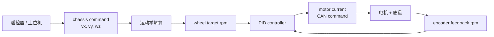
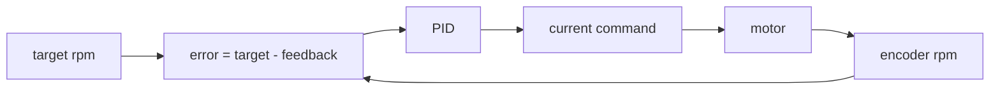
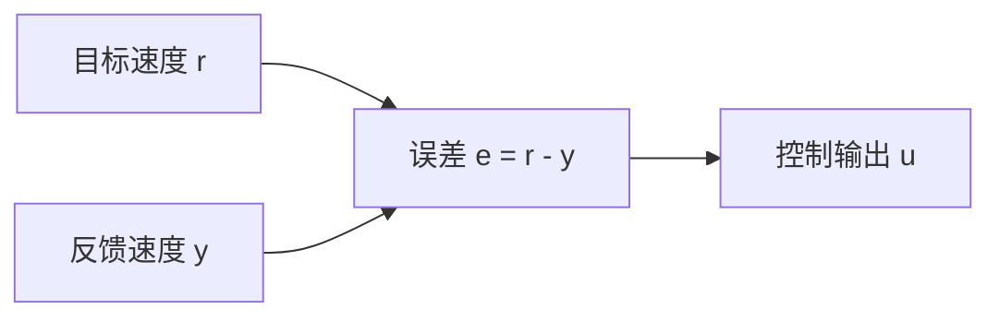
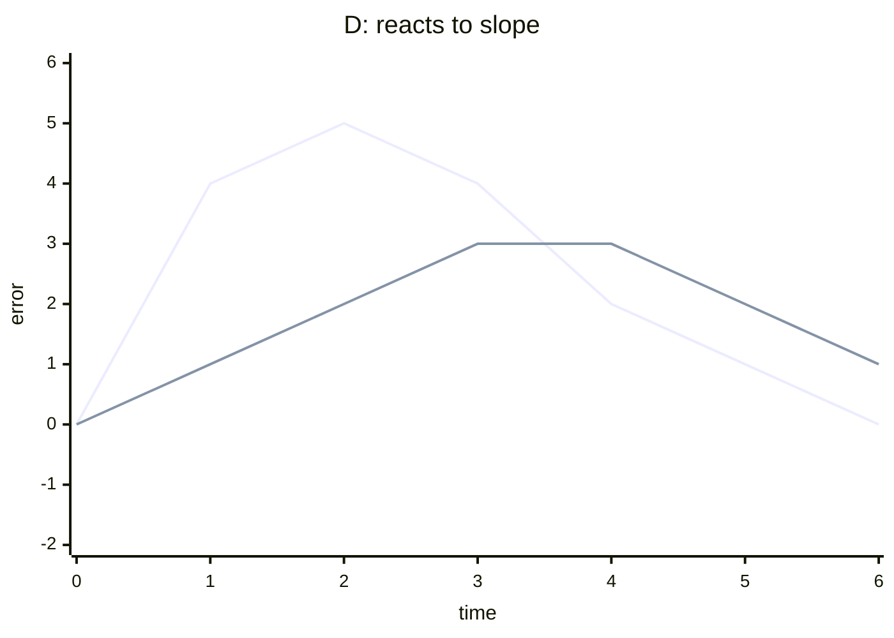
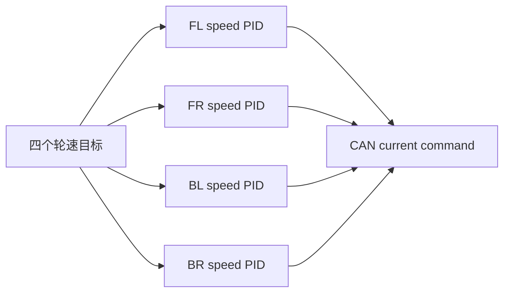
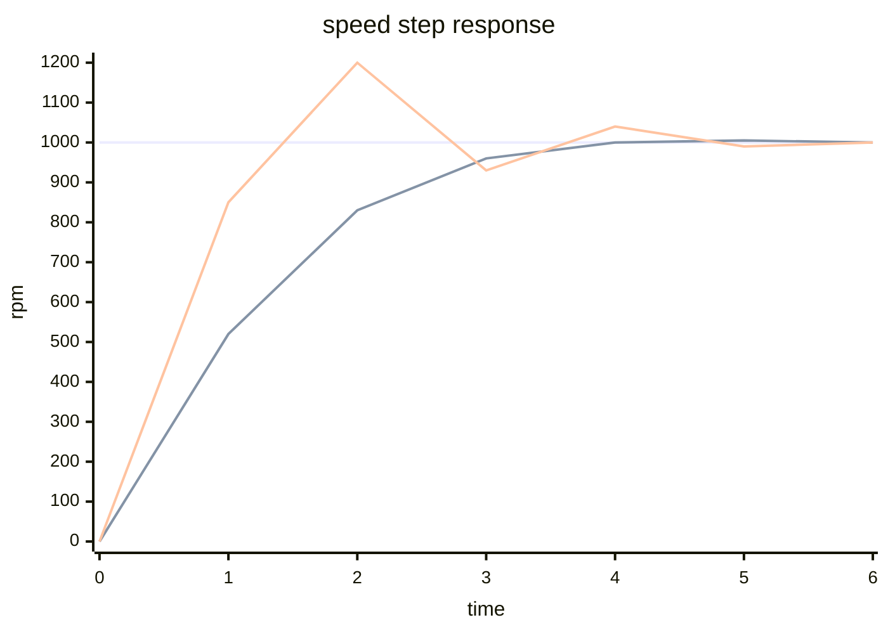
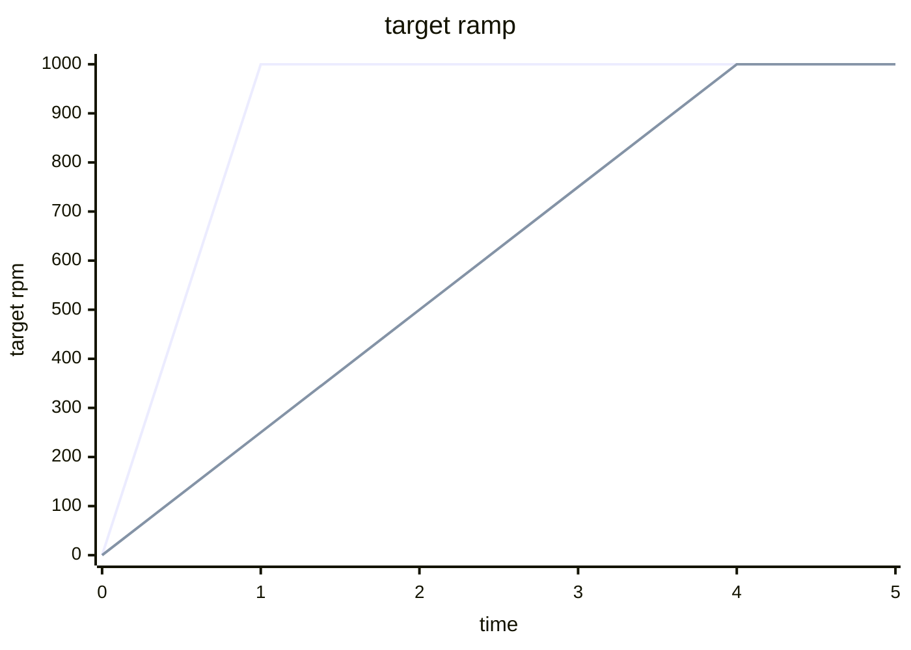
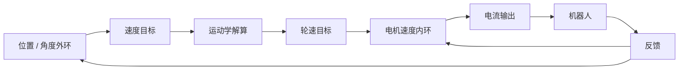
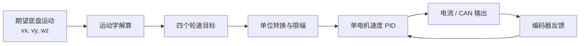

# Kinematics and PID Control

运动学解算与闭环控制

RM Summer Camp 2026

---

# 课程大纲

| 章节 | 主线                       |
| ---- | -------------------------- |
| 1    | 控制链路总览               |
| 2    | 麦轮运动学解算             |
| 3    | 从轮速到电机目标           |
| 4    | PID 控制基础               |
| 5    | 离散 PID 与工程实现        |
| 6    | 调参与常见问题             |
| 7    | 整车控制中的边界与检查清单 |

目标：理解从“期望底盘运动”到“电机闭环跟踪”的完整链路。

---
layout: section
---

# <Counter :level="1" /> - Control Chain

从指令到反馈的完整路径

---

# 整体链路



主线：运动学负责“目标分配”，PID 负责“让电机跟上目标”。

---

# 开环与闭环

| 控制方式 | 做法                 | 问题或收益                           |
| -------- | -------------------- | ------------------------------------ |
| 开环     | 直接给固定电流或 PWM | 简单，但负载变化时速度不可控         |
| 闭环     | 比较目标值和反馈值   | 能根据误差自动修正输出               |
| 反馈     | 编码器测得实际速度   | 让控制器知道“现在到底转得有多快”     |
| 误差     | `target - feedback`  | PID 的输入，也是调试时最重要的量之一 |

如果没有反馈，程序只是在“希望电机听话”。

---
layout: section
---

# <Counter :level="1" /> - Kinematics

运动学解算

---

# <Counter :level="2" /> 什么是运动学

运动学只研究“几何运动关系”，暂时不关心：

- 电机力矩够不够
- 轮胎是否打滑
- 地面摩擦力够不够
- PID 参数怎么调

在底盘控制里，它回答的是：

| 问题       | 典型含义                       |
| ---------- | ------------------------------ |
| 底盘怎么动 | `vx`, `vy`, `wz`               |
| 轮子怎么转 | 四个轮子的线速度、角速度或 rpm |

运动学是“目标分配”，不是“让电机真的做到”。

---

# 正运动学与逆运动学

| 名称                        | 输入                | 输出                |
| --------------------------- | ------------------- | ------------------- |
| 正运动学 Forward Kinematics | 每个轮子的实际速度  | 底盘实际 `vx/vy/wz` |
| 逆运动学 Inverse Kinematics | 期望底盘 `vx/vy/wz` | 每个轮子的目标速度  |

---

# 举个简单例子：差速底盘

差速底盘只有左右两侧轮速：

$$
v = \frac{v_R + v_L}{2}
$$

$$
\omega = \frac{v_R - v_L}{W}
$$

- 正运动学：已知 $v_L$、$v_R$，求底盘前进速度 $v$ 和角速度 $\omega$
- 逆运动学：已知 $v$、$\omega$，反过来求 $v_L$、$v_R$

---

# 坐标系约定

| 符号       | 含义             | 正方向示例           |
| ---------- | ---------------- | -------------------- |
| $v_x$      | 底盘前后线速度   | 正值向前             |
| $v_y$      | 底盘左右线速度   | 正值向左             |
| $\omega_z$ | 底盘绕中心角速度 | 正值逆时针（右手系） |

约定不统一时，公式本身很难救回来。

同一套约定要贯穿：遥控器输入、运动学矩阵、轮子编号、电机反馈方向。

---

# 轮子编号约定

```text
         x+ forward
              ^
              |
       FL     |     FR
        \     |     /
         \    |    /
y+ left <-----+-----> y- right
         /    |    \
        /     |     \
       BL     |     BR
```

- _FL_: Front Left
- _FR_: Front Right
- _BL_ or _RL_: Back Left or Rear Left
- _BR_ or _RR_: Back Right or Rear Right

---

# 常见数学方法

| 方法            | 用在什么地方                         |
| --------------- | ------------------------------------ |
| 坐标变换        | 世界坐标速度转到底盘坐标速度         |
| 刚体速度分解    | 底盘平移速度 + 绕中心旋转速度        |
| 向量投影        | 把轮子接触点速度投影到轮子可驱动方向 |
| 矩阵 / Jacobian | 把多个轮子的关系写成统一线性方程     |
| 伪逆 / 最小二乘 | 轮子数量和自由度不完全匹配时求近似解 |

麦轮逆运动学主要用前三个思想，最后写成矩阵。

---

# <Counter :level="2" /> 麦轮推导思路

把底盘看成刚体。

每个轮子接触点的速度都由两部分组成：

$$
\vec{v_i} =
\begin{bmatrix}
v_x \\\\
v_y
\end{bmatrix}
+
\omega_z
\begin{bmatrix}
-y_i \\\\
x_i
\end{bmatrix}
$$

- 第一项：底盘整体平移
- 第二项：绕底盘中心旋转带来的切向速度

接下来把 $\vec{v_i}$ 投影到第 $i$ 个麦轮的可驱动方向。

---

# 轮子速度来自投影

设第 $i$ 个轮子的可驱动方向单位向量为 $\vec{t_i}$。

轮子外缘线速度可以写成：

$$
v_i = \vec{t_i}^{T} \vec{v_i}
$$

代入刚体速度后：

$$
v_i =
\vec{t_i}^{T}
\begin{bmatrix}
v_x \\\\
v_y
\end{bmatrix}
+
\omega_z
\vec{t_i}^{T}
\begin{bmatrix}
-y_i \\\\
x_i
\end{bmatrix}
$$

这就是麦轮矩阵每一行的来源。

---

# 麦轮逆运动学矩阵

常见简化模型中：

- 轮子在矩形底盘四角对称分布
- 底盘中心到轮子的 $x$/$y$ 距离为 $L_x$、$L_y$
- 旋转项系数：$k = L_x + L_y$
- 四个麦轮安装方向：与地面接触的四个辊子围成 O 形

给定底盘速度：

$$
\begin{bmatrix}
v_{\text{FL}} \\\\
v_{\text{FR}} \\\\
v_{\text{BL}} \\\\
v_{\text{BR}}
\end{bmatrix}
=
\begin{bmatrix}
1 & -1 & -k \\\\
1 &  1 &  k \\\\
1 &  1 & -k \\\\
1 & -1 &  k
\end{bmatrix}
\begin{bmatrix}
v_x \\\\
v_y \\\\
\omega_z
\end{bmatrix}
$$

这里的 $v_{\text{FL}}$ 等表示轮子外缘的目标线速度。

---

# 矩阵每一列的直觉

| 输入       | 对四个轮子的影响           | 直觉                 |
| ---------- | -------------------------- | -------------------- |
| $v_x$      | 四个轮子同向               | 一起往前或往后       |
| $v_y$      | 左右/前后轮出现不同符号    | 利用麦轮斜向滚子平移 |
| $\omega_z$ | 对角轮同向，另一对角反向   | 产生绕中心的转动     |
| $k$        | 底盘越大，旋转需要轮速越大 | 外圈半径越大         |

实车第一次验证时，先分别测前进、横移、旋转，再测试复合运动。

---

# 逆运动学与正运动学的矩阵关系

把逆运动学写成：

$$
\vec{v}_{\text{wheel}} = J \vec{v}_{\text{chassis}}
$$

其中 $J$ 是底盘的运动学矩阵。

正运动学就是反过来估计底盘速度：

$$
\vec{v}_{\text{chassis}} = J^{+}\vec{v}_{\text{wheel}}
$$

$J^{+}$ 表示伪逆。对称四麦轮底盘通常可以推成简洁公式；更一般的轮式底盘常用矩阵方法统一处理。

---

# 轮速限幅的概念

运动学可能算出超过电机能力的轮速。

如果只把某一个轮子截断，四个轮子的比例会被破坏，底盘运动方向也会变。

更合理的做法是按比例缩放：

$$
s = \frac{v_{\text{max}}}{\max(|v_i|)}
$$

$$
v_i' = s v_i
$$

这样每个轮子的目标都变小，但整体运动方向尽量保持不变。

---

# 其他底盘

| 底盘类型 | 解算思路                       | 本节不展开的部分           |
| -------- | ------------------------------ | -------------------------- |
| 差速底盘 | 左右轮速度决定前进和转向       | 无法直接横移               |
| 全向轮   | 根据轮子安装角建立速度投影     | 安装角不同，矩阵不同       |
| 舵轮     | 每个轮子同时有转向角和驱动速度 | 需要处理舵角优化和奇异情况 |

所有底盘都在解决同一个问题：把底盘运动目标变成执行器目标。

---
layout: section
---

# <Counter :level="1" /> - Wheel Targets

从轮子线速度到电机可理解的目标

---

# <Counter :level="2" /> 单位转换

运动学矩阵通常先得到轮子外缘线速度 `v_wheel`。

电机控制常用的目标可能是电机轴 rpm 或编码器 rpm。

$$
\omega_{wheel} = \frac{v_{wheel}}{r}
$$

$$
rpm_{wheel} = \omega_{wheel} \times \frac{60}{2\pi}
$$

如果编码器测的是电机轴：

$$
rpm_{motor} = rpm_{wheel} \times gear\_ratio
$$

---

# 从底盘速度到电机目标


关键不是背代码，而是知道每一层量纲是什么。

同一个数值如果单位错了，控制效果会完全不同。

---

# 单位和符号检查

| 量             | 常见单位   | 检查重点                  |
| -------------- | ---------- | ------------------------- |
| 底盘线速度     | `m/s`      | 不要和 `mm/s` 混用        |
| 底盘角速度     | `rad/s`    | 不要把 `deg/s` 当 `rad/s` |
| 轮子外缘线速度 | `m/s`      | 来自运动学矩阵            |
| 轮子角速度     | `rad/s`    | 除以轮半径                |
| 电机轴速度     | `rpm`      | 注意减速比                |
| 编码器反馈     | `rpm/tick` | 搞清楚是电机轴还是轮轴    |

运动学讲的是几何关系；单位和符号是工程落地时最容易出错的部分。

---
layout: section
---

# <Counter :level="1" /> - PID Control

从单个电机速度环开始

---

# <Counter :level="2" /> 单电机速度环



---

# 误差：控制器真正看到的量



PID 不直接关心“电机为什么慢了”。

它先只看一件事：目标值和反馈值差了多少。

$$
e(t) = r(t) - y(t)
$$

- $r(t)$：reference，目标值
- $y(t)$：measurement，反馈值
- $e(t)$：error，误差

---
layout: two-cols-header
---

# <Counter :level="2" /> Proportional：看到误差就推一把

::left::

P 项像一个“弹簧”：

- 离目标越远，推得越用力
- 离目标越近，推力自然变小
- $K_{\mathrm{p}}$ 越大，反应越快，但也越容易震荡

::right::

```mermaid
xychart-beta
  title "P: larger error -> larger output"
  x-axis "error" [-3, -2, -1, 0, 1, 2, 3]
  y-axis "output" -6 --> 6
  line "P output" [-6, -4, -2, 0, 2, 4, 6]
```

---

# P 项公式

$$
u_{\mathrm{P}}(t) = K_{\mathrm{p}} e(t)
$$

其中：

- $u_{\mathrm{P}}(t)$：P 项输出
- $K_{\mathrm{p}}$：比例系数
- $e(t)$：当前误差

只用 P 控制时，很多系统会留下稳态误差：明明已经接近目标，但负载和摩擦让它差一点到不了。

---

# <Counter :level="2" /> Integral：把过去没补上的误差记下来


I 项像一个“账本”：

- 误差长期存在，就持续累加
- 累加越多，补偿越强
- 它适合消除稳态误差
- 但如果不限制，容易累过头，造成明显超调

---

# I 项公式

$$
u_{\mathrm{I}}(t) =
K_{\mathrm{i}}
\int_{0}^{t} e(\tau)\,\mathrm{d}\tau
$$

其中：

- $u_{\mathrm{I}}(t)$：I 项输出
- $K_{\mathrm{i}}$：积分系数
- $\int_{0}^{t} e(\tau)\,\mathrm{d}\tau$：从过去到现在的误差面积

---
layout: two-cols-header
---

# <Counter :level="2" /> Derivative：看到变化趋势就提前刹车

::left::

D 项像“阻尼”：

- 误差变化越快，D 项反应越强
- 它可以抑制超调，让系统不那么冲
- 它对噪声很敏感，速度环里经常先不加或只加很小

::right::



---

# D 项公式

$$
u_{\mathrm{D}}(t) =
K_{\mathrm{d}}
\frac{\mathrm{d}e(t)}{\mathrm{d}t}
$$

其中：

- $u_{\mathrm{D}}(t)$：D 项输出
- $K_{\mathrm{d}}$：微分系数
- $\frac{\mathrm{d}e(t)}{\mathrm{d}t}$：误差随时间变化的速度

两个 $\mathrm{d}$ 都是微分算子，使用直体；$e$ 和 $t$ 是变量，使用斜体。

---

# <Counter :level="2" /> 连续 PID

$$
u(t) =
K_{\mathrm{p}} e(t)
+
K_{\mathrm{i}} \int_{0}^{t} e(\tau)\,\mathrm{d}\tau
+
K_{\mathrm{d}} \frac{\mathrm{d}e(t)}{\mathrm{d}t}
$$

| 项  | 看什么       | 直觉               | 主要风险     |
| --- | ------------ | ------------------ | ------------ |
| P   | 当前误差     | 现在差多少就推多少 | 太大容易震荡 |
| I   | 历史误差面积 | 长期不到目标就补偿 | 容易积分饱和 |
| D   | 误差变化趋势 | 变化太快就阻尼     | 对噪声敏感   |

---

# <Counter :level="2" /> 从连续到离散

MCU 里没有真正连续运行的 PID。

控制任务通常每隔固定周期运行一次：

```text
1 ms / 2 ms / 5 ms / 10 ms
```

设采样周期为 $T_{\mathrm{s}}$，第 $k$ 次计算时：

$$
e[k] = r[k] - y[k]
$$

---

# 离散 P / I / D

$$
u_{\mathrm{P}}[k] =
K_{\mathrm{p}} e[k]
$$

$$
u_{\mathrm{I}}[k] =
u_{\mathrm{I}}[k-1] +
K_{\mathrm{i}} e[k] T_{\mathrm{s}}
$$

$$
u_{\mathrm{D}}[k] =
K_{\mathrm{d}}
\frac{e[k] - e[k-1]}{T_{\mathrm{s}}}
$$

积分从“面积”变成每次累加一小块。

微分从“瞬时斜率”变成相邻两次误差的差分。

---

# 离散 PID 输出

$$
\begin{aligned}
u[k] &=
u_{\mathrm{P}}[k] +
u_{\mathrm{I}}[k] +
u_{\mathrm{D}}[k] \\
&= K_{\mathrm{p}} e[k]
+ \left(u_{\mathrm{I}}[k-1] + K_{\mathrm{i}} e[k] T_{\mathrm{s}}\right)
+ K_{\mathrm{d}} \frac{e[k] - e[k-1]}{T_{\mathrm{s}}} \\
&= u[k-1] + K_{\mathrm{p}} (e[k] - e[k-1]) + K_{\mathrm{i}} e[k] T_{\mathrm{s}} + K_{\mathrm{d}} \frac{e[k] - e[k-1]}{T_{\mathrm{s}}}
\end{aligned}
$$

工程实现时还会额外处理：

- 输出限幅：不能超过电调或协议允许范围
- 积分限幅：避免积分一直累到不可恢复
- 死区：目标附近的小误差可以不处理
- 周期稳定：$T_{\mathrm{s}}$ 抖动会直接影响 I 和 D

---
layout: section
---

# <Counter :level="1" /> - PID Usage

以 Arm CMSIS-DSP `arm_pid_f32` 为例

---

# <Counter :level="2" /> CMSIS-DSP 提供了什么

Arm CMSIS-DSP 的 floating-point PID 主要用这几个对象和函数：

| 名称                   | 作用                          |
| ---------------------- | ----------------------------- |
| `arm_pid_instance_f32` | 保存 PID 参数、派生系数和状态 |
| `Kp`, `Ki`, `Kd`       | 用户设置的 PID 参数           |
| `arm_pid_init_f32()`   | 根据参数初始化实例            |
| `arm_pid_f32()`        | 每次处理一个输入样本          |
| `arm_pid_reset_f32()`  | 清空历史状态                  |

---
layout: two-cols-header
---

# 初始化 PID 实例

::left::

使用顺序：

- 先确定速度环周期 `SPEED_LOOP_TS_SEC`
- 连续参数先换算成 CMSIS-DSP 使用的离散参数
- 再调用 `arm_pid_init_f32`

`resetStateFlag = 1` 表示初始化时清空历史状态

`arm_pid_f32` 不接收 `dt`，所以周期影响必须在初始化参数里体现。

$$
\begin{aligned}
u[k] = u[k-1] 
&+ K_{\mathrm{p}} (e[k] - e[k-1]) \\
&+ K_{\mathrm{i}} e[k] T_{\mathrm{s}} \\
&+ K_{\mathrm{d}} \frac{e[k] - e[k-1]}{T_{\mathrm{s}}}
\end{aligned}
$$

::right::

```c
#include "arm_math.h"

#define SPEED_LOOP_TS_SEC 0.001f  // 1 ms

static arm_pid_instance_f32 speed_pid;

void speed_pid_init(void) {
    const float32_t kp_cont = 8.0f;
    const float32_t ki_cont = 200.0f;
    const float32_t kd_cont = 0.0f;

    speed_pid.Kp = kp_cont;
    speed_pid.Ki = ki_cont * SPEED_LOOP_TS_SEC;
    speed_pid.Kd = kd_cont / SPEED_LOOP_TS_SEC;

    arm_pid_init_f32(&speed_pid, 1);  // 1: reset state
}
```

---

# 周期调用

CMSIS-DSP 的 `arm_pid_f32` 每次处理一个输入样本。

在速度环里，这个输入通常就是误差：

```c
void speed_loop_update(float32_t target_rpm, float32_t feedback_rpm) {
    float32_t error = target_rpm - feedback_rpm;
    float32_t current = arm_pid_f32(&speed_pid, error);

    current = clamp_current(current);
    motor_set_current(current);
}
```

调用方仍然只需要关心：目标值、反馈值、输出限幅和执行器。

---

# CMSIS-DSP 的离散形式

`arm_pid_f32` 内部使用的形式可以写成：

$$
y[n] =
y[n-1] +
A_0 x[n] +
A_1 x[n-1] +
A_2 x[n-2]
$$

其中：

$$
A_0 = K_{\mathrm{p}} + K_{\mathrm{i}} + K_{\mathrm{d}}
$$

$$
A_1 = -K_{\mathrm{p}} - 2K_{\mathrm{d}},
\qquad
A_2 = K_{\mathrm{d}}
$$

---

# 一个电机一个实例

四个底盘电机通常各自有一个 `arm_pid_instance_f32`。



---

# 使用时关注的状态

| 时机     | 应该做什么                               |
| -------- | ---------------------------------------- |
| 初始化   | 设置 `Kp/Ki/Kd`，调用 `arm_pid_init_f32` |
| 周期任务 | 固定周期调用一次 `arm_pid_f32`           |
| 模式切换 | 必要时调用 `arm_pid_reset_f32`           |
| 电机离线 | 停止输出，清空或冻结 PID 状态            |
| 参数调整 | 改参数后重新初始化派生系数               |

PID 的“状态”比函数名更重要。CMSIS-DSP 把历史状态放在实例结构体里。

---

# 控制周期 $T_{\mathrm{s}}$

PID 参数和控制周期绑定。

同一组参数在不同周期下，表现可能完全不同：

| 周期变化                  | 影响                         |
| ------------------------- | ---------------------------- |
| $T_{\mathrm{s}}$ 变大     | 积分每次增加更多，微分更粗糙 |
| $T_{\mathrm{s}}$ 抖动     | 输出不稳定，难以调参         |
| 忘记使用 $T_{\mathrm{s}}$ | 换周期后参数意义改变         |
| 任务偶发卡顿              | 电机输出可能出现尖峰         |

速度环任务应该使用稳定周期。

如果参数来自连续 PID 推导，常见处理是：

$$
K_{\mathrm{p,cmsis}} = K_{\mathrm{p}}
$$

$$
K_{\mathrm{i,cmsis}} = K_{\mathrm{i}}T_{\mathrm{s}}
$$

$$
K_{\mathrm{d,cmsis}} = \frac{K_{\mathrm{d}}}{T_{\mathrm{s}}}
$$

---
layout: section
---

# <Counter :level="1" /> - Tuning

调参流程与常见问题

---

# 推荐调参顺序：P -> I -> D

| 步骤 | 操作                                            | 观察重点                |
| ---- | ----------------------------------------------- | ----------------------- |
| 1    | 先令 $K_{\mathrm{i}} = 0$，$K_{\mathrm{d}} = 0$ | 只看 P 的响应和震荡边界 |
| 2    | 增大 $K_{\mathrm{p}}$                           | 响应够快但不过度震荡    |
| 3    | 加小 $K_{\mathrm{i}}$                           | 消除稳态误差            |
| 4    | 必要时加很小的 $K_{\mathrm{d}}$                 | 抑制超调或快速变化      |
| 5    | 做阶跃测试                                      | 观察目标切换时的响应    |

先让系统可控，再追求更快。

---
layout: two-cols-header
---

# 典型响应

::left::

调参时不要只看“最后有没有到目标”。

还要看上升速度、超调、震荡和恢复时间。

::right::



---

# 常见现象

| 现象             | 可能原因                                        | 优先检查                          |
| ---------------- | ----------------------------------------------- | --------------------------------- |
| 电机无力         | $K_{\mathrm{p}}$ 太小、输出限幅太低、反馈单位错 | 当前输出是否已经打满              |
| 稳态误差明显     | 没有 I 项、摩擦或负载偏大                       | 小幅增加 $K_{\mathrm{i}}$         |
| 来回震荡         | $K_{\mathrm{p}}$ 太大、周期抖动、反馈噪声大     | 降低 $K_{\mathrm{p}}$，确认周期   |
| 超调很大         | I 项过强、没有积分限幅                          | 降低 $K_{\mathrm{i}}$，加积分限幅 |
| 一启动就冲反方向 | 电机方向或反馈方向反了                          | 单电机正方向测试                  |
| 目标变化时很猛   | 目标阶跃太大、没有斜坡限制                      | 给目标值加变化率限制              |

---
layout: two-cols-header
---

# 目标斜坡

::left::

遥控器目标可能瞬间从 0 跳到最大速度。

对电机速度环来说，这就是一个很大的阶跃输入。

斜坡限制能降低启动冲击，也能让调参更可控。

::right::



---
layout: section
---

# <Counter :level="1" /> - System Boundaries

整车控制中的边界

---

# <Counter :level="2" /> 外环和内环



常见结构：外环生成速度目标，内环负责电机速度跟踪。

不要让一个 PID 同时承担所有事情。

---

# 运动学和 PID 的边界

| 模块       | 输入                       | 输出           | 不负责什么       |
| ---------- | -------------------------- | -------------- | ---------------- |
| 运动学解算 | `vx`, `vy`, `wz`           | 四轮目标速度   | 电机是否真的跟上 |
| PID        | 单电机目标速度和反馈速度   | 单电机控制输出 | 底盘几何关系     |
| 模式管理   | 遥控器、裁判系统、保护状态 | 当前可执行目标 | 具体电机误差计算 |

边界清楚，问题定位会快很多。

---

# Debug 顺序

推荐从低层往高层查：

1. 单电机给电流，方向是否正确
2. 单电机读编码器，方向和单位是否正确
3. 单电机速度 PID，能否跟踪目标 rpm
4. 四个电机分别给相同目标，是否一致
5. 运动学分别测试前进、横移、旋转
6. 再测试复合运动和上层控制

不要一开始就直接开整车复杂模式。

---

# 本节主线回顾



运动学让目标合理分配，PID 让执行器闭环跟踪。

---

# 检查清单

| 类别   | 检查项                         |
| ------ | ------------------------------ |
| 坐标系 | `vx/vy/wz` 正方向是否固定      |
| 轮序   | `FL/FR/BL/BR` 是否和实车一致   |
| 单位   | `m/s`、`rad/s`、`rpm` 是否统一 |
| 限幅   | 轮速目标和电流输出是否限幅     |
| 反馈   | 编码器方向是否和目标方向一致   |
| 周期   | PID 任务周期是否稳定           |
| 积分   | 是否有积分限幅或抗饱和策略     |
| 安全   | 离线、急停、异常输出是否处理   |

---
layout: end
---

# Q&A
