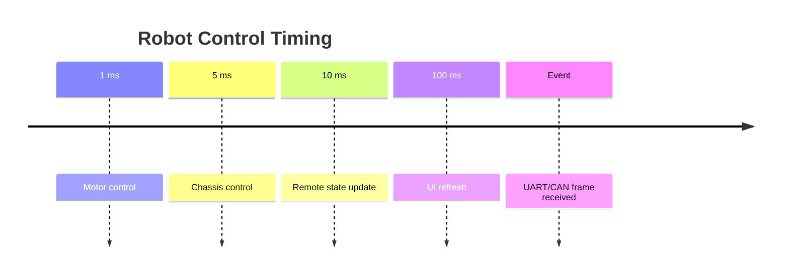
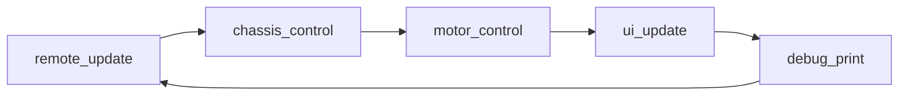
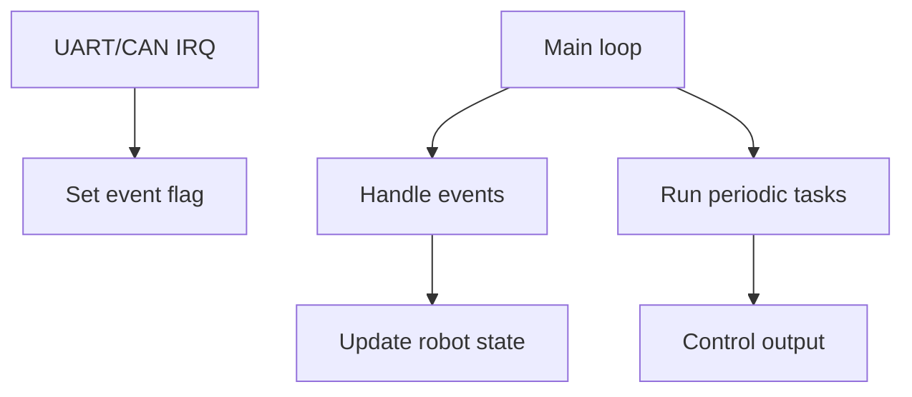
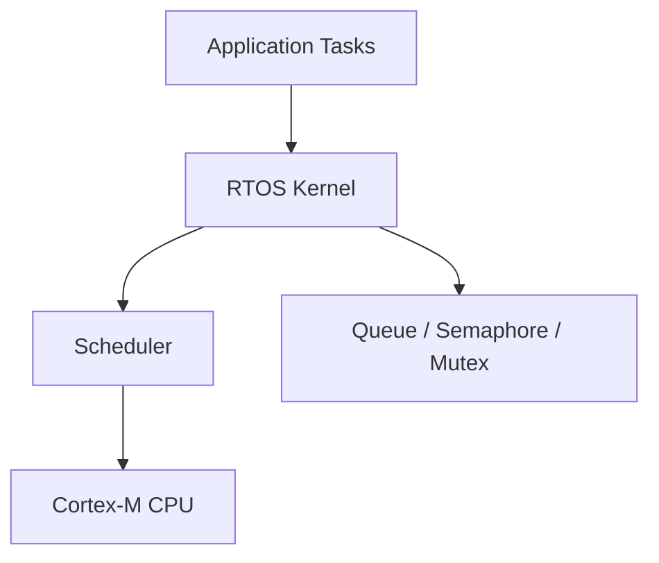
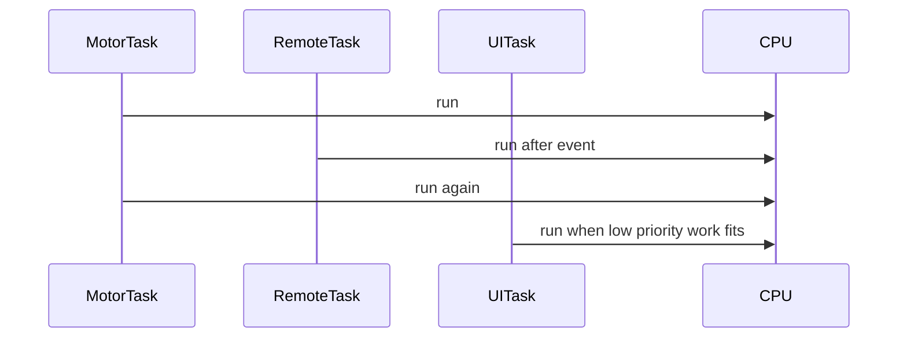
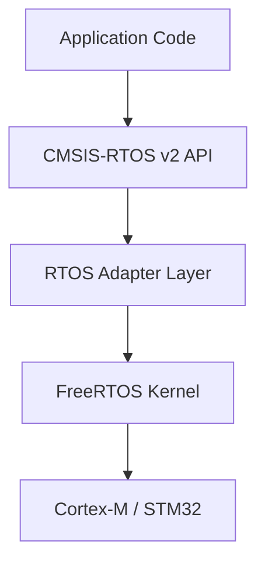
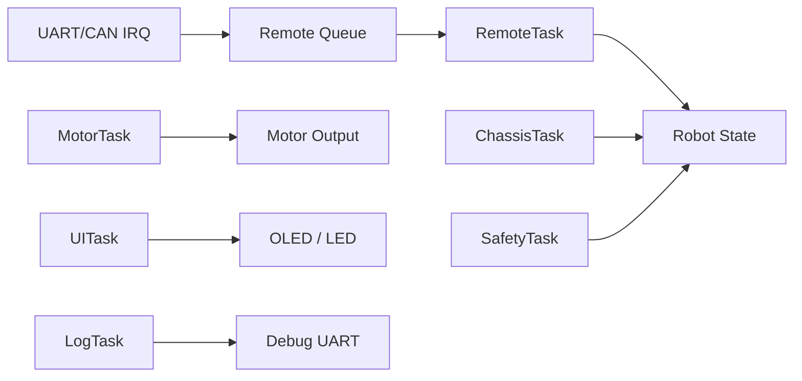

# RTOS Introduction

实时操作系统入门

RM Summer Camp 2026

---

# 课程大纲

| 章节 | 内容                      |
| ---- | ------------------------- |
| 1    | 机器人电控需求            |
| 2    | 裸机 `while(1)`           |
| 3    | 裸机 tick 调度            |
| 4    | 裸机 event driven         |
| 5    | 裸机方案的边界            |
| 6    | RTOS 基本概念             |
| 7    | CMSIS-RTOS v2 和 FreeRTOS |
| 8    | RTOS 核心功能             |
| 9    | 示例架构总览              |
| 10   | 代价和常见坑              |

---
layout: section
---

# 1 - 需求情景

一个机器人电控程序要同时做什么

---

# RTOS 是为了解决什么问题

RTOS 不是让 MCU 变成多核。

它的核心价值是：

```text
让多个有不同节奏和优先级的任务更容易组织。
```

这节课先从裸机方案出发，再看 RTOS 多提供了什么。

---

# 一个机器人电控程序要同时做什么

| 模块                | 类型                | 典型要求                |
| ------------------- | ------------------- | ----------------------- |
| 电机控制            | 周期任务            | 1 ms 或 2 ms 执行       |
| 底盘控制            | 周期任务            | 5-10 ms 执行            |
| 遥控器接收          | 事件驱动            | UART/CAN 收到数据后处理 |
| 裁判系统/上位机通信 | 事件驱动            | 收到一帧再解析          |
| 掉线保护            | 周期检查 + 事件更新 | 超时后立即保护          |
| UI / OLED / LED     | 低频任务            | 50-200 ms 执行          |
| 调试打印            | 低优先级            | 慢，不能影响控制        |

---

# 不同模块的节奏不一样



这些事情看起来像是“同时发生”。

但 MCU 大部分时候只有一个 CPU 核心。

---
layout: section
---

# 2 - 裸机 `while(1)`

最直接的程序结构

---

# 最直接的写法

```c
while (1) {
    remote_update();
    chassis_control();
    motor_control();
    ui_update();
    debug_print();
}
```

这是很多嵌入式程序的起点。

每一轮循环按顺序调用所有模块。

---

# `while(1)` 的优点

- 结构简单
- 容易单步调试
- 没有额外调度成本
- 适合功能很少、节奏接近的小程序

简单系统里，裸机主循环完全可以是正确选择。

---

# 问题：所有模块挤在同一个循环里



- 每个函数都会影响整轮循环时间
- 慢操作会拖慢控制逻辑
- 不同模块的执行频率不好表达
- 功能越多，主循环越难维护

---
layout: section
---

# 3 - 裸机 Tick 调度

把主循环变成调度循环

---

# 把 `while(1)` 变成调度循环

```c
while (1) {
    uint32_t now = HAL_GetTick();

    if (now - last_motor >= 1) {
        last_motor = now;
        motor_control();
    }

    if (now - last_chassis >= 5) {
        last_chassis = now;
        chassis_control();
    }

    if (now - last_ui >= 100) {
        last_ui = now;
        ui_update();
    }
}
```

主循环开始负责“什么时候调用谁”。

---

# 周期任务：不同模块不同频率

| 模块                | 周期   | 原因                 |
| ------------------- | ------ | -------------------- |
| `motor_control()`   | 1 ms   | 输出控制要稳定       |
| `chassis_control()` | 5 ms   | 控制决策频率较低     |
| `safety_check()`    | 10 ms  | 检查遥控器、通信超时 |
| `ui_update()`       | 100 ms | 显示慢，不应频繁刷新 |

高频控制和低频显示不必每轮都执行。

---

# tick 调度能解决什么

- 表达不同模块的执行周期
- 避免低频任务浪费主循环时间
- 让主循环有明确的调度职责
- 在不引入 RTOS 的情况下提升结构清晰度

裸机不是低级写法。

合理设计的 tick 调度可以支撑不少项目。

---
layout: section
---

# 4 - 裸机 Event Driven

事件来了再处理

---

# 事件不是每一轮都发生

周期任务适合用 tick。

但通信接收更像事件：

```text
没有收到数据：不需要解析
收到一帧数据：尽快处理
长时间没收到：进入保护
```

遥控器、裁判系统、上位机通信都常见这种模式。

---

# 中断通知，主循环处理

```c
volatile bool remote_rx_event = false;

void HAL_UART_RxCpltCallback(UART_HandleTypeDef *huart) {
    remote_rx_event = true;
}

while (1) {
    if (remote_rx_event) {
        remote_rx_event = false;
        remote_parse_frame();
        remote_last_seen = HAL_GetTick();
    }

    run_periodic_tasks();
}
```

中断只做通知，主循环处理具体逻辑。

---

# event driven + tick 调度

```c
while (1) {
    uint32_t now = HAL_GetTick();

    if (remote_rx_event) {
        remote_rx_event = false;
        remote_parse_frame();
        remote_last_seen = now;
    }

    if (now - remote_last_seen > 100) {
        enter_safe_mode();
    }

    run_periodic_tasks(now);
}
```

事件更新时间，周期任务检查超时。

---

# 裸机已经可以写得很工程化



- tick 处理周期任务
- event flag 处理异步事件
- 中断保持短小
- 主循环仍然是唯一执行上下文

---
layout: section
---

# 5 - 裸机方案的边界

复杂度开始转移到主循环

---

# 裸机方案还能继续扩展吗

假设继续增加需求：

- 裁判系统和遥控器都要解析数据帧
- UI 刷新很慢，但不能影响控制
- 日志打印有时会等待串口
- 多个模块都要读写机器人状态
- 某些模块希望“等到消息再继续”

裸机仍然能写，但主循环会越来越像手写调度器。

---

# 复杂度开始转移到主循环

```text
if flag A:
  handle A

if time for task B:
  run B

if resource C available:
  use C

if timeout D:
  protect
```

- flag 越来越多
- 代码顺序隐含优先级
- 等待逻辑被拆成很多判断
- 共享数据保护依赖人为约定

---

# 我们真正缺少什么

当系统变复杂时，我们希望直接表达：

| 需要表达的事情   | RTOS 提供的机制   |
| ---------------- | ----------------- |
| 不同职责分开运行 | task / thread     |
| 重要任务先响应   | priority          |
| 没事做时等待     | blocking wait     |
| 任务之间传数据   | queue             |
| 只通知事件发生   | flags / semaphore |
| 保护共享资源     | mutex             |

RTOS 的价值从这里开始出现。

---
layout: section
---

# 6 - RTOS 登场

把职责拆成任务

---

# RTOS 的基本想法



RTOS 提供一个内核。

内核负责调度任务，并提供任务间协作机制。

---

# 从函数列表到任务列表

| Task          | 触发方式       | 优先级 |
| ------------- | -------------- | ------ |
| `MotorTask`   | 周期 1 ms      | 高     |
| `ChassisTask` | 周期 5 ms      | 中高   |
| `RemoteTask`  | 收到数据后处理 | 高     |
| `SafetyTask`  | 周期检查超时   | 高     |
| `UITask`      | 周期 100 ms    | 低     |
| `LogTask`     | 有日志再发送   | 低     |

不同职责不再全部挤在一个 `while(1)` 里。

---

# 任务不是并行魔法，而是调度



- task 是独立的执行上下文
- scheduler 决定当前运行哪个 task
- task 可以阻塞等待事件
- 高优先级 task 可以更快响应

---
layout: section
---

# 7 - CMSIS-RTOS v2 和 FreeRTOS

概念分层和术语对照

---

# CMSIS-RTOS v2 是什么

CMSIS-RTOS v2 是 ARM 提供的一层 RTOS API。

```text
应用代码
  |
CMSIS-RTOS v2 API
  |
RTOS Kernel Adapter
  |
具体 RTOS Kernel
```

它让应用代码使用相对统一的接口描述任务、队列、互斥锁等概念。

---

# 它和 FreeRTOS 是什么关系



- FreeRTOS 是具体 RTOS 内核
- CMSIS-RTOS v2 是统一 API 层
- CubeMX 常见做法是启用 FreeRTOS，并选择 CMSIS-RTOS v2 接口
- 本课示例使用 CMSIS-RTOS v2 术语

---

# 同一个概念的不同名字

| 概念     | CMSIS-RTOS v2    | FreeRTOS                             |
| -------- | ---------------- | ------------------------------------ |
| 任务     | thread           | task                                 |
| 延时     | `osDelay`        | `vTaskDelay`                         |
| 队列     | `osMessageQueue` | `xQueue`                             |
| 信号量   | `osSemaphore`    | semaphore                            |
| 互斥锁   | `osMutex`        | mutex                                |
| 事件标志 | `osEventFlags`   | event group                          |
| 线程标志 | `osThreadFlags`  | task notification / event-like usage |

学概念时要看机制，不只看函数名。

---
layout: section
---

# 8 - RTOS 核心功能

只讲实现示例需求所需的能力

---

# Thread：把职责拆开

```c
osThreadNew(MotorTask, NULL, &motorTaskAttr);
osThreadNew(RemoteTask, NULL, &remoteTaskAttr);
osThreadNew(UITask, NULL, &uiTaskAttr);
```

```c
void MotorTask(void *argument) {
    for (;;) {
        motor_control();
        osDelay(1);
    }
}
```

- 每个任务有自己的循环
- 每个任务有自己的 stack
- 周期任务可以写成“做事，然后等待”

---

# Delay：等待时让出 CPU

```c
void UITask(void *argument) {
    for (;;) {
        ui_update();
        osDelay(100);
    }
}
```

`osDelay()` 的意义：

- 不是忙等
- 当前 task 进入等待状态
- 调度器可以运行其他 ready task
- 延时结束后 task 再变回 ready

---

# Queue：让事件带着数据流动

```c
typedef struct {
    uint8_t data[18];
    uint32_t tick;
} RemoteFrame;
```

```c
void HAL_UART_RxCpltCallback(UART_HandleTypeDef *huart) {
    RemoteFrame frame = remote_make_frame();
    osMessageQueuePut(remoteQueue, &frame, 0, 0);
}
```

队列适合“事件发生，并且要携带数据”的场景。

---

# Queue：任务等待消息

```c
void RemoteTask(void *argument) {
    RemoteFrame frame;

    for (;;) {
        osMessageQueueGet(
            remoteQueue,
            &frame,
            NULL,
            osWaitForever
        );

        remote_parse_frame(&frame);
    }
}
```

- 没有消息时，任务睡眠等待
- 收到消息后，任务被唤醒
- 比主循环反复检查 flag 更清晰

---

# Flags / Semaphore：轻量通知

```c
void HAL_GPIO_EXTI_Callback(uint16_t pin) {
    osThreadFlagsSet(remoteTaskHandle, REMOTE_RX_FLAG);
}
```

```c
void RemoteTask(void *argument) {
    for (;;) {
        osThreadFlagsWait(
            REMOTE_RX_FLAG,
            osFlagsWaitAny,
            osWaitForever
        );

        remote_handle_event();
    }
}
```

只需要通知“发生了”，可以用 flags 或 semaphore。

---

# Mutex：保护共享资源

```c
void log_printf(const char *msg) {
    osMutexAcquire(logMutex, osWaitForever);
    debug_print(msg);
    osMutexRelease(logMutex);
}
```

典型共享资源：

- 调试串口
- 共享状态结构
- 同一组外设寄存器访问

mutex 只保护确实共享且可能冲突的资源。

---

# 把示例需求组合起来

| 需求                 | RTOS 机制                |
| -------------------- | ------------------------ |
| 电机稳定周期控制     | `MotorTask` + `osDelay`  |
| 遥控器收到一帧再解析 | `osMessageQueue`         |
| 掉线超时保护         | `SafetyTask` + timestamp |
| UI 低频刷新          | `UITask` + low priority  |
| 日志不要影响控制     | `LogTask` + queue        |
| 多 task 共享串口     | `osMutex`                |

这不是 API 清单，而是一组架构工具。

---
layout: section
---

# 9 - 示例架构总览

从需求回到系统结构

---

# RTOS 版本的整体架构



异步输入通过队列进入任务，周期控制通过 task 自己的节奏运行。

---

# 优先级不是随便填的

| Task          | Priority | Reason                   |
| ------------- | -------- | ------------------------ |
| `MotorTask`   | High     | 控制周期敏感             |
| `RemoteTask`  | High     | 输入更新和掉线判断依赖它 |
| `SafetyTask`  | High     | 保护逻辑要及时           |
| `ChassisTask` | Normal   | 控制决策                 |
| `UITask`      | Low      | 慢，不应影响控制         |
| `LogTask`     | Low      | 调试输出可以延后         |

高优先级任务要短。

低优先级任务不能拿着共享资源不放。

---
layout: section
---

# 10 - 代价和常见坑

RTOS 不是免费午餐

---

# RTOS 不是免费午餐

RTOS 带来更清晰的组织方式，也带来额外成本：

- 每个 task 都需要 stack
- 上下文切换有开销
- task 太多会增加调试难度
- 共享数据需要明确保护
- 调度行为会让 bug 更隐蔽

RTOS 管理复杂度，但不会消除复杂度。

---

# 常见坑：优先级、栈、共享资源

| 问题                 | 现象                         |
| -------------------- | ---------------------------- |
| 高优先级 task 写太长 | 低优先级任务长期运行不到     |
| stack 分配太小       | 随机 HardFault 或异常行为    |
| 共享数据不保护       | 偶现错误，难以复现           |
| mutex 使用不当       | 系统卡住或响应变慢           |
| 中断里调用阻塞 API   | 行为错误或直接崩溃           |
| 误解 `osDelay(1)`    | 以为它等于严格 1 ms 实时精度 |

这些问题不必现在深入，但必须知道它们存在。

---

# 什么时候不需要 RTOS

简单系统可以继续使用裸机：

- 模块少
- 周期简单
- 没有复杂任务通信
- 没有明显的优先级差异
- tick + event driven 已经足够清楚

不要因为“更高级”而使用 RTOS。

要因为它能让系统结构更清楚而使用。

---

# 总结：RTOS 解决的是组织复杂度

```text
简单系统：
  裸机 tick + event driven 可能更合适

复杂系统：
  RTOS 提供任务、等待、通信和同步模型
```

这节课的关键判断：

| 问题       | 工具               |
| ---------- | ------------------ |
| 不同周期   | tick / task delay  |
| 异步事件   | event flag / queue |
| 数据传递   | message queue      |
| 共享资源   | mutex              |
| 优先级响应 | scheduler priority |

---
layout: end
---

# Q&A

下一步：在 CubeMX 工程中启用 CMSIS-RTOS v2
