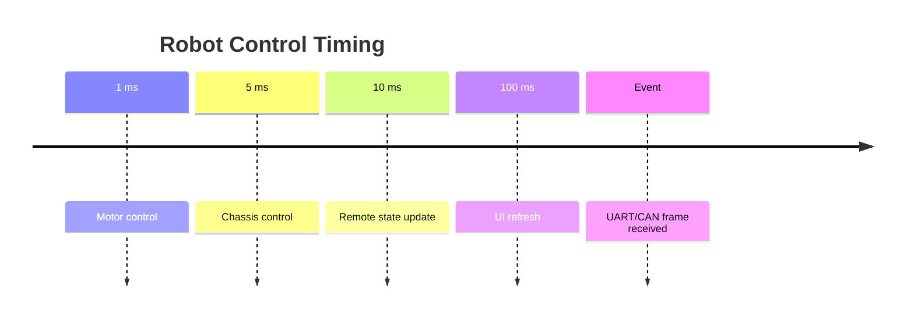
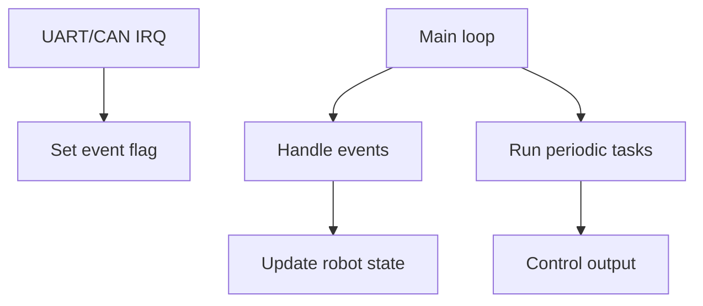
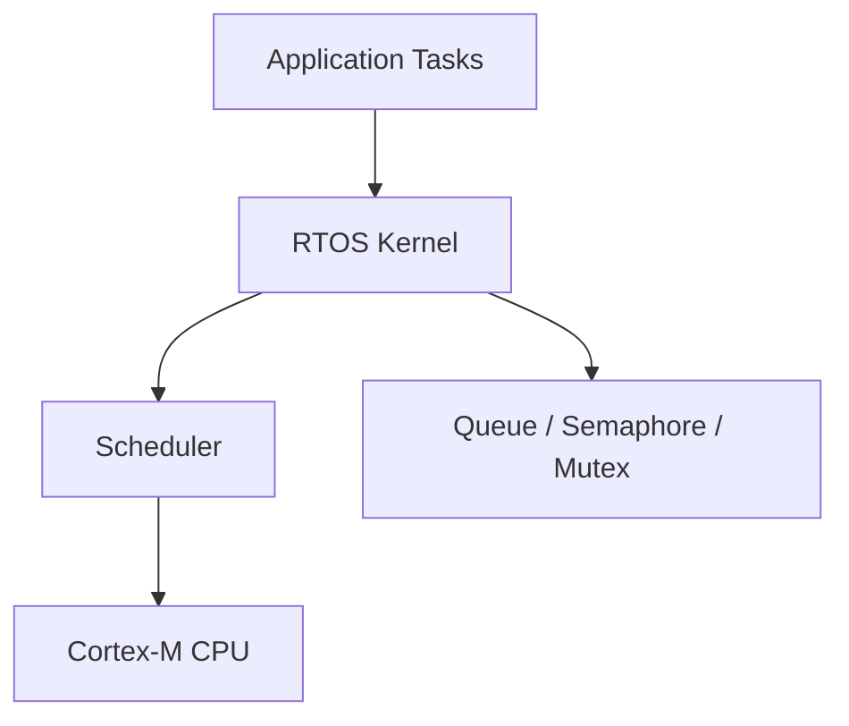
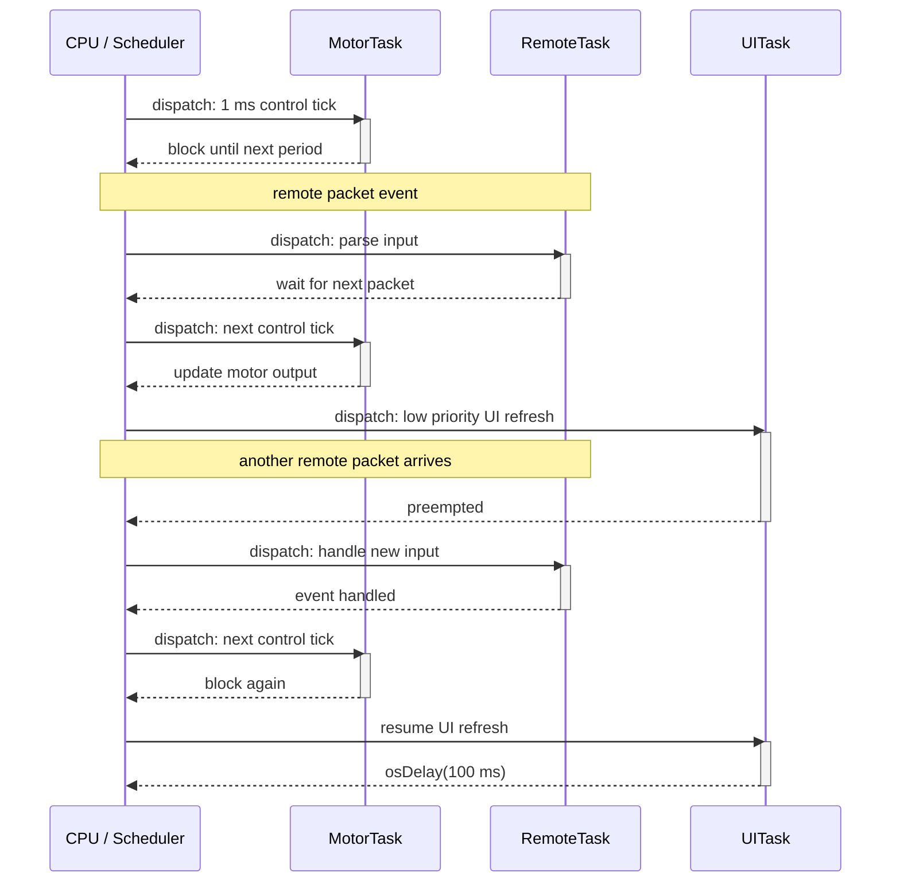
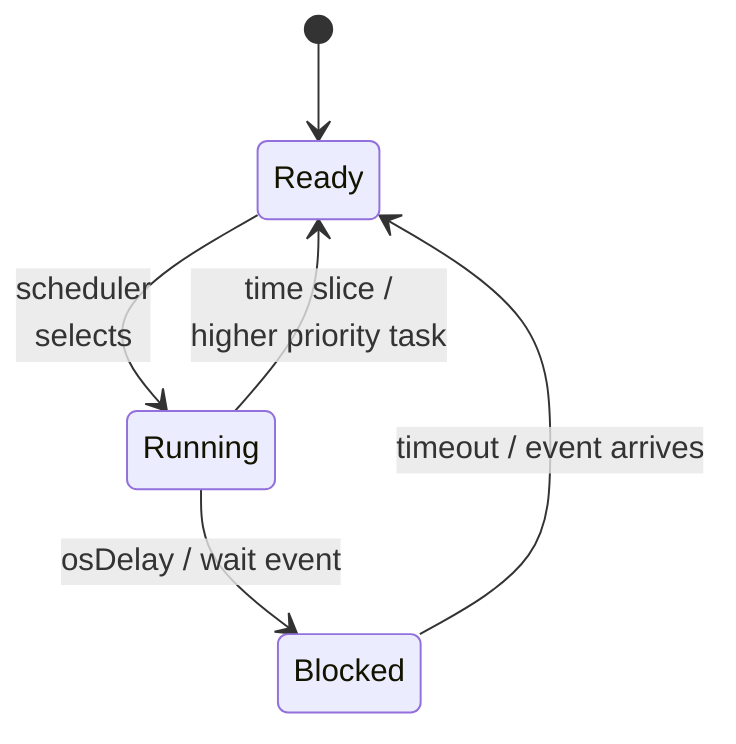

# RTOS Introduction

实时操作系统入门

RM Summer Camp 2026

---

# 课程大纲

| 章节 | 主线             |
| ---- | ---------------- |
| 1    | HAL 时间基础     |
| 2    | 复杂裸机程序     |
| 3    | 裸机调度器封装 |
| 4    | RTOS 基本模型    |
| 5    | CMSIS-RTOS2 API  |

主线：先理解裸机方案如何被推到复杂度边界，再看 RTOS 提供了哪些组织复杂度的机制。

---
layout: section
---

# 1 - HAL 时间基础

---

# `HAL_Delay`：阻塞等待

```c
while (1) {
    led_off();
    HAL_Delay(400);

    led_on();
    HAL_Delay(100);
}
```

- 灭灯 → 等 400 ms → 亮灯 → 等 100 ms

`HAL_Delay` 阻塞当前执行流，参数单位为毫秒：

```c
/**
  * @brief This function provides minimum delay (in milliseconds) based on variable incremented.
  * @param Delay specifies the delay time length, in milliseconds.
  */
void HAL_Delay(uint32_t Delay);
```

---

# `HAL_Delay` 源代码

```c
/**
  * @brief This function provides minimum delay (in milliseconds) based on variable incremented.
  * @note In the default implementation, SysTick timer is the source of time base.
  *       It is used to generate interrupts at regular time intervals where uwTick is incremented.
  * @note This function is declared as __weak to be overwritten in case of other implementations in user file.
  * @param Delay specifies the delay time length, in milliseconds.
  * @retval None
  */
__weak void HAL_Delay(uint32_t Delay) {
    uint32_t tickstart = HAL_GetTick();
    uint32_t wait = Delay;

    /* Add a freq to guarantee minimum wait */
    if (wait < HAL_MAX_DELAY) {
        wait += uwTickFreq;
    }

    while ((HAL_GetTick() - tickstart) < wait) { }
}
```

（来自 `stm32f4xx_hal.c`）

---

# `HAL_IncTick` 和 `HAL_GetTick`

STM32 HAL 的关键源码结构（来自 `stm32f4xx_hal.c`）可以简化成：

```c
__IO uint32_t uwTick;
uint32_t uwTickFreq = 1U;  // HAL_TICK_FREQ_1KHZ

/**
  * @note In the default implementation, this variable is incremented each 1ms in SysTick ISR.
  */
__weak void HAL_IncTick(void) {
    uwTick += uwTickFreq;
}

/**
  * @brief Provides a tick value in millisecond.
  */
__weak uint32_t HAL_GetTick(void) {
    return uwTick;
}
```

`HAL_GetTick()` 本质上就是读 HAL 内部维护的 tick 计数。

---

# HAL tick

常见 CubeMX / HAL 工程默认用 `SysTick` 产生 1 ms 中断。

中断处理函数里会推进 HAL tick（见 `stm32f4xx_it.c`）：

```c
void SysTick_Handler(void) {
    HAL_IncTick();
}
```

也可以配置成其他定时器作为 HAL timebase。以 TIM6 为例：

```c
/**
  * @brief  Period elapsed callback in non blocking mode
  * @note   This function is called  when TIM6 interrupt took place, inside HAL_TIM_IRQHandler().
  * It makes a direct call to HAL_IncTick() to increment a global variable "uwTick" used as application time base.
  * @param  htim : TIM handle
  */
void HAL_TIM_PeriodElapsedCallback(TIM_HandleTypeDef *htim) {
  if (htim->Instance == TIM6) {
    HAL_IncTick();
  }
}
```

---
layout: two-cols
---

::left::

**SysTick**

- Cortex-M 内核自带的 24-bit 递减计数器，不属于 STM32 外设。
- 只有一个 SysTick。
- 时钟通常来自内核时钟 `HCLK` 或 `HCLK/8`。
- 功能简单：主要就是周期性中断。常见用途：
  - HAL 计时、任务调度节拍、RTOS 计时。

::right::

**TIM**

- STM32 外设定时器，属于芯片外设资源。
- 位宽可能是 16-bit 或 32-bit，取决于具体 TIM。
- 数量较多，如 `TIM1`、`TIM2`、`TIM3` 等。
- 时钟来自 APB 总线定时器时钟。
- 功能丰富：
  - 定时中断、PWM 输出、输入捕获、输出比较等
- 每个 TIM 有独立的预分频器、自动重装载寄存器、通道等。
- 不同 TIM 功能可能不同：
  - 如高级定时器支持死区时间、刹车输入等。
  - 基本定时器只有定时中断功能。

---

# 阻塞等待的问题：不方便多任务协同

如果程序只需要闪 LED，阻塞等待没问题。

但如果还要同时处理其他事情：

```c
while (1) {
    led_off();
    HAL_Delay(400);

    led_on();
    HAL_Delay(100);

    do_some_other_task();  // too late
}
```

`do_some_other_task()` 每 500 ms 才有机会执行一次。

---

# 解决方案：用时间差判断

```c
bool led_is_on = false;
uint32_t last_change = HAL_GetTick();

while (1) {
    uint32_t now = HAL_GetTick();

    if (!led_is_on && now - last_change >= 400) {
        led_on();
        led_is_on = true;
        last_change = now;
    }

    if (led_is_on && now - last_change >= 100) {
        led_off();
        led_is_on = false;
        last_change = now;
    }

    do_some_other_task();
}
```

---
layout: section
---

# 2 - 复杂裸机程序

多任务协同

---

# 一个机器人电控程序要同时做什么

| 模块                | 类型                | 典型要求                |
| ------------------- | ------------------- | ----------------------- |
| 电机控制            | 周期任务            | 1 ms 或 2 ms 执行       |
| 底盘控制            | 周期任务            | 5-10 ms 执行            |
| 遥控器接收          | 事件驱动            | UART/CAN 收到数据后处理 |
| 裁判系统/上位机通信 | 事件驱动            | 收到一帧再解析          |
| 掉线保护            | 周期检查 + 事件更新 | 超时后立即保护          |
| UI / OLED / LED     | 低频任务            | 50-200 ms 执行          |
| 调试打印            | 低优先级            | 慢，不能影响控制        |

---

# 不同模块的节奏不一样



这些事情看起来像是“同时发生”。

但 MCU 大部分时候只有一个 CPU 核心。

---

# Tick 调度：不同模块不同频率

```c
while (1) {
    uint32_t now = HAL_GetTick();

    if (now - last_motor >= 1) {
        last_motor = now;
        motor_control();
    }

    if (now - last_chassis >= 5) {
        last_chassis = now;
        chassis_control();
    }

    if (now - last_ui >= 100) {
        last_ui = now;
        ui_update();
    }
}
```

主循环开始负责“什么时候调用谁”。

---

# 事件驱动（Event Driven）

```c
volatile bool remote_rx_event = false;

void HAL_UART_RxCpltCallback(UART_HandleTypeDef *huart) {
    remote_rx_event = true;
}

while (1) {
    if (remote_rx_event) {
        remote_rx_event = false;
        remote_parse_frame();
        remote_last_seen = HAL_GetTick();
    }

    do_other_tasks();
}
```

这个例子中，通知来自中断。中断只做通知，主循环处理具体逻辑。

通知也可能来自其他任务。

---

# 事件驱动 + Tick 调度

```c
while (1) {
    uint32_t now = HAL_GetTick();

    if (remote_rx_event) {
        remote_rx_event = false;
        remote_parse_frame();
        remote_last_seen = now;
    }

    if (now - remote_last_seen > 100) {
        // 超过 100 ms 没收到遥控器数据 -> 进入保护模式
        enter_safe_mode();
    }
}
```

事件更新时间，周期任务检查超时。

---
layout: section
---

# 3 - 裸机调度器封装

封装、复用，以及它的边界

---

# 整体架构



- tick 处理周期任务
- event flag 处理异步事件
- 中断保持短小
- 主循环仍然是唯一执行上下文

---

# 把调度逻辑封装起来

当周期任务越来越多，主循环可以继续抽象：

```c
while (1) {
    event_dispatch();
    scheduler_run();
}
```

这样 `while(1)` 不再直接写所有模块。

它只负责分发事件和运行调度器。

---

# 一个简单的事件表

```c
typedef void (*EventFn)(void);

typedef struct {
    volatile bool *flag;
    EventFn run;
} EventJob;

volatile bool remote_rx_event = false;
volatile bool referee_rx_event = false;
volatile bool button_event = false;

EventJob events[] = {
//  { flag,              event_handler     },
    { &remote_rx_event,  remote_handle_rx  },
    { &referee_rx_event, referee_handle_rx },
    { &button_event,     button_handle     },
};
```

事件表描述“哪个事件发生后，调用哪个处理函数”。

---

# `event_dispatch()`

某个事件发生了 → 执行某个函数

```c
void event_dispatch(void) {
    for (size_t i = 0; i < ARRAY_SIZE(events); i++) {
        EventJob *event = &events[i];

        if (*event->flag) {
            *event->flag = false;
            event->run();
        }
    }
}
```

`event_dispatch()` 遍历事件表，判断事件是否发生，执行相应的处理函数。

---

# 一个简单的周期任务表

```c
typedef void (*JobFn)(void);

typedef struct {
    uint32_t period_ms;
    uint32_t last_run;
    JobFn run;
} PeriodicJob;

PeriodicJob jobs[] = {
//  { period_ms, last_run, job_function     },
    { 1,         0,        motor_control    },
    { 5,         0,        chassis_control  },
    { 10,        0,        safety_check     },
    { 100,       0,        ui_update        },
};
```

周期、上次运行时间、执行函数被放进同一张表。

---

# `scheduler_run()`

到时间了 → 执行某个函数

```c
void scheduler_run() {
    uint32_t now = HAL_GetTick();
    for (size_t i = 0; i < ARRAY_SIZE(jobs); i++) {
        PeriodicJob *job = &jobs[i];

        if (now - job->last_run >= job->period_ms) {
            job->last_run = now;
            job->run();
        }
    }
}
```

`scheduler_run()` 遍历周期任务表，判断是否到时间，执行相应的函数。

---
layout: section
---

# 4 - RTOS

Real-Time Operating System

---
layout: two-cols
---

# RTOS 的基本想法

RTOS 提供一个调度器内核。

内核负责调度任务，并提供任务间协作机制。

::right::



---
layout: two-cols-header
---

# CMSIS-RTOS v2

Arm 官方文档：https://arm-software.github.io/CMSIS_6/latest/RTOS2/index.html

::left::

CMSIS-RTOS v2 是 ARM 提供的一层 RTOS API。

它让应用代码使用相对统一的接口描述任务、队列、互斥锁等概念。

典型分层关系是：

- 应用代码优先调用 CMSIS-RTOS2 通用 API
- CMSIS-RTOS2 下面适配具体 RTOS kernel
- kernel 仍然运行在 Cortex-M 处理器上
- OS tick/timebase 由 SysTick 或定时器实现

::right::

<br>


---

每种 RTOS 内核都有自己的 API，但 CMSIS-RTOS v2 提供了统一的接口。

比如 FreeRTOS 的 CMSIS-RTOS2 适配层：

```c
osStatus_t osDelay (uint32_t ticks) {
  osStatus_t stat;

  if (IS_IRQ()) {
    stat = osErrorISR;
  }
  else {
    stat = osOK;

    if (ticks != 0U) {
      vTaskDelay(ticks);  // FreeRTOS 提供的 API
    }
  }

  return (stat);
}
```

---

| 概念     | CMSIS-RTOS API v2                    | FreeRTOS                                             |
| -------- | ------------------------------------ | ---------------------------------------------------- |
| 任务     | `osThreadId_t`, `osThreadNew`        | `TaskHandle_t`, `xTaskCreate`, `xTaskCreateStatic`   |
| 延时     | `osDelay`                            | `vTaskDelay`                                         |
| 队列     | `osMessageQueuePut`                  | `xQueueSendToBack`                                   |
| 信号量   | `osSemaphoreNew`                     | `xSemaphoreCreateBinary`, `xSemaphoreCreateCounting` |
| 互斥锁   | `osMutexAcquire`, `osMutexRelease`   | `xSemaphoreTake`, `xSemaphoreGive`                   |
| 事件标志 | `osEventFlagsNew`, `osEventFlagsSet` | `xEventGroupCreate`, `xEventGroupSetBits`            |

---

# 常见的 RTOS 内核

| 内核            | 许可证     | 说明                                       |
| --------------- | ---------- | ------------------------------------------ |
| FreeRTOS        | MIT        | 小型 MCU 常用，生态成熟                    |
| Zephyr          | Apache-2.0 | 面向互联设备，驱动和协议栈丰富             |
| RT-Thread       | Apache-2.0 | 国产开源 RTOS，组件生态丰富                |
| Keil RTX5       | Apache-2.0 | Arm 提供，原生 CMSIS-RTOS2 接口            |
| Eclipse ThreadX | MIT        | 原 ThreadX / Azure RTOS，现由 Eclipse 维护 |
| embOS           | 商业授权   | SEGGER 商业 RTOS，重视确定性和技术支持     |

---
layout: image
image: https://github.com/RT-Thread/rt-thread/blob/master/documentation/figures/architecture.png?raw=true
backgroundSize: 63%
---

### RT-Thread

---
layout: two-cols-header
---

# FreeRTOS = Kernel + Libraries

::left::

## _Kernel_

- Task management
- Software timers
- Queues
- Message buffers
- Stream buffers
- Semaphores and mutexes
- Event flags or groups
- Co-routines

::right::

## _Libraries_

#### FreeRTOS Plus

- FreeRTOS-Plus-TCP
- FreeRTOS-Plus-CLI
- FreeRTOS-Plus-IO

#### FreeRTOS Core

- coreMQTT
- coreJSON
- coreHTTP
- corePKCS #11

#### FreeRTOS for AWS IoT

#### FreeRTOS Lab libraries

---

# 任务列表

| Task          | 触发方式       | 优先级 |
| ------------- | -------------- | ------ |
| `MotorTask`   | 周期 1 ms      | 高     |
| `ChassisTask` | 周期 5 ms      | 中高   |
| `RemoteTask`  | 收到数据后处理 | 高     |
| `SafetyTask`  | 周期检查超时   | 高     |
| `UITask`      | 周期 100 ms    | 低     |
| `LogTask`     | 有日志再发送   | 低     |

不同职责不再全部挤在一个 `while(1)` 里。

---
layout: two-cols
---

# 任务调度

- task 是独立的执行上下文
- scheduler 决定当前运行哪个 task
- task 可以阻塞等待事件
- 高优先级 task 可以更快响应

::right::



---

# 任务状态

| 状态                | 含义                                  |
| ------------------- | ------------------------------------- |
| `Running`           | 当前正在 CPU 上执行                   |
| `Ready`             | 已经可以运行，等待 scheduler 分配 CPU |
| `Blocked / Waiting` | 等待时间、队列、信号量、事件等条件    |
| `Suspended`         | 被人为暂停，不参与调度                |
| `Terminated`        | 任务结束或被删除                      |

RTOS 调度器主要在 `Ready` 任务里选择一个进入 `Running`。

---
layout: two-cols
---

# 任务状态转换

- `Blocked`：任务主动让出 CPU
- 高优先级任务从 `Blocked` 回到 `Ready` 后，可能抢占低优先级任务
- `osDelay()`、队列等待、信号量等待本质上都会让任务离开 `Running`

::right::



---

# 调度策略

| 机制         | 核心想法                                                    |
| ------------ | ----------------------------------------------------------- |
| _抢占式调度_ | 高优先级任务一旦变成 `Ready`，可以打断低优先级任务          |
| _时间片调度_ | 同优先级的多个 `Ready` 任务，轮流运行（每次运行一个时间片） |
| _协作式调度_ | 任务主动 `delay` / `yield` / `wait`，将 CPU 让给其他任务    |

- 优先级通常先于时间片生效
- 时间片主要解决同优先级任务之间怎么轮流
- 协作式调度依赖任务自己让出 CPU

---

# `osDelay` 和 `HAL_Delay`

| API              | 行为                     | 对调度的影响                          | 适合场景                         |
| ---------------- | ------------------------ | ------------------------------------- | -------------------------------- |
| `HAL_Delay(ms)`  | 当前执行流等待 HAL tick  | 默认实现是忙等，不主动让出 CPU        | 裸机初始化、简单 bare-metal 示例 |
| `osDelay(ticks)` | 当前 task 进入 `Blocked` | 让出 CPU，scheduler 可以运行别的 task | RTOS task 内的周期等待           |

- 在 RTOS task 里写周期等待，优先使用 `osDelay()`

---
layout: section
---

# 5 - CMSIS-RTOS2 API

使用示例

---

# Thread Management

**Thread**（线程）是 CMSIS-RTOS 调度的基本对象。（在 FreeRTOS 中称为 **Task**）

```c
__NO_RETURN void MotorThreadFunc(void *argument) {
    for (;;) {
        motor_control();
        osDelay(100);
    }
}
```

- 每个 thread 有自己的执行上下文
- 每个 thread 有自己的 stack
- scheduler 在多个 ready thread 之间切换
- thread 可以阻塞等待，不必一直占着 CPU

任务函数不可直接 `return`，如果确实要结束任务，使用 `osThreadExit()`

---

### Example 1: 创建一个简单的 thread

```c
__NO_RETURN void thread_func(void * /* Unused */) {

    do_init_work();

    for (;;) {
        do_periodic_work();
        osDelay(100);
    }
}
```

```c
int main(void) {
    // ...

    osKernelInitialize();

    osThreadNew(thread_func, NULL, NULL);     // Create thread with default settings

    osKernelStart();                          // Start the scheduler
}
```

---

### Example 2: 传递参数

相同的逻辑，公共的线程函数：

```c
__NO_RETURN void recv_thread(void * argument) {
    UartHandle_t *huart = (UART_Handle_t *)argument;
    uint8_t rx_buffer[128];
    for (;;) {
        size_t rx_size = uart_receive(huart, rx_buffer, sizeof(rx_buffer));
        parse_and_handle(rx_buffer, rx_size);
    }
}
```

创建两个*不同的 thread*，分别处理不同的 UART：

```c
osThreadNew(recv_thread, huart_1, NULL);     // Create thread with default settings
osThreadNew(recv_thread, huart_2, NULL);     // Create another thread with different parameter
```

---

### Example 3: 使用属性创建 thread

```c
const osThreadAttr_t attr = {
    .name = "Motor task",           // 线程名称，可在调试时显示
    .priority = osPriorityHigh,     // 线程优先级
    .stack_size = 512,              // 线程栈大小（字节）（动态分配）
};

osThreadNew(motor_thread, NULL, &attr);
```

静态分配栈大小：

```c
uint8_t stack_buffer[512];               // 预分配一片内存

const osThreadAttr_t attr = {
    .stack_mem = stack_buffer,           // 指向预分配的栈内存
    .stack_size = sizeof(stack_buffer),  // 栈大小
};
```

---

# 周期任务：`osDelay` 与 `osDelayUntil`

简单周期等待：

```c
void UITask(void *) {
    for (;;) {
        ui_update();
        osDelay(100);         // 周期为 100 ticks
    }
}
```

更稳定的周期表达：

```c
void MotorTask(void *) {
    uint32_t next = osKernelGetTickCount();

    for (;;) {
        next += 2;             // 周期为 2 ticks
        motor_control();
        osDelayUntil(next);
    }
}
```

---

# Message Queue

**Message Queue**（消息队列）本质是一个线程安全队列，用于在不同上下文之间传递数据。

### Example 1: 创建一个 message queue

```c
typedef struct {
    uint8_t data[18];
    uint32_t tick;
} RemoteFrame;

osMessageQueueId_t remote_queue;

remote_queue = osMessageQueueNew(/* msg_count */ 8, /* msg_size */ sizeof(RemoteFrame), /* attr */ NULL);
```

- queue 里保存固定大小的 message
- `msg_count` 决定最多缓存多少条
- `msg_size` 决定每条 message 的大小
- 没有 message 时，接收 thread 可以阻塞等待

---

### Example 2: 从中断投递 message

中断里只复制一帧数据，不在中断里解析协议。

```c
void HAL_UART_RxCpltCallback(UART_HandleTypeDef *huart) {
    RemoteFrame frame;

    remote_copy_rx_data(frame.data);
    frame.tick = osKernelGetTickCount();

    osMessageQueuePut(
        remote_queue,
        &frame,
        0,      // msg_prio: 入门阶段通常不用
        0       // timeout: ISR 中必须不等待
    );
}
```

---

### Example 3: thread 等待 message

```c
void remote_thread(void *argument) {
    RemoteFrame frame;

    for (;;) {
        osMessageQueueGet(
            remote_queue,
            &frame,
            NULL,              // msg_prio
            osWaitForever      // timeout: 阻塞等待，直到有 message
        );

        remote_parse_frame(&frame);
    }
}
```

没有数据时，`remote_thread` blocked；收到 message 后才继续运行。

---

### Example 4: 使用属性创建 queue

```c
#define MSG_COUNT 8
#define MSG_SIZE sizeof(RemoteFrame)

uint8_t queue_buffer[MSG_COUNT * MSG_SIZE];  // 预分配一片内存

const osMessageQueueAttr_t attr = {
    .name = "Remote queue",    // 调试时显示
    .mq_mem = queue_buffer,    // 指向预分配的内存
    .mq_size = sizeof(queue_buffer),
};

remote_queue = osMessageQueueNew(
    MSG_COUNT,
    MSG_SIZE,
    &attr
);
```

如果没有提供 `mq_mem`，则 queue 内部会动态分配内存。

---

### Example 5: put/get 的等待策略

```c
osStatus_t status;

status = osMessageQueuePut(remote_queue, &frame, 0, 0);      // timeout = 0, 不等待
if (status != osOK) {
    remote_drop_count++;
}
```

```c
status = osMessageQueueGet(remote_queue, &frame, NULL, 20);  // timeout = 20 ticks, 最多等 20 tick
if (status == osOK) {
    remote_parse_frame(&frame);
} else if (status == osErrorTimeout) {
    enter_safe_mode();
}
```

- `timeout = 0`：不等待，queue 满/空就立即返回
- `timeout = osWaitForever`：一直等
- 有 timeout 时，可以把通信超时保护写在同一个 thread 里

---

# Queue 的使用边界

| 需求             | 适合用 queue 吗        |
| ---------------- | ---------------------- |
| 传递完整数据帧   | 适合：`RemoteFrame`    |
| 传递调试日志消息 | 适合：日志结构体或指针 |
| 只通知“发生了”   | 不一定需要 queue       |
| 共享串口互斥访问 | 不适合，应使用 `Mutex` |

Message queue 内部会复制 message。

如果数据很大，通常传指针或 buffer id，而不是直接塞大结构体。

---

# API 能不能在 ISR 中使用？

```c
void HAL_UART_RxCpltCallback(UART_HandleTypeDef *huart) {
    osMessageQueuePut(remote_queue, &frame, 0, 0);
}
```

```c
void remote_thread(void *argument) {
    osMessageQueueGet(remote_queue, &frame, NULL, osWaitForever);
}
```

分析一个 API 能不能在 ISR 中使用：

- ISR 中不能阻塞等待：
  - `osDelay`、`osDelayUntil` 不能用，`osMutexAcquire` 不能用
  - `timeout` 不能大于 0（必要条件）
- 一般地，`New`、`Delete` 不可在 ISR 中使用，比如 `osMessageQueueNew`
- 官方**文档**给每个 API 都标注了是否可以在 ISR 中使用。

---

# 如何学习使用 API？查文档

Arm CMSIS-RTOS2 文档（直接 Google 即可搜出）：

- Version 2.3.0: https://arm-software.github.io/CMSIS_6/latest/RTOS2/index.html
- Version 2.2.0: https://arm-software.github.io/CMSIS_5/develop/RTOS2/html/index.html

重点关注：

1. 函数原型：参数和返回值（一般是错误代码）是什么
2. ISR 说明：能不能在中断里调用
3. 相关 API：new / delete / put / get 通常成组出现

对于新的 API，可以看示例代码。

---

# 常见坑：优先级、栈、共享资源

| 问题                 | 现象                               |
| -------------------- | ---------------------------------- |
| 高优先级 task 写太长 | 低优先级任务长期运行不到           |
| stack 分配太小       | 随机 HardFault 或异常行为          |
| 共享数据不保护       | 偶现错误，难以复现                 |
| mutex 使用不当       | 系统卡住或响应变慢                 |
| 中断里调用阻塞 API   | 行为错误或直接崩溃                 |
| `osDelay(n)`         | 实际时长在 `n-1` 到 `n` ticks 之间 |

---
layout: end
---

# Q&A

下一步：在 CubeMX 工程中启用 CMSIS-RTOS v2
