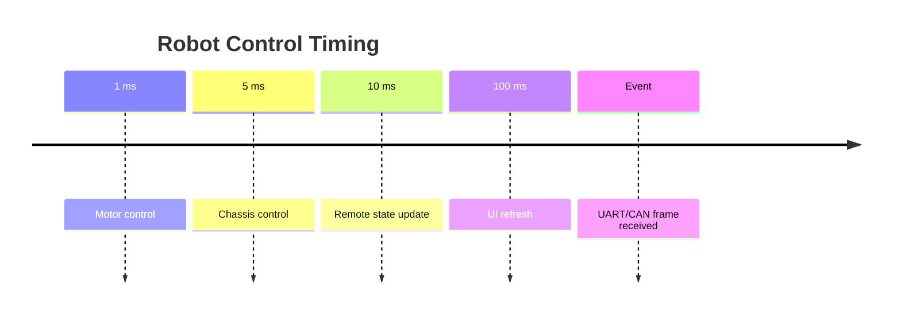
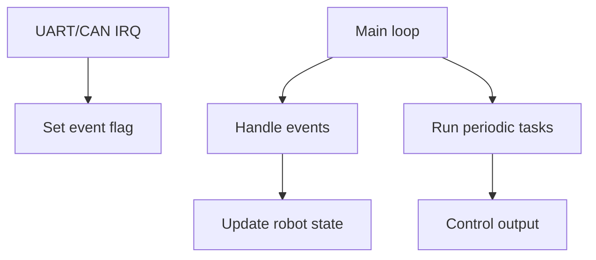
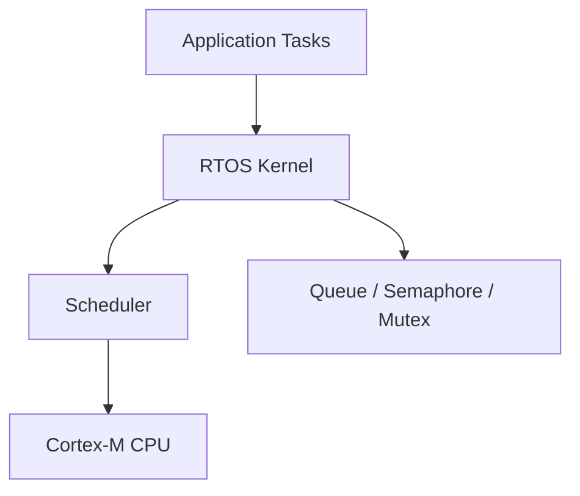
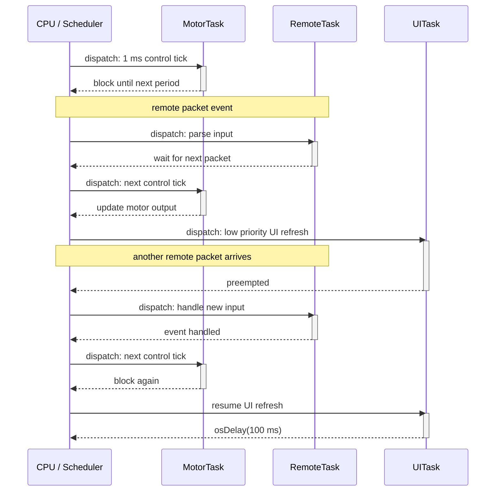
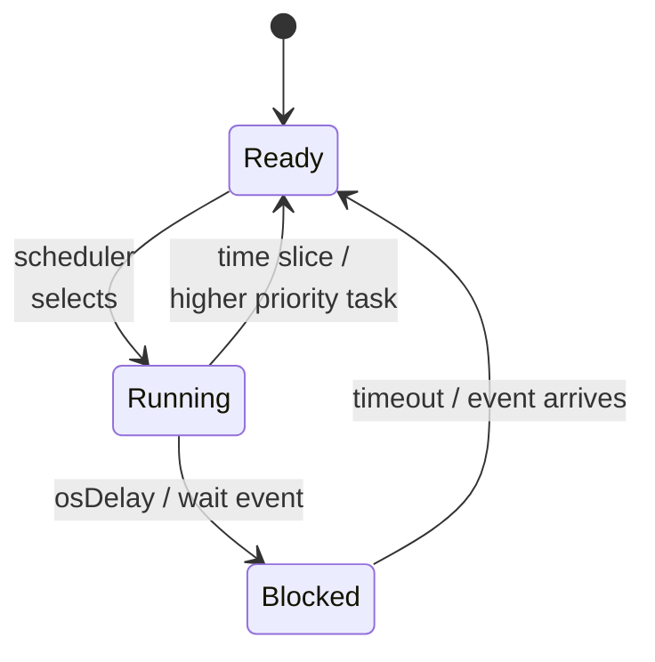
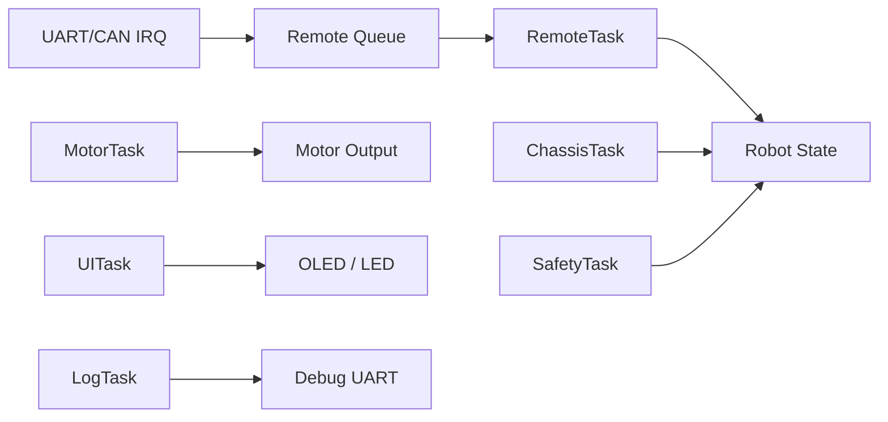

# RTOS Introduction

实时操作系统入门

RM Summer Camp 2026

---

# 课程大纲

| 章节 | 内容                     |
| ---- | ------------------------ |
| 1    | LED 闪烁与 HAL 时间基础  |
| 2    | 裸机程序如何变复杂       |
| 3    | 裸机调度循环的封装与边界 |
| 4    | RTOS 登场                |
| 5    | 示例架构、代价和取舍     |

---
layout: section
---

# 1 - HAL 时间基础

---

# `HAL_Delay`：阻塞等待

```c
while (1) {
    led_off();
    HAL_Delay(400);

    led_on();
    HAL_Delay(100);
}
```

- 灭灯 → 等 400 ms → 亮灯 → 等 100 ms

`HAL_Delay` 阻塞当前执行流，参数单位为毫秒：

```c
/**
  * @brief This function provides minimum delay (in milliseconds) based on variable incremented.
  * @param Delay specifies the delay time length, in milliseconds.
  */
void HAL_Delay(uint32_t Delay);
```

---

# `HAL_Delay` 源代码

```c
/**
  * @brief This function provides minimum delay (in milliseconds) based on variable incremented.
  * @note In the default implementation, SysTick timer is the source of time base.
  *       It is used to generate interrupts at regular time intervals where uwTick is incremented.
  * @note This function is declared as __weak to be overwritten in case of other implementations in user file.
  * @param Delay specifies the delay time length, in milliseconds.
  * @retval None
  */
__weak void HAL_Delay(uint32_t Delay) {
    uint32_t tickstart = HAL_GetTick();
    uint32_t wait = Delay;

    /* Add a freq to guarantee minimum wait */
    if (wait < HAL_MAX_DELAY) {
        wait += uwTickFreq;
    }

    while ((HAL_GetTick() - tickstart) < wait) { }
}
```

（来自 `stm32f4xx_hal.c`）

---

# `HAL_IncTick` 和 `HAL_GetTick`

STM32 HAL 的关键源码结构（来自 `stm32f4xx_hal.c`）可以简化成：

```c
__IO uint32_t uwTick;
uint32_t uwTickFreq = 1U;  // HAL_TICK_FREQ_1KHZ

/**
  * @note In the default implementation, this variable is incremented each 1ms in SysTick ISR.
  */
__weak void HAL_IncTick(void) {
    uwTick += uwTickFreq;
}

/**
  * @brief Provides a tick value in millisecond.
  */
__weak uint32_t HAL_GetTick(void) {
    return uwTick;
}
```

`HAL_GetTick()` 本质上就是读 HAL 内部维护的 tick 计数。

---

# HAL tick

常见 CubeMX / HAL 工程默认用 `SysTick` 产生 1 ms 中断。

中断处理函数里会推进 HAL tick（见 `stm32f4xx_it.c`）：

```c
void SysTick_Handler(void) {
    HAL_IncTick();
}
```

也可以配置成其他定时器作为 HAL timebase。以 TIM6 为例：

```c
/**
  * @brief  Period elapsed callback in non blocking mode
  * @note   This function is called  when TIM6 interrupt took place, inside HAL_TIM_IRQHandler().
  * It makes a direct call to HAL_IncTick() to increment a global variable "uwTick" used as application time base.
  * @param  htim : TIM handle
  */
void HAL_TIM_PeriodElapsedCallback(TIM_HandleTypeDef *htim) {
  if (htim->Instance == TIM6) {
    HAL_IncTick();
  }
}
```

---
layout: two-cols
---

::left::

**SysTick**

- Cortex-M 内核自带的 24-bit 递减计数器，不属于 STM32 外设。
- 只有一个 SysTick。
- 时钟通常来自内核时钟 `HCLK` 或 `HCLK/8`。
- 功能简单：主要就是周期性中断。常见用途：
  - HAL 计时、任务调度节拍、RTOS 计时。

::right::

**TIM**

- STM32 外设定时器，属于芯片外设资源。
- 位宽可能是 16-bit 或 32-bit，取决于具体 TIM。
- 数量较多，如 `TIM1`、`TIM2`、`TIM3` 等。
- 时钟来自 APB 总线定时器时钟。
- 功能丰富：
  - 定时中断、PWM 输出、输入捕获、输出比较等
- 每个 TIM 有独立的预分频器、自动重装载寄存器、通道等。
- 不同 TIM 功能可能不同：
  - 如高级定时器支持死区时间、刹车输入等。
  - 基本定时器只有定时中断功能。

---

# 阻塞等待的问题：不方便多任务协同

如果程序只需要闪 LED，阻塞等待没问题。

但如果还要同时处理其他事情：

```c
while (1) {
    led_off();
    HAL_Delay(400);

    led_on();
    HAL_Delay(100);

    do_some_other_task();  // too late
}
```

`do_some_other_task()` 每 500 ms 才有机会执行一次。

---

# 解决方案：用时间差判断

```c
bool led_is_on = false;
uint32_t last_change = HAL_GetTick();

while (1) {
    uint32_t now = HAL_GetTick();

    if (!led_is_on && now - last_change >= 400) {
        led_on();
        led_is_on = true;
        last_change = now;
    }

    if (led_is_on && now - last_change >= 100) {
        led_off();
        led_is_on = false;
        last_change = now;
    }

    do_some_other_task();
}
```

---
layout: section
---

# 2 - 复杂裸机程序

多任务协同

---

# 一个机器人电控程序要同时做什么

| 模块                | 类型                | 典型要求                |
| ------------------- | ------------------- | ----------------------- |
| 电机控制            | 周期任务            | 1 ms 或 2 ms 执行       |
| 底盘控制            | 周期任务            | 5-10 ms 执行            |
| 遥控器接收          | 事件驱动            | UART/CAN 收到数据后处理 |
| 裁判系统/上位机通信 | 事件驱动            | 收到一帧再解析          |
| 掉线保护            | 周期检查 + 事件更新 | 超时后立即保护          |
| UI / OLED / LED     | 低频任务            | 50-200 ms 执行          |
| 调试打印            | 低优先级            | 慢，不能影响控制        |

---

# 不同模块的节奏不一样



这些事情看起来像是“同时发生”。

但 MCU 大部分时候只有一个 CPU 核心。

---

# Tick 调度：不同模块不同频率

```c
while (1) {
    uint32_t now = HAL_GetTick();

    if (now - last_motor >= 1) {
        last_motor = now;
        motor_control();
    }

    if (now - last_chassis >= 5) {
        last_chassis = now;
        chassis_control();
    }

    if (now - last_ui >= 100) {
        last_ui = now;
        ui_update();
    }
}
```

主循环开始负责“什么时候调用谁”。

---

# 事件驱动（Event Driven）

```c
volatile bool remote_rx_event = false;

void HAL_UART_RxCpltCallback(UART_HandleTypeDef *huart) {
    remote_rx_event = true;
}

while (1) {
    if (remote_rx_event) {
        remote_rx_event = false;
        remote_parse_frame();
        remote_last_seen = HAL_GetTick();
    }

    do_other_tasks();
}
```

这个例子中，通知来自中断。中断只做通知，主循环处理具体逻辑。

通知也可能来自其他任务。

---

# 事件驱动 + Tick 调度

```c
while (1) {
    uint32_t now = HAL_GetTick();

    if (remote_rx_event) {
        remote_rx_event = false;
        remote_parse_frame();
        remote_last_seen = now;
    }

    if (now - remote_last_seen > 100) {
        // 超过 100 ms 没收到遥控器数据 -> 进入保护模式
        enter_safe_mode();
    }
}
```

事件更新时间，周期任务检查超时。

---
layout: section
---

# 3 - 裸机调度循环封装

封装、复用，以及它的边界

---

# 整体架构



- tick 处理周期任务
- event flag 处理异步事件
- 中断保持短小
- 主循环仍然是唯一执行上下文

---

# 把调度逻辑封装起来

当周期任务越来越多，主循环可以继续抽象：

```c
while (1) {
    event_dispatch();
    scheduler_run();
}
```

这样 `while(1)` 不再直接写所有模块。

它只负责分发事件和运行调度器。

---

# 一个简单的事件表

```c
typedef void (*EventFn)(void);

typedef struct {
    volatile bool *flag;
    EventFn run;
} EventJob;

volatile bool remote_rx_event = false;
volatile bool referee_rx_event = false;
volatile bool button_event = false;

EventJob events[] = {
//  { flag,              event_handler     },
    { &remote_rx_event,  remote_handle_rx  },
    { &referee_rx_event, referee_handle_rx },
    { &button_event,     button_handle     },
};
```

事件表描述“哪个事件发生后，调用哪个处理函数”。

---

# `event_dispatch()`

某个事件发生了 → 执行某个函数

```c
void event_dispatch(void) {
    for (size_t i = 0; i < ARRAY_SIZE(events); i++) {
        EventJob *event = &events[i];

        if (*event->flag) {
            *event->flag = false;
            event->run();
        }
    }
}
```

`event_dispatch()` 遍历事件表，判断事件是否发生，执行相应的处理函数。

---

# 一个简单的周期任务表

```c
typedef void (*JobFn)(void);

typedef struct {
    uint32_t period_ms;
    uint32_t last_run;
    JobFn run;
} PeriodicJob;

PeriodicJob jobs[] = {
//  { period_ms, last_run, job_function     },
    { 1,         0,        motor_control    },
    { 5,         0,        chassis_control  },
    { 10,        0,        safety_check     },
    { 100,       0,        ui_update        },
};
```

周期、上次运行时间、执行函数被放进同一张表。

---

# `scheduler_run()`

到时间了 → 执行某个函数

```c
void scheduler_run() {
    uint32_t now = HAL_GetTick();
    for (size_t i = 0; i < ARRAY_SIZE(jobs); i++) {
        PeriodicJob *job = &jobs[i];

        if (now - job->last_run >= job->period_ms) {
            job->last_run = now;
            job->run();
        }
    }
}
```

`scheduler_run()` 遍历周期任务表，判断是否到时间，执行相应的函数。

---
layout: section
---

# 4 - RTOS

Real-Time Operating System

---
layout: two-cols
---

# RTOS 的基本想法

RTOS 提供一个调度器内核。

内核负责调度任务，并提供任务间协作机制。

::right::



---
layout: two-cols-header
---

# CMSIS-RTOS v2

Arm 官方文档：https://arm-software.github.io/CMSIS_6/latest/RTOS2/index.html

::left::

CMSIS-RTOS v2 是 ARM 提供的一层 RTOS API。

它让应用代码使用相对统一的接口描述任务、队列、互斥锁等概念。

典型分层关系是：

- 应用代码优先调用 CMSIS-RTOS2 通用 API
- CMSIS-RTOS2 下面适配具体 RTOS kernel
- kernel 仍然运行在 Cortex-M 处理器上
- OS tick/timebase 由 SysTick 或定时器实现

::right::

<br>


---

# 常见的 RTOS 内核

| 内核            | 许可证     | 说明 |
| --------------- | ---------- | ---- |
| FreeRTOS        | MIT        | 小型 MCU 常用，生态成熟 |
| Zephyr          | Apache-2.0 | 面向互联设备，驱动和协议栈丰富 |
| RT-Thread       | Apache-2.0 | 国产开源 RTOS，组件生态丰富 |
| Keil RTX5       | Apache-2.0 | Arm 提供，原生 CMSIS-RTOS2 接口 |
| Eclipse ThreadX | MIT        | 原 ThreadX / Azure RTOS，现由 Eclipse 维护 |
| embOS           | 商业授权   | SEGGER 商业 RTOS，重视确定性和技术支持 |

---

# 同一个概念的不同名字

| 概念     | CMSIS-RTOS v2    | FreeRTOS                             |
| -------- | ---------------- | ------------------------------------ |
| 任务     | thread           | task                                 |
| 延时     | `osDelay`        | `vTaskDelay`                         |
| 队列     | `osMessageQueue` | `xQueue`                             |
| 信号量   | `osSemaphore`    | semaphore                            |
| 互斥锁   | `osMutex`        | mutex                                |
| 事件标志 | `osEventFlags`   | event group                          |
| 线程标志 | `osThreadFlags`  | task notification / event-like usage |

学概念时要看机制，不只看函数名。

---

# 任务列表

| Task          | 触发方式       | 优先级 |
| ------------- | -------------- | ------ |
| `MotorTask`   | 周期 1 ms      | 高     |
| `ChassisTask` | 周期 5 ms      | 中高   |
| `RemoteTask`  | 收到数据后处理 | 高     |
| `SafetyTask`  | 周期检查超时   | 高     |
| `UITask`      | 周期 100 ms    | 低     |
| `LogTask`     | 有日志再发送   | 低     |

不同职责不再全部挤在一个 `while(1)` 里。

---
layout: two-cols
---

# 任务调度

- task 是独立的执行上下文
- scheduler 决定当前运行哪个 task
- task 可以阻塞等待事件
- 高优先级 task 可以更快响应

::right::



---

# 任务状态

| 状态                 | 含义 |
| -------------------- | ---- |
| `Running`            | 当前正在 CPU 上执行 |
| `Ready`              | 已经可以运行，等待 scheduler 分配 CPU |
| `Blocked / Waiting`  | 等待时间、队列、信号量、事件等条件 |
| `Suspended`          | 被人为暂停，不参与调度 |
| `Terminated`         | 任务结束或被删除 |

RTOS 调度器主要在 `Ready` 任务里选择一个进入 `Running`。

---
layout: two-cols
---

# 任务状态转换

- `Blocked`：任务主动让出 CPU
- 高优先级任务从 `Blocked` 回到 `Ready` 后，可能抢占低优先级任务
- `osDelay()`、队列等待、信号量等待本质上都会让任务离开 `Running`

::right::



---

# Thread：把职责拆开

```c
osThreadNew(MotorTask, NULL, &motorTaskAttr);
osThreadNew(RemoteTask, NULL, &remoteTaskAttr);
osThreadNew(UITask, NULL, &uiTaskAttr);
```

```c
void MotorTask(void *argument) {
    for (;;) {
        motor_control();
        osDelay(1);
    }
}
```

- 每个任务有自己的循环
- 每个任务有自己的 stack
- 周期任务可以写成“做事，然后等待”

---

# Delay：等待时让出 CPU

```c
void UITask(void *argument) {
    for (;;) {
        ui_update();
        osDelay(100);
    }
}
```

`osDelay()` 的意义：

- 不是忙等
- 当前 task 进入等待状态
- 调度器可以运行其他 ready task
- 延时结束后 task 再变回 ready

---

# Queue：让事件带着数据流动

```c
typedef struct {
    uint8_t data[18];
    uint32_t tick;
} RemoteFrame;
```

```c
void HAL_UART_RxCpltCallback(UART_HandleTypeDef *huart) {
    RemoteFrame frame = remote_make_frame();
    osMessageQueuePut(remoteQueue, &frame, 0, 0);
}
```

队列适合“事件发生，并且要携带数据”的场景。

---

# Queue：任务等待消息

```c
void RemoteTask(void *argument) {
    RemoteFrame frame;

    for (;;) {
        osMessageQueueGet(
            remoteQueue,
            &frame,
            NULL,
            osWaitForever
        );

        remote_parse_frame(&frame);
    }
}
```

- 没有消息时，任务睡眠等待
- 收到消息后，任务被唤醒
- 比主循环反复检查 flag 更清晰

---

# Flags / Semaphore：轻量通知

```c
void HAL_GPIO_EXTI_Callback(uint16_t pin) {
    osThreadFlagsSet(remoteTaskHandle, REMOTE_RX_FLAG);
}
```

```c
void RemoteTask(void *argument) {
    for (;;) {
        osThreadFlagsWait(
            REMOTE_RX_FLAG,
            osFlagsWaitAny,
            osWaitForever
        );

        remote_handle_event();
    }
}
```

只需要通知“发生了”，可以用 flags 或 semaphore。

---

# Mutex：保护共享资源

```c
void log_printf(const char *msg) {
    osMutexAcquire(logMutex, osWaitForever);
    debug_print(msg);
    osMutexRelease(logMutex);
}
```

典型共享资源：

- 调试串口
- 共享状态结构
- 同一组外设寄存器访问

mutex 只保护确实共享且可能冲突的资源。

---
layout: section
---

# 5 - 架构与取舍

从示例需求回到系统设计

---

# 把示例需求组合起来

| 需求                 | RTOS 机制                |
| -------------------- | ------------------------ |
| 电机稳定周期控制     | `MotorTask` + `osDelay`  |
| 遥控器收到一帧再解析 | `osMessageQueue`         |
| 掉线超时保护         | `SafetyTask` + timestamp |
| UI 低频刷新          | `UITask` + low priority  |
| 日志不要影响控制     | `LogTask` + queue        |
| 多 task 共享串口     | `osMutex`                |

这不是 API 清单，而是一组架构工具。

---

# RTOS 版本的整体架构



异步输入通过队列进入任务，周期控制通过 task 自己的节奏运行。

---

# 优先级不是随便填的

| Task          | Priority | Reason                   |
| ------------- | -------- | ------------------------ |
| `MotorTask`   | High     | 控制周期敏感             |
| `RemoteTask`  | High     | 输入更新和掉线判断依赖它 |
| `SafetyTask`  | High     | 保护逻辑要及时           |
| `ChassisTask` | Normal   | 控制决策                 |
| `UITask`      | Low      | 慢，不应影响控制         |
| `LogTask`     | Low      | 调试输出可以延后         |

高优先级任务要短。

低优先级任务不能拿着共享资源不放。

---

# RTOS 不是免费午餐

RTOS 带来更清晰的组织方式，也带来额外成本：

- 每个 task 都需要 stack
- 上下文切换有开销
- task 太多会增加调试难度
- 共享数据需要明确保护
- 调度行为会让 bug 更隐蔽

RTOS 管理复杂度，但不会消除复杂度。

---

# 常见坑：优先级、栈、共享资源

| 问题                 | 现象                         |
| -------------------- | ---------------------------- |
| 高优先级 task 写太长 | 低优先级任务长期运行不到     |
| stack 分配太小       | 随机 HardFault 或异常行为    |
| 共享数据不保护       | 偶现错误，难以复现           |
| mutex 使用不当       | 系统卡住或响应变慢           |
| 中断里调用阻塞 API   | 行为错误或直接崩溃           |
| 误解 `osDelay(1)`    | 以为它等于严格 1 ms 实时精度 |

这些问题不必现在深入，但必须知道它们存在。

---

# 什么时候不需要 RTOS

简单系统可以继续使用裸机：

- 模块少
- 周期简单
- 没有复杂任务通信
- 没有明显的优先级差异
- tick + event driven 已经足够清楚

不要因为“更高级”而使用 RTOS。

要因为它能让系统结构更清楚而使用。

---

# 总结：RTOS 解决的是组织复杂度

```text
简单系统：
  裸机 tick + event driven 可能更合适

复杂系统：
  RTOS 提供任务、等待、通信和同步模型
```

这节课的关键判断：

| 问题       | 工具               |
| ---------- | ------------------ |
| 不同周期   | tick / task delay  |
| 异步事件   | event flag / queue |
| 数据传递   | message queue      |
| 共享资源   | mutex              |
| 优先级响应 | scheduler priority |

---
layout: end
---

# Q&A

下一步：在 CubeMX 工程中启用 CMSIS-RTOS v2
