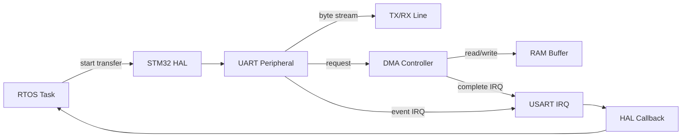
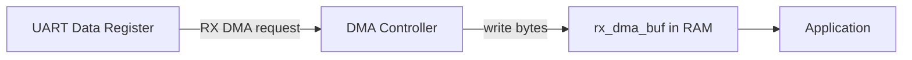
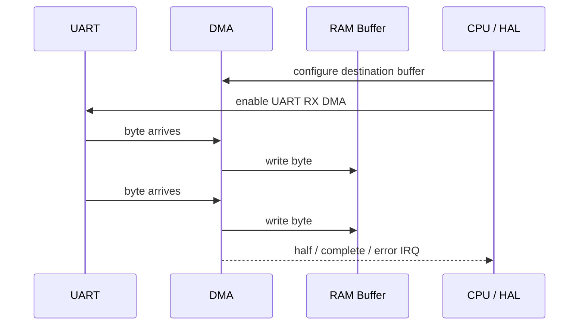
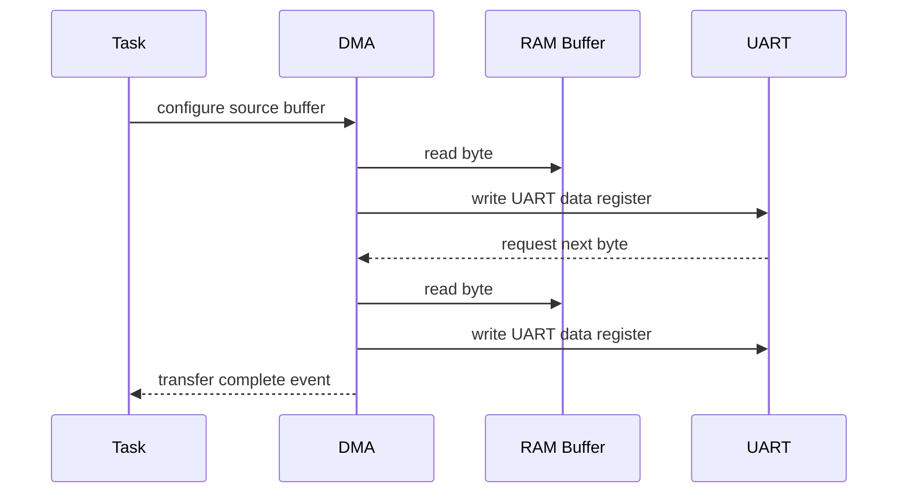
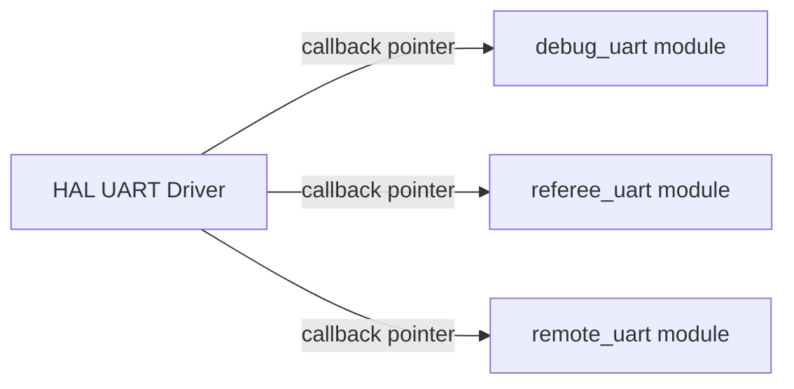
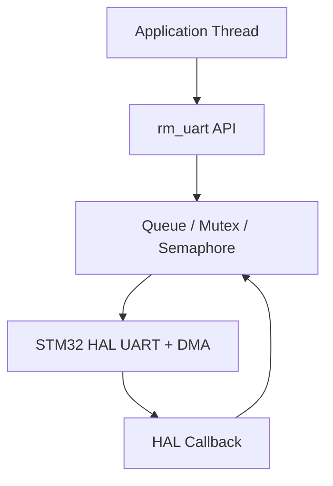
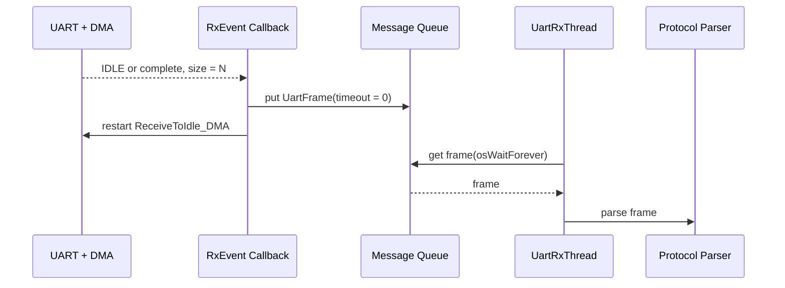
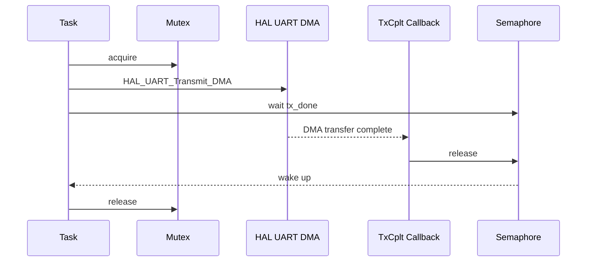
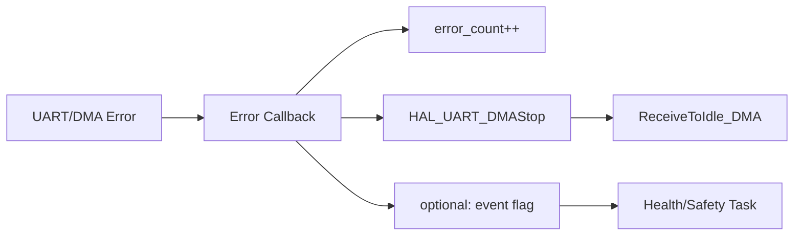

# UART DMA with CMSIS-RTOS2

用 RTOS 封装串口和 DMA

RM Summer Camp 2026

---

# 课程大纲

| 章节 | 主线                       |
| ---- | -------------------------- |
| 1    | UART 通信模型              |
| 2    | DMA 基础                   |
| 3    | HAL Callback 写法演进      |
| 4    | CMSIS-RTOS2 封装 UART      |
| 5    | RX / TX / Error 完整数据流 |

主线：先理解 UART 为什么需要异步化，再用 DMA 和 RTOS 把外设事件封装成清晰的模块接口。

---
layout: section
---

# 1 - UART 通信模型

从阻塞收发到异步收发

---

# UART 在机器人程序里的位置

| 场景           | 方向  | 特点                     |
| -------------- | ----- | ------------------------ |
| 遥控器 / DBUS  | RX    | 固定长度、高频、要判掉线 |
| 裁判系统       | RX    | 变长帧、协议解析较复杂   |
| 上位机通信     | RX/TX | 变长帧、调试和控制命令   |
| 调试日志       | TX    | 低优先级、不能卡控制任务 |
| 模块间串口通信 | RX/TX | 收发都可能比较频繁       |

UART 本身只是字节流。真正复杂的是：什么时候收完一帧，收到后在哪个上下文处理。

---

# 阻塞收发的问题

```c
uint8_t data[32];

while (1) {
    HAL_UART_Receive(&huart1, data, sizeof(data), HAL_MAX_DELAY);
    parse_frame(data, sizeof(data));

    motor_control();
    chassis_control();
}
```

`HAL_UART_Receive()` 等不到数据就一直卡住。

- 控制任务没有机会按周期运行
- 多个 UART 很难同时等待
- 超时和掉线保护容易散落在各处
- 在 RTOS task 中阻塞外设不等于合理阻塞

---

# 三种常见收发模式

| 模式      | 典型 API               | CPU 行为              | 适合场景                 |
| --------- | ---------------------- | --------------------- | ------------------------ |
| Blocking  | `HAL_UART_Receive`     | 当前执行流等待完成    | 初始化、简单测试         |
| Interrupt | `HAL_UART_Receive_IT`  | 每个字节/完成事件中断 | 小数据量、低频事件       |
| DMA       | `HAL_UART_Receive_DMA` | DMA 搬运，完成后通知  | 高频、连续、大量数据收发 |

在机器人电控里，UART 通常应当尽量走异步路径。

---

# UART 收发不是只有“函数调用”



调用 `HAL_UART_Receive_DMA()` 只是启动传输。真正的数据到达发生在之后。

---

# 设计目标：把 UART 变成模块

应用层希望看到的是：

```c
rm_uart_write(&debug_uart, data, len, 20);

if (rm_uart_read_frame(&referee_uart, &frame, osWaitForever)) {
    referee_parse(&frame);
}
```

而不是在业务代码里到处写：

- `HAL_UART_Transmit_DMA`
- `HAL_UARTEx_ReceiveToIdle_DMA`
- `HAL_UART_TxCpltCallback`
- `HAL_UARTEx_RxEventCallback`
- DMA buffer 管理
- queue / semaphore / mutex

---
layout: section
---

# 2 - DMA 基础

Direct Memory Access

---

# DMA 是什么

DMA 可以在外设和内存之间搬数据。



- DMA 不是另一个 CPU
- DMA 不会理解你的协议
- DMA 只按配置搬运字节
- 传输完成、半传输、错误等事件会通过中断通知 CPU

---

# RX DMA：接收路径



CPU 不需要每收到 1 byte 就复制 1 byte。

---

# TX DMA：发送路径



TX DMA 期间，发送 buffer 不能被修改或释放。

---

# DMA 事件

| 事件          | 含义                  | UART 封装里的常见处理      |
| ------------- | --------------------- | -------------------------- |
| Half Complete | buffer 前半段传输完成 | 流式处理时可用，入门先少用 |
| Complete      | 指定长度传输完成      | 通知 task / 重启接收       |
| IDLE          | UART 线空闲一帧时间   | 变长帧接收常用             |
| Error         | DMA 或 UART 发生错误  | 记录错误、停止并重启接收   |

对于变长 UART 帧，`IDLE` 往往比 “buffer 填满” 更接近真实帧边界。

---

# 固定长度帧

比如遥控器 DBUS 常见固定长度帧：

```c
#define DBUS_FRAME_SIZE 18

static uint8_t dbus_rx_buf[DBUS_FRAME_SIZE];

void remote_start_rx(void) {
    HAL_UART_Receive_DMA(&huart1, dbus_rx_buf, DBUS_FRAME_SIZE);
}

void HAL_UART_RxCpltCallback(UART_HandleTypeDef *huart) {
    if (huart == &huart1) {
        remote_on_frame(dbus_rx_buf, DBUS_FRAME_SIZE);
        remote_start_rx();
    }
}
```

收到固定长度后触发 complete callback。

---

# 变长帧：Receive To Idle

裁判系统、上位机通信、调试命令通常是变长帧：

```c
#define RX_DMA_SIZE 256

static uint8_t rx_dma_buf[RX_DMA_SIZE];

void uart_start_rx(void) {
    HAL_UARTEx_ReceiveToIdle_DMA(&huart2, rx_dma_buf, RX_DMA_SIZE);
}

void HAL_UARTEx_RxEventCallback(UART_HandleTypeDef *huart, uint16_t size) {
    if (huart == &huart2) {
        uart_on_rx_event(rx_dma_buf, size);
        uart_start_rx();
    }
}
```

`size` 表示本次事件中 HAL 认为收到的数据长度。

---

# Buffer 生命周期

错误写法：

```c
void start_rx(void) {
    uint8_t rx_buf[64];
    HAL_UART_Receive_DMA(&huart1, rx_buf, sizeof(rx_buf));
}
```

`start_rx()` 返回后，`rx_buf` 已经不再有效，但 DMA 还会继续往那片地址写。

正确方向：

```c
static uint8_t rx_buf[64];

void start_rx(void) {
    HAL_UART_Receive_DMA(&huart1, rx_buf, sizeof(rx_buf));
}
```

DMA buffer 必须活得比 DMA 传输更久。

---

# DMA 和 Cache

在 Cortex-M7 / H7 等带 D-Cache 的芯片上，DMA 和 CPU 可能看到不同步的数据。

常见处理方向：

- DMA buffer 放到非 cache 区域
- RX 后 invalidate cache
- TX 前 clean cache
- 按芯片和 HAL 示例检查 MPU / linker 配置

F4 入门工程通常先不会遇到这个问题，但以后换 H7 时必须重新检查。

---
layout: section
---

# 3 - HAL Callback 写法演进

从弱函数覆盖到注册回调

---

# HAL 弱函数覆盖

很多 HAL callback 默认是弱函数：

```c
void HAL_UART_RxCpltCallback(UART_HandleTypeDef *huart);
void HAL_UART_TxCpltCallback(UART_HandleTypeDef *huart);
void HAL_UART_ErrorCallback(UART_HandleTypeDef *huart);
void HAL_UARTEx_RxEventCallback(UART_HandleTypeDef *huart, uint16_t Size);
```

用户在自己的文件里实现同名函数，链接时覆盖 HAL 里的默认弱实现。

---

# 弱函数写法示例

```c
void HAL_UART_TxCpltCallback(UART_HandleTypeDef *huart) {
    if (huart == &huart1) {
        debug_uart_on_tx_done();
    } else if (huart == &huart2) {
        referee_uart_on_tx_done();
    }
}

void HAL_UARTEx_RxEventCallback(UART_HandleTypeDef *huart, uint16_t size) {
    if (huart == &huart1) {
        debug_uart_on_rx(size);
    } else if (huart == &huart2) {
        referee_uart_on_rx(size);
    }
}
```

所有 UART 的事件都挤到全局函数里再分发。

---

# 弱函数写法的问题

| 问题           | 影响                                  |
| -------------- | ------------------------------------- |
| 全局入口唯一   | 多个模块都想处理 UART callback 时冲突 |
| 靠 `if` 分发   | UART 越多，函数越长                   |
| 模块边界不清楚 | `uart.c` 的逻辑可能散在 `main.c`      |
| 不容易复用     | 同一份封装难以服务多个 UART           |
| 测试和替换困难 | callback 和业务代码耦合               |

弱函数适合入门，但不适合长期维护复杂工程。

---

# Register Callback

STM32 HAL 支持动态注册 callback：

```c
#define USE_HAL_UART_REGISTER_CALLBACKS 1U
```

普通 UART callback 使用：

```c
HAL_UART_RegisterCallback(
    &huart2,
    HAL_UART_TX_COMPLETE_CB_ID,
    uart_tx_complete_callback
);
```

`RxEventCallback` 使用专用函数：

```c
HAL_UART_RegisterRxEventCallback(&huart2, uart_rx_event_callback);
```

---

# 注册回调的初始化位置

```c
void app_uart_init(void) {
    MX_USART2_UART_Init();

    HAL_UART_RegisterCallback(
        &huart2,
        HAL_UART_TX_COMPLETE_CB_ID,
        uart_tx_complete_callback
    );

    HAL_UART_RegisterCallback(
        &huart2,
        HAL_UART_ERROR_CB_ID,
        uart_error_callback
    );

    HAL_UART_RegisterRxEventCallback(&huart2, uart_rx_event_callback);
}
```

通常先让 CubeMX 初始化外设，再注册应用层 callback。

---

# Register Callback 的价值



- callback 入口可以靠模块注册，而不是写死在全局弱函数中
- 同一个 `RmUart` 封装可以绑定到不同 `UART_HandleTypeDef`
- 外设事件更容易落回对应对象

---

# 使用约束

| 约束                   | 说明                                       |
| ---------------------- | ------------------------------------------ |
| HAL 配置               | `USE_HAL_UART_REGISTER_CALLBACKS` 必须为 1 |
| CubeMX 生成代码        | 重新生成后要确认宏没有被改回 0             |
| 普通 callback 注册状态 | 通常要求 UART handle 处于 ready 状态       |
| `RxEventCallback`      | 使用 `HAL_UART_RegisterRxEventCallback`    |
| 旧工程迁移             | 不要同时依赖弱函数和注册回调处理同一事件   |

如果注册失败，要检查返回值，而不是默认认为 callback 已经生效。

---
layout: section
---

# 4 - CMSIS-RTOS2 封装 UART

让外设事件变成模块接口

---

# 封装目标



应用层只关心：

- 发一段数据，等待发送完成或超时
- 收到一帧数据，阻塞等待或超时
- 出错时能统计、重启、上报

---

# 数据类型骨架

```c
#define RM_UART_FRAME_MAX_SIZE 256

typedef struct {
    uint8_t data[RM_UART_FRAME_MAX_SIZE];
    uint16_t size;
    uint32_t tick;
} UartFrame;

typedef struct {
    UART_HandleTypeDef *hal;
    uint8_t *rx_dma_buf;
    uint16_t rx_dma_size;

    osMessageQueueId_t rx_queue;
    osMutexId_t tx_mutex;
    osSemaphoreId_t tx_done;

    uint32_t error_count;
} RmUart;
```

`RmUart` 保存 HAL handle、DMA buffer 和 RTOS 同步对象。

---

# 对外 API 骨架

```c
bool rm_uart_init(RmUart *uart);

bool rm_uart_start_rx_dma_idle(RmUart *uart);

bool rm_uart_write(
    RmUart *uart,
    const uint8_t *data,
    uint16_t size,
    uint32_t timeout
);

bool rm_uart_read_frame(
    RmUart *uart,
    UartFrame *frame,
    uint32_t timeout
);
```

这不是完整驱动，只是一个教学用接口形状。

---

# 创建 RTOS 对象

```c
bool rm_uart_init(RmUart *uart) {
    uart->rx_queue = osMessageQueueNew(8, sizeof(UartFrame), NULL);
    uart->tx_mutex = osMutexNew(NULL);
    uart->tx_done = osSemaphoreNew(1, 0, NULL);

    if (uart->rx_queue == NULL || uart->tx_mutex == NULL || uart->tx_done == NULL) {
        return false;
    }

    HAL_UART_RegisterCallback(
        uart->hal,
        HAL_UART_TX_COMPLETE_CB_ID,
        rm_uart_hal_tx_complete
    );

    HAL_UART_RegisterCallback(uart->hal, HAL_UART_ERROR_CB_ID, rm_uart_hal_error);
    HAL_UART_RegisterRxEventCallback(uart->hal, rm_uart_hal_rx_event);

    return rm_uart_start_rx_dma_idle(uart);
}
```

初始化时把 HAL callback 和 RTOS 同步对象连接起来。

---

# 找回 `RmUart` 对象

HAL callback 只给 `UART_HandleTypeDef *`，没有直接传 `RmUart *`。

教学中可以先用小表做映射：

```c
static RmUart *uart_table[] = {
    &debug_uart,
    &referee_uart,
};

static RmUart *rm_uart_from_hal(UART_HandleTypeDef *hal) {
    for (size_t i = 0; i < ARRAY_SIZE(uart_table); i++) {
        if (uart_table[i]->hal == hal) {
            return uart_table[i];
        }
    }

    return NULL;
}
```

更复杂工程可以用注册表或外设 handle 扩展字段。

---

# 启动 RX DMA Idle

```c
bool rm_uart_start_rx_dma_idle(RmUart *uart) {
    HAL_StatusTypeDef status;

    status = HAL_UARTEx_ReceiveToIdle_DMA(
        uart->hal,
        uart->rx_dma_buf,
        uart->rx_dma_size
    );

    return status == HAL_OK;
}
```

启动接收后，函数会返回。后续收到数据时由 callback 通知。

---

# RX Callback：只做短逻辑

```c
static void rm_uart_hal_rx_event(UART_HandleTypeDef *hal, uint16_t size) {
    RmUart *uart = rm_uart_from_hal(hal);
    if (uart == NULL || size == 0) {
        return;
    }

    UartFrame frame = {
        .size = MIN(size, RM_UART_FRAME_MAX_SIZE),
        .tick = osKernelGetTickCount(),
    };
    memcpy(frame.data, uart->rx_dma_buf, frame.size);

    osMessageQueuePut(uart->rx_queue, &frame, 0, 0);
    rm_uart_start_rx_dma_idle(uart);
}
```

callback 不解析协议，不做耗时计算。

---

# RX Thread：解析协议

```c
void referee_uart_thread(void *argument) {
    RmUart *uart = argument;
    UartFrame frame;

    for (;;) {
        if (rm_uart_read_frame(uart, &frame, osWaitForever)) {
            referee_parse_frame(frame.data, frame.size);
        }
    }
}
```

没有数据时 thread 处于 blocked 状态，CPU 可以运行其他任务。

---

# `rm_uart_read_frame`

```c
bool rm_uart_read_frame(
    RmUart *uart,
    UartFrame *frame,
    uint32_t timeout
) {
    osStatus_t status;

    status = osMessageQueueGet(
        uart->rx_queue,
        frame,
        NULL,
        timeout
    );

    return status == osOK;
}
```

queue 把 ISR/callback 上下文和 thread 上下文隔开。

---

# TX：互斥和完成通知

```c
bool rm_uart_write(
    RmUart *uart,
    const uint8_t *data,
    uint16_t size,
    uint32_t timeout
) {
    if (osMutexAcquire(uart->tx_mutex, timeout) != osOK) {
        return false;
    }

    osSemaphoreAcquire(uart->tx_done, 0);

    bool ok = HAL_UART_Transmit_DMA(uart->hal, data, size) == HAL_OK;
    if (ok) {
        ok = osSemaphoreAcquire(uart->tx_done, timeout) == osOK;
    }

    osMutexRelease(uart->tx_mutex);
    return ok;
}
```

mutex 防止多个 task 同时发同一个 UART。

---

# TX Complete Callback

```c
static void rm_uart_hal_tx_complete(UART_HandleTypeDef *hal) {
    RmUart *uart = rm_uart_from_hal(hal);
    if (uart == NULL) {
        return;
    }

    osSemaphoreRelease(uart->tx_done);
}
```

发送完成后释放 semaphore，等待中的 task 才继续运行。

---

# Error Callback

```c
static void rm_uart_hal_error(UART_HandleTypeDef *hal) {
    RmUart *uart = rm_uart_from_hal(hal);
    if (uart == NULL) {
        return;
    }

    uart->error_count++;

    HAL_UART_DMAStop(uart->hal);
    rm_uart_start_rx_dma_idle(uart);
}
```

真实工程里还要区分错误来源，并避免在错误风暴中无限重启。

---

# 中断里能不能调用 RTOS API？

| API                  | ISR/Callback 中用法  |
| -------------------- | -------------------- |
| `osMessageQueuePut`  | 可以用 `timeout = 0` |
| `osSemaphoreRelease` | 常用于 ISR 通知 task |
| `osMutexAcquire`     | 不应在 ISR 中使用    |
| `osDelay`            | 不能在 ISR 中使用    |
| `osMessageQueueGet`  | ISR 中不能阻塞等待   |

原则：callback 中不能等待，只能快速通知。

---
layout: section
---

# 5 - 完整数据流示例

RX / TX / Error

---

# RX 数据流



帧解析不放在 callback 里。

---

# TX 数据流



发送接口看起来是同步的，内部实际靠 DMA 异步完成。

---

# Error 数据流



通信错误不是只打印一下。至少要能统计、恢复、暴露给安全逻辑。

---

# 一个完整实例：调试串口

```c
static uint8_t debug_rx_dma_buf[256];

RmUart debug_uart = {
    .hal = &huart2,
    .rx_dma_buf = debug_rx_dma_buf,
    .rx_dma_size = sizeof(debug_rx_dma_buf),
};

void app_start(void) {
    rm_uart_init(&debug_uart);

    osThreadNew(debug_uart_thread, &debug_uart, NULL);
}
```

同一套封装也可以用于裁判系统、上位机、模块间通信。

---

# 业务线程只看业务

```c
void debug_uart_thread(void *argument) {
    RmUart *uart = argument;
    UartFrame frame;

    for (;;) {
        if (!rm_uart_read_frame(uart, &frame, 1000)) {
            continue;
        }

        debug_command_dispatch(frame.data, frame.size);
    }
}
```

协议解析线程不直接碰 HAL callback。

---

# 实战检查清单

| 项目       | 检查点                                 |
| ---------- | -------------------------------------- |
| DMA buffer | 是否是静态/全局/长期有效内存           |
| NVIC       | USART IRQ 和 DMA IRQ 是否开启          |
| Callback   | weak 覆盖或 register callback 是否生效 |
| RTOS API   | ISR 中 timeout 是否为 0                |
| TX buffer  | DMA 发送完成前是否保持有效且不被修改   |
| Queue 满   | 是否统计 drop count                    |
| Error      | 是否能停止并重启接收                   |

先让数据流稳定，再优化性能和抽象。

---

# 常见坑

| 现象                   | 可能原因                          |
| ---------------------- | --------------------------------- |
| callback 不进          | IRQ 没开、DMA 没关联、注册失败    |
| 只收到一次             | callback 里没有重启接收           |
| 数据偶尔乱             | DMA buffer 生命周期或 cache 问题  |
| TX 偶尔卡死            | 没有 complete callback 释放信号量 |
| 多任务同时打印混在一起 | 没有 mutex 保护 TX                |
| 中断里系统异常         | ISR 中调用了会阻塞的 RTOS API     |

调 UART 问题时，先画出“谁启动传输、谁通知完成、谁重启接收”。

---

# 官方资料入口

STM32 HAL UART driver source：

https://github.com/STMicroelectronics/stm32f4xx-hal-driver

重点看：

- `HAL_UART_Transmit_DMA`
- `HAL_UART_Receive_DMA`
- `HAL_UARTEx_ReceiveToIdle_DMA`
- `HAL_UART_RegisterCallback`
- `HAL_UART_RegisterRxEventCallback`
- `HAL_UARTEx_RxEventCallback`

CMSIS-RTOS2 文档：

https://arm-software.github.io/CMSIS_6/latest/RTOS2/index.html

---
layout: end
---

# Q&A

下一步：把 UART 封装接到遥控器或裁判系统协议解析
