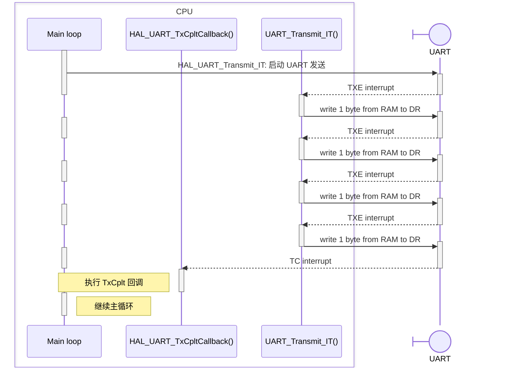
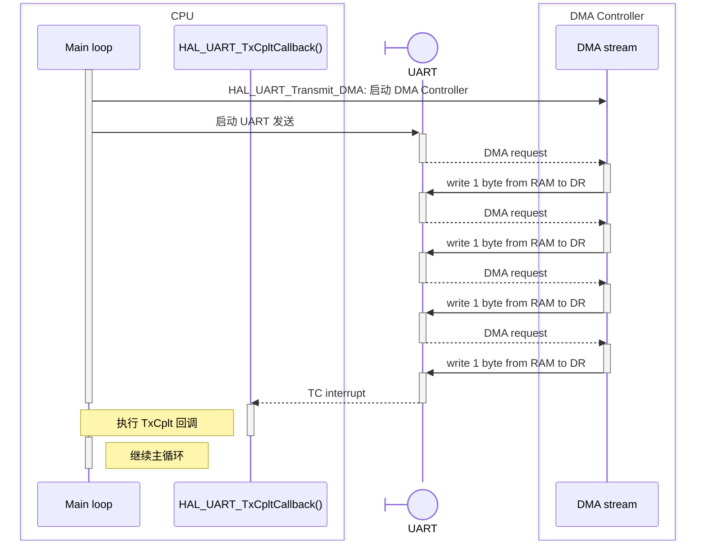
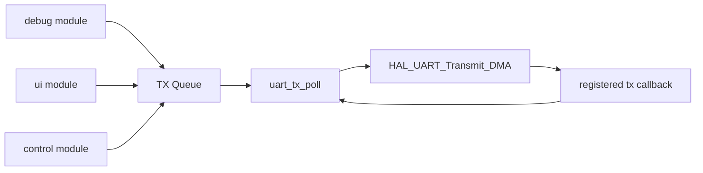
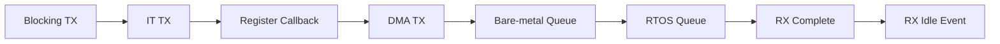

# UART IT/DMA with CMSIS-RTOS2

从裸机发送到 RTOS 串口封装

RM Summer Camp 2026

---

# 课程大纲

| 章节 | 主线                        |
| ---- | --------------------------- |
| 1    | 主循环阻塞发送              |
| 2    | 用 IT 避免阻塞调度          |
| 3    | 从 weak callback 到注册回调 |
| 4    | 大数据量发送：DMA           |
| 5    | 裸机队列缓冲待发送消息      |
| 6    | 换成 RTOS 写法              |
| 7    | 接收数据与 idle event       |

主线：先把“发送”这件事一步步异步化，再把同样的思路迁移到 RTOS 和接收路径。

---
layout: section
---

# 1 - Blocking TX

主循环里的周期阻塞发送

---

# 阻塞发送

```c
static uint8_t tx_buf[64];

while (1) {
    uint16_t len = debug_build_packet(tx_buf, sizeof(tx_buf));

    HAL_StatusTypeDef status = HAL_UART_Transmit(&huart2, tx_buf, len, 20); // timeout 20 ms

    if (status == HAL_OK) {
        led_green_blink();
    } else {
        led_red_blink();
    }

    HAL_Delay(100);
}
```

- 主循环每 100 ms 发送一次调试包
- 发送成功闪一下绿灯，发送失败闪一下红灯

代码顺序非常直观：发送完成后才继续往下走。

---

# 阻塞发送的特点

| 特点           | 影响                                   |
| -------------- | -------------------------------------- |
| 写法简单       | 适合第一版验证 UART 是否能发           |
| 顺序明确       | 返回后就知道成功或失败                 |
| 暂停当前执行流 | 发送期间主循环不能执行其他逻辑         |
| timeout        | timeout 太短容易失败，太长会拖慢主循环 |

---

# 发送时间消耗

UART 发送时间由波特率决定。

以 115200 bps 估算：

$$
\begin{aligned}
1\ \text{byte} &= 8\ \text{data bits} \\
1\ \text{UART frame} &= 1\ \text{start bit} + 8\ \text{data bits} + 1\ \text{stop bit}
= 10\ \text{bits} \\\\
64\ \text{bytes} &\Rightarrow 64 \times 10 = 640\ \text{bits on wire} \\\\
\frac{640\ \text{bits}}{115200\ \text{bits/s}} &\approx 5.56\ \text{ms}
\end{aligned}
$$

如果主循环里还有 1 ms 或 2 ms 周期任务，5 ms 级别的阻塞已经很明显。

---
layout: section
---

# 2 - 中断发送

使用中断异步发送，避免阻塞

---

# 主循环开始变忙

```c
while (1) {
    do_task_1();
    do_task_2();
    do_task_3();

    debug_send_periodic();
}
```

```c
void debug_send_periodic(void) {
    uint16_t len = debug_build_packet(tx_buf, sizeof(tx_buf));

    HAL_StatusTypeDef status = HAL_UART_Transmit(&huart2, tx_buf, len, 20);

    if (status == HAL_OK)
        led_green_blink();
    else led_red_blink();
}
```

此时不能让 `debug_send_periodic()` 长时间卡住主循环。

---

# 改用 `HAL_UART_Transmit_IT`

```c
static uint8_t tx_buf[64];
static volatile bool tx_busy = false;
static volatile bool tx_done = false;
static volatile bool tx_error = false;

void debug_send_periodic(void) {
    if (tx_busy) return;

    uint16_t len = debug_build_packet(tx_buf, sizeof(tx_buf));

    tx_done = false;
    tx_error = false;
    tx_busy = true;

    if (HAL_UART_Transmit_IT(&huart2, tx_buf, len) != HAL_OK) {
        tx_busy = false;
        led_red_blink();
    }
}
```

`Transmit_IT` 只是启动发送，不等待所有字节发完。

---

# 在中断回调中更新状态标志

```c
void HAL_UART_TxCpltCallback(UART_HandleTypeDef *huart) {
    if (huart == &huart2) {
        tx_busy = false;
        tx_done = true;
    }
}

void HAL_UART_ErrorCallback(UART_HandleTypeDef *huart) {
    if (huart == &huart2) {
        tx_busy = false;
        tx_error = true;
    }
}
```

---

# 主循环检查发送结果

```c
void debug_tx_poll_result(void) {
    if (tx_done) {
        tx_done = false;
        led_green_blink();
    }

    if (tx_error) {
        tx_error = false;
        led_red_blink();
    }
}
```

```c
while (1) {
    scheduler_run();
    debug_send_periodic();
    debug_tx_poll_result();
}
```

发送完成由中断通知，主循环只消费结果。

---

# 弱函数

HAL 中（`stm32f4xx_hal_uart.c`），这些中断回调函数被定义为弱函数：

```c
/**
  * @brief  Tx Transfer completed callbacks.
  * @param  huart  Pointer to a UART_HandleTypeDef structure that contains
  *                the configuration information for the specified UART module.
  */
__weak void HAL_UART_TxCpltCallback(UART_HandleTypeDef *huart)
{
  /* NOTE: This function should not be modified, when the callback is needed,
           the HAL_UART_TxCpltCallback could be implemented in the user file
   */
}
```

用户自己实现同名函数后，会覆盖 HAL 默认实现：

```c
void HAL_UART_TxCpltCallback(UART_HandleTypeDef *huart) {
    if (huart == &huart2) {
        // ...
    }
}
```

---

# weak callback 的问题

```c
void HAL_UART_TxCpltCallback(UART_HandleTypeDef *huart) {
    if (huart == &huart1) {
        remote_uart_on_tx_done();
    } else if (huart == &huart2) {
        debug_uart_on_tx_done();
    } else if (huart == &huart3) {
        referee_uart_on_tx_done();
    }
}
```

| 问题           | 影响                         |
| -------------- | ---------------------------- |
| 全局入口唯一   | 多个模块容易挤在同一个函数里 |
| 依赖 `if` 分发 | UART 越多，callback 越长     |
| 模块边界不清楚 | 串口模块逻辑散落到全局文件里 |

**优化方法**：把 callback *注册到模块*里，形成*高内聚*、*低耦合*的代码组织结构。

---

# Register Callback

HAL 配置（若在 CubeMX 中：`Project Manager -> Advanced Settings -> Register Callback`）：

```c
#define USE_HAL_UART_REGISTER_CALLBACKS 1U
```

然后注册 callback：

```c
static void debug_uart_tx_done_callback(UART_HandleTypeDef *huart);   // 分模块和功能定义和实现回调函数
static void debug_uart_error_callback(UART_HandleTypeDef *huart);

void debug_uart_init(void) {
    HAL_UART_RegisterCallback(
        &huart2,                      // 将回调函数注册到具体的 UART 实例上，不同的 UART 示例互不影响
        HAL_UART_TX_COMPLETE_CB_ID,   // 绑定对应的事件，不同的事件互不影响
        debug_uart_tx_done_callback
    );

    HAL_UART_RegisterCallback(
        &huart2,
        HAL_UART_ERROR_CB_ID,
        debug_uart_error_callback
    );
}
```

---

# 注册后的 callback

```c
static void debug_uart_tx_done_callback(UART_HandleTypeDef *huart) {
    tx_busy = false;
    tx_done = true;
}

static void debug_uart_error_callback(UART_HandleTypeDef *huart) {
    tx_busy = false;
    tx_error = true;
}
```

callback 名字变成模块自己的名字，不再占用 HAL 全局弱函数。

---
layout: section
---

# 3 - DMA

大数据量发送时让 DMA 搬数据

---

# 普通 IT 发送路径：CPU 仍逐字节参与

当发送内容变大时：

- 调试波形数据
- 一段较长日志
- 上位机大包
- 多模块频繁发送

CPU 会更频繁地进入 UART 中断。

关键点：

- 不阻塞主循环
- 但每个字节仍需要 CPU 进入 UART IRQ
- ISR 里由 CPU 写一次 `UART->DR`

---

# DMA: Direct Memory Access

DMA Controller 是 MCU 内部的独立数据搬运单元。

CPU 不再逐字节执行：

```c
UART->DR = *p++;
```

而是先配置一次 DMA：

- 源地址：内存中的 TX buffer
- 目标地址：UART 数据寄存器 `DR`
- 搬运长度：`len`

之后 UART 每需要一个新字节，就向 DMA controller 发出 request。

DMA 负责把下一个字节从内存搬到 `UART->DR`。

关键点：DMA 不会让 UART 波特率变快，它降低的是 CPU 逐字节参与发送的调度占用。

---
layout: two-cols
---

## 普通 IT 发送路径

`HAL_UART_Transmit_IT` 避免了主循环阻塞，但每次发送进度仍由中断推进。



::right::

## DMA 发送路径

逐字节搬运由 DMA controller 完成，CPU 主要负责启动和收尾。



---

# 改成 DMA

```c
bool debug_send_dma(void) {
    if (tx_busy) {
        return false;
    }

    uint16_t len = debug_build_big_packet(tx_buf, sizeof(tx_buf));

    tx_done = false;
    tx_error = false;
    tx_busy = true;

    if (HAL_UART_Transmit_DMA(&huart2, tx_buf, len) != HAL_OK) {
        tx_busy = false;
        return false;
    }

    return true;
}
```

callback 仍然使用刚才注册的 TX complete 和 error callback。

---

# DMA buffer 生命周期

错误写法：

```c
bool debug_send_dma(void) {
    uint8_t local_buf[128];
    uint16_t len = debug_build_packet(local_buf, sizeof(local_buf));

    return HAL_UART_Transmit_DMA(&huart2, local_buf, len) == HAL_OK;
}
```

函数返回后，`local_buf` 已经无效，但 DMA 还可能继续读取它。

正确方向：

```c
static uint8_t tx_buf[256];
```

DMA 传输完成前，buffer 必须保持有效，且内容不能被修改。

---

# DMA 不是队列

```c
debug_send_dma();  // starts DMA
debug_send_dma();  // likely busy
debug_send_dma();  // still busy
```

UART + DMA 一次只能发送一段正在进行的传输。

如果更多模块都想发送：

- 直接调用会遇到 busy
- 复用同一个 buffer 会覆盖正在发送的数据
- 丢消息还是等待，需要明确策略

这时需要发送队列。

---
layout: section
---

# 4 - Bare-Metal TX Queue

裸机队列缓冲待发送消息

---

# 目标结构



生产者只负责把消息放进队列，真正启动 DMA 的地方只有一个。

---

# 消息结构

```c
#define UART_TX_QUEUE_LEN 8
#define UART_TX_MSG_MAX_SIZE 128

typedef struct {
    uint8_t data[UART_TX_MSG_MAX_SIZE];
    uint16_t size;
} UartTxMsg;

typedef struct {
    UartTxMsg items[UART_TX_QUEUE_LEN];
    uint8_t head;
    uint8_t tail;
    uint8_t count;

    bool tx_busy;
    uint32_t drop_count;
} UartTxQueue;
```

为了教学简单，消息数据直接复制进队列。

---

# 入队

```c
bool uart_send_async(const uint8_t *data, uint16_t size) {
    if (size > UART_TX_MSG_MAX_SIZE) {
        return false;
    }

    if (tx_queue.count >= UART_TX_QUEUE_LEN) {
        tx_queue.drop_count++;
        led_red_blink();
        return false;
    }

    UartTxMsg *msg = &tx_queue.items[tx_queue.tail];
    memcpy(msg->data, data, size);
    msg->size = size;

    tx_queue.tail = (tx_queue.tail + 1) % UART_TX_QUEUE_LEN;
    tx_queue.count++;
    return true;
}
```

这里的策略是：队列满就丢弃新消息。

---

# 主循环 poll 队列

```c
void uart_tx_poll(void) {
    if (tx_queue.tx_busy || tx_queue.count == 0) {
        return;
    }

    UartTxMsg *msg = &tx_queue.items[tx_queue.head];

    tx_queue.tx_busy = true;

    if (HAL_UART_Transmit_DMA(&huart2, msg->data, msg->size) != HAL_OK) {
        tx_queue.tx_busy = false;
        tx_queue.drop_count++;
        led_red_blink();
    }
}
```

只有 `uart_tx_poll()` 启动 DMA，避免多个模块同时碰 UART。

---

# DMA 完成后出队

```c
static void uart_tx_done_callback(UART_HandleTypeDef *huart) {
    (void)huart;

    tx_queue.head = (tx_queue.head + 1) % UART_TX_QUEUE_LEN;
    tx_queue.count--;
    tx_queue.tx_busy = false;

    led_green_blink();
}

static void uart_error_callback(UART_HandleTypeDef *huart) {
    (void)huart;

    if (tx_queue.tx_busy && tx_queue.count > 0) {
        tx_queue.head = (tx_queue.head + 1) % UART_TX_QUEUE_LEN;
        tx_queue.count--;
    }

    tx_queue.tx_busy = false;
    tx_queue.drop_count++;
    led_red_blink();
}
```

发送完成后，下一次 `uart_tx_poll()` 会启动下一条消息。

---

# 裸机版本的主循环

```c
while (1) {
    scheduler_run();

    debug_build_and_enqueue();
    referee_build_and_enqueue();

    uart_tx_poll();
}
```

这已经有一点像 RTOS 了：

- queue 缓冲待处理消息
- callback 只通知状态变化
- 主循环负责推进工作

下一步：让 RTOS 来管理等待和唤醒。

---
layout: section
---

# 5 - RTOS Version

把裸机队列改成 CMSIS-RTOS2

---

# 从裸机结构映射到 RTOS

| 裸机写法              | RTOS 写法                         |
| --------------------- | --------------------------------- |
| 环形队列              | `osMessageQueue`                  |
| 主循环 `uart_tx_poll` | `UartTxThread`                    |
| `tx_busy` flag        | TX thread 串行处理                |
| 完成 flag             | `osSemaphoreRelease`              |
| 周期调用 poll         | thread 阻塞等待 queue / semaphore |

RTOS 不改变“队列 + callback”的思路，只是把等待变成内核对象。

---

# RTOS UART 对象

```c
#define UART_TX_MSG_MAX_SIZE 128

typedef struct {
    uint8_t data[UART_TX_MSG_MAX_SIZE];
    uint16_t size;
} UartTxMsg;

typedef struct {
    UART_HandleTypeDef *hal;
    osMessageQueueId_t tx_queue;
    osSemaphoreId_t tx_done;
    volatile bool tx_ok;
    uint32_t drop_count;
} RtosUart;
```

每个 UART 可以有自己的 queue 和 tx done semaphore。

---

# 初始化 RTOS 对象和 callback

```c
bool rtos_uart_init(RtosUart *uart) {
    uart->tx_queue = osMessageQueueNew(8, sizeof(UartTxMsg), NULL);
    uart->tx_done = osSemaphoreNew(1, 0, NULL);

    if (uart->tx_queue == NULL || uart->tx_done == NULL) {
        return false;
    }

    HAL_UART_RegisterCallback(
        uart->hal,
        HAL_UART_TX_COMPLETE_CB_ID,
        rtos_uart_tx_done_callback
    );

    HAL_UART_RegisterCallback(
        uart->hal,
        HAL_UART_ERROR_CB_ID,
        rtos_uart_error_callback
    );

    return true;
}
```

这里继续使用 Register Callback。

---

# task 投递发送消息

```c
bool rtos_uart_send_async(
    RtosUart *uart,
    const uint8_t *data,
    uint16_t size
) {
    if (size > UART_TX_MSG_MAX_SIZE) {
        return false;
    }

    UartTxMsg msg = {
        .size = size,
    };
    memcpy(msg.data, data, size);

    osStatus_t status = osMessageQueuePut(uart->tx_queue, &msg, 0, 0);
    if (status != osOK) {
        uart->drop_count++;
        led_red_blink();
        return false;
    }

    return true;
}
```

多个 task 可以向同一个 queue 投递消息。

---

# TX Thread

```c
void uart_tx_thread(void *argument) {
    RtosUart *uart = argument;
    UartTxMsg msg;

    for (;;) {
        osMessageQueueGet(
            uart->tx_queue,
            &msg,
            NULL,
            osWaitForever
        );

        uart->tx_ok = false;

        if (HAL_UART_Transmit_DMA(uart->hal, msg.data, msg.size) != HAL_OK) {
            uart->drop_count++;
            led_red_blink();
            continue;
        }

        osSemaphoreAcquire(uart->tx_done, osWaitForever);

        if (uart->tx_ok) {
            led_green_blink();
        } else {
            uart->drop_count++;
            led_red_blink();
        }
    }
}
```

没有待发送消息时，TX thread 阻塞，不占 CPU。

---

# TX Complete / Error Callback

```c
static void rtos_uart_tx_done_callback(UART_HandleTypeDef *hal) {
    RtosUart *uart = rtos_uart_from_hal(hal);
    if (uart == NULL) {
        return;
    }

    uart->tx_ok = true;
    osSemaphoreRelease(uart->tx_done);
}

static void rtos_uart_error_callback(UART_HandleTypeDef *hal) {
    RtosUart *uart = rtos_uart_from_hal(hal);
    if (uart == NULL) {
        return;
    }

    uart->tx_ok = false;
    osSemaphoreRelease(uart->tx_done);
}
```

callback 只更新结果并释放 semaphore，不做复杂逻辑。

---

# RTOS 下的使用方式

```c
static RtosUart debug_uart = {
    .hal = &huart2,
};

void app_start(void) {
    rtos_uart_init(&debug_uart);

    osThreadNew(uart_tx_thread, &debug_uart, NULL);
    osThreadNew(debug_task, &debug_uart, NULL);
}

void debug_task(void *argument) {
    RtosUart *uart = argument;
    uint8_t data[64];

    for (;;) {
        uint16_t len = debug_build_packet(data, sizeof(data));
        rtos_uart_send_async(uart, data, len);
        osDelay(100);
    }
}
```

业务 task 不再直接启动 DMA。

---
layout: section
---

# 6 - RX Path

对应地看一下接收数据

---

# 接收也有三种路径

| 模式      | 典型 API               | 特点                        |
| --------- | ---------------------- | --------------------------- |
| Blocking  | `HAL_UART_Receive`     | 当前执行流等待收到数据      |
| Interrupt | `HAL_UART_Receive_IT`  | 收满指定长度后进入 callback |
| DMA       | `HAL_UART_Receive_DMA` | DMA 把数据搬到 RX buffer    |

接收和发送的核心区别：

- 发送通常由应用主动发起
- 接收通常由外部设备决定什么时候来数据

---

# 固定长度接收

适合每帧长度固定的协议：

```c
#define REMOTE_FRAME_SIZE 18

static uint8_t remote_rx_buf[REMOTE_FRAME_SIZE];

void remote_start_rx(void) {
    HAL_UART_Receive_DMA(
        &huart1,
        remote_rx_buf,
        REMOTE_FRAME_SIZE
    );
}
```

收满 `REMOTE_FRAME_SIZE` 后触发 RX complete callback。

---

# 注册 RX Complete Callback

```c
HAL_UART_RegisterCallback(
    &huart1,
    HAL_UART_RX_COMPLETE_CB_ID,
    remote_rx_done_callback
);
```

```c
static void remote_rx_done_callback(UART_HandleTypeDef *huart) {
    (void)huart;

    remote_on_frame(remote_rx_buf, REMOTE_FRAME_SIZE);
    remote_start_rx();
}
```

注意：处理完之后要重新启动下一次接收。

---

# RTOS 下的 RX

```c
typedef struct {
    uint8_t data[32];
    uint16_t size;
    uint32_t tick;
} UartRxMsg;

static void remote_rx_done_callback(UART_HandleTypeDef *huart) {
    (void)huart;

    UartRxMsg msg = {
        .size = REMOTE_FRAME_SIZE,
        .tick = osKernelGetTickCount(),
    };
    memcpy(msg.data, remote_rx_buf, REMOTE_FRAME_SIZE);

    osMessageQueuePut(remote_rx_queue, &msg, 0, 0);
    remote_start_rx();
}
```

callback 投递消息，协议解析放到 RX thread。

---

# RX Thread

```c
void remote_rx_thread(void *argument) {
    (void)argument;

    UartRxMsg msg;

    for (;;) {
        osMessageQueueGet(
            remote_rx_queue,
            &msg,
            NULL,
            osWaitForever
        );

        remote_parse_frame(msg.data, msg.size);
    }
}
```

接收 callback 越短，系统响应越稳定。

---
layout: section
---

# 7 - UART IDLE Event

变长接收时怎么判断“一段数据结束了”

---

# 普通 RX Complete 的限制

普通 `HAL_UART_Receive_IT/DMA` 需要提前指定长度：

```c
HAL_UART_Receive_DMA(&huart2, rx_buf, 64);
```

只有收满 64 bytes 后才会进入 RX complete callback。

如果真实数据可能是：

```text
12 bytes
37 bytes
5 bytes
90 bytes
```

固定长度 complete 就不够自然。

---

# 什么是 IDLE Event

UART idle event 可以理解为：

```text
已经收到一些数据，然后 RX 线上空闲了一段时间
```

在很多变长协议里，包和包之间会有间隔。

这个间隔可以被用来判断：

```text
这一段数据可能结束了
```

IDLE 不是协议解析，它只是一个“可能分段”的硬件事件。

---

# Receive To Idle DMA

```c
#define RX_DMA_SIZE 256

static uint8_t rx_dma_buf[RX_DMA_SIZE];

void uart_start_rx_idle(void) {
    HAL_UARTEx_ReceiveToIdle_DMA(
        &huart2,
        rx_dma_buf,
        RX_DMA_SIZE
    );
}
```

收到 idle event 或 buffer 相关事件后，HAL 会调用 RxEvent callback，并给出 `Size`。

---

# 注册 RxEvent Callback

`RxEventCallback` 使用专用注册函数：

```c
HAL_UART_RegisterRxEventCallback(
    &huart2,
    uart_rx_event_callback
);
```

```c
static void uart_rx_event_callback(
    UART_HandleTypeDef *huart,
    uint16_t size
) {
    (void)huart;

    uart_on_rx_segment(rx_dma_buf, size);
    uart_start_rx_idle();
}
```

这里继续使用 Register Callback。

---

# 和普通 RX Complete 对比

| 机制        | 触发条件                   | 适合场景                   |
| ----------- | -------------------------- | -------------------------- |
| RX Complete | 收满预设长度               | 固定长度帧                 |
| IDLE Event  | 收到数据后总线空闲一段时间 | 变长帧、有明显包间隔的协议 |

普通 complete 更确定，idle 更灵活。

能用固定长度稳定解决时，不必强行用 idle。

---

# 什么时候用 IDLE

适合：

- 上位机命令
- 文本协议
- 裁判系统这类变长帧接收缓冲
- 数据包之间有明显间隔的通信

不适合：

- 每帧严格固定长度，且频率高
- 数据流连续不断，没有可靠包间隔
- 协议必须靠帧头、长度、CRC 做严格同步

IDLE 可以辅助分段，但不能替代协议校验。

---

# IDLE 接收检查清单

| 项目           | 检查点                            |
| -------------- | --------------------------------- |
| RX buffer      | 是否长期有效，DMA 是否能一直访问  |
| `Size`         | 是否检查 0、过大、半包等情况      |
| 重启接收       | callback 里是否启动下一次 receive |
| Queue 满       | 是否统计 drop，而不是静默丢失     |
| Error callback | 是否能停止 DMA 并恢复接收         |
| 协议解析       | 是否仍然检查帧头、长度、CRC       |

先保证数据流不会断，再谈协议解析的完整性。

---

# 本节主线回顾



发送：从等待外设，变成把消息交给队列和 DMA。

接收：从等待固定长度，变成用 callback 通知 task 解析数据。

---

# 官方资料入口

STM32 HAL UART driver source：

https://github.com/STMicroelectronics/stm32f4xx-hal-driver

重点看：

- `HAL_UART_Transmit`
- `HAL_UART_Transmit_IT`
- `HAL_UART_Transmit_DMA`
- `HAL_UART_RegisterCallback`
- `HAL_UART_RegisterRxEventCallback`
- `HAL_UARTEx_ReceiveToIdle_DMA`

CMSIS-RTOS2 文档：

https://arm-software.github.io/CMSIS_6/latest/RTOS2/index.html

---
layout: end
---

# Q&A

下一步：把 UART 队列接到遥控器、裁判系统或上位机协议
