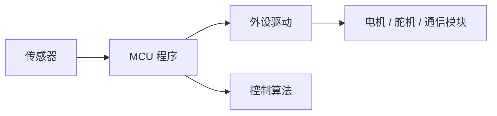

# Lec 1 Foundation

C 语言嵌入式开发基础

RoboMaster Summer Camp 2026

---
layout: two-cols-header
---

# 课程目标

::left::

## 你将建立的能力

- 读懂嵌入式 C 工程的基本结构
- 理解变量、指针、数组、结构体在 MCU 中的使用方式
- 知道如何用 Git 保存和同步代码
- 为后续外设、通信、控制算法课程打基础

::right::

## 今天不追求

- 一次讲完所有 C 语言细节
- 直接上复杂驱动和 RTOS
- 背 API 或机械记语法

重点是把开发环境、语言模型和工程习惯搭起来。

---

# 上课物品准备

- 笔记本电脑
- 插线板
- USB 数据线
- 开发板和调试器
- 已安装的编辑器、编译工具链、Git

---
layout: section
---

# C 语言

---

# C 在嵌入式里的位置



C 语言是连接硬件寄存器、驱动代码和上层控制逻辑的主要工具。

---

# 最小 C 程序结构

```c
#include <stdint.h>
#include <stdbool.h>

int main(void) {
  while (true) {
    // main loop
  }
}
```

- `#include` 引入头文件
- `main` 是程序入口
- 嵌入式程序通常不会自然退出

---

# 类型与硬件意识

```c
#include <stdint.h>

uint8_t  mode = 0;
uint16_t speed_rpm = 3500;
int16_t  current_ma = -120;
float    angle_deg = 15.5f;
```

嵌入式开发更关心类型的宽度、符号、内存占用和数据范围。

---

# 指针：地址就是接口

```c
uint32_t value = 42;
uint32_t *ptr = &value;

*ptr = 100;
```

- `&value` 取得变量地址
- `ptr` 保存地址
- `*ptr` 访问地址里的值

---

# 结构体：把相关数据放在一起

```c
typedef struct {
  float yaw;
  float pitch;
  float roll;
} Attitude;

Attitude imu = {
  .yaw = 0.0f,
  .pitch = 0.0f,
  .roll = 0.0f,
};
```

结构体适合表达传感器数据、控制参数、通信报文和模块状态。

---
layout: section
---

# Git

---

# Git 的基本节奏

```bash
git status
git add .
git commit -m "Add first embedded C example"
git push
```

Git 不是只在项目结束时使用，而是开发过程中持续保存有效状态。

---

# 课堂练习

1. 创建一个 C 文件，写出最小 `main` 循环
2. 定义一个结构体保存 IMU 姿态数据
3. 修改一次代码并用 Git 提交
4. 说明这次提交解决了什么问题

---
layout: end
---

# Q&A

下一讲：开发环境、编译流程与第一个外设实验
