# Embedded C Development

嵌入式 C 开发基础

RM Summer Camp 2026


---
layout: section
---


# Git 基础

本地历史、分支与远程同步

---

# 本地提交历史

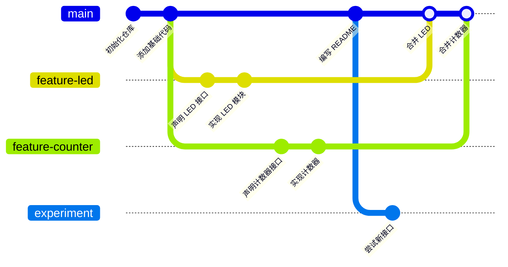

- `commit`：一次可追踪的工程快照
- `branch`：指向某个提交的分支名称

---

# `main` 和 `HEAD`


- `main`：当前分支名
- `HEAD`：你当前所在的位置

后续通过实操观察 `HEAD` 随分支切换和提交移动。

---

# Git 和 GitHub

| 名称 | 作用 |
| --- | --- |
| Git | 本地版本管理工具 |
| GitHub | 远程代码托管平台 |

Git 是完全独立的工具，GitHub 是基于 Git 的在线服务。

其他类似平台：GitLab、Bitbucket、Gitee 等。

查看当前设置的远程：

```bash
git remote -v
```

---

# Example Project 1

```bash
mkdir proj-1
cd proj-1
```

本节 Git 操作都围绕这个项目理解：

```text
proj-1/
├── include/
├── src/
├── README.md
└── .gitignore
```

---

# 初始化仓库

```bash
git init
```

初始化前：

```text
proj-1/
├── include/
├── src/
└── README.md
```

初始化后：

```text {2}
proj-1/
├── .git/
├── include/
├── src/
└── README.md
```

<!--
Presenter notes:
`.git` 是隐藏目录。
macOS Finder 显示隐藏文件：Command + Shift + .
Windows 文件资源管理器：View/查看 -> Show/显示 -> Hidden items/隐藏的项目。
命令行中可以用 `ls -la` 查看隐藏文件。
-->

---

# `.git/` 是什么

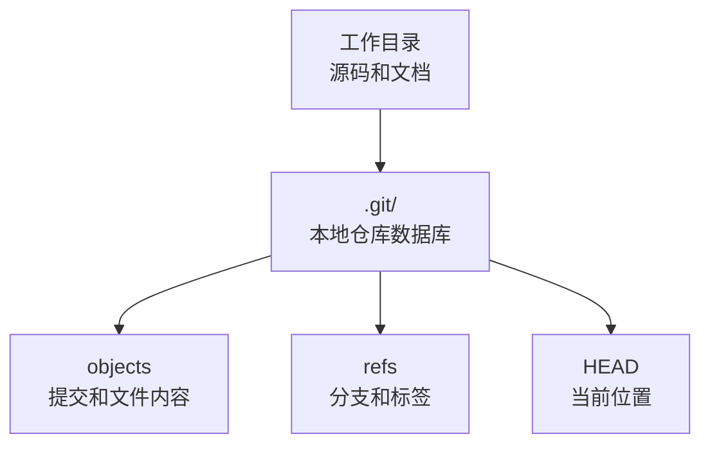

`.git/` 记录仓库历史和元数据。

---

# `.git/` 的特性

- 它是隐藏目录
- 它让当前目录变成 Git 仓库
- 删除 `.git/` 后，文件还在，但 Git 历史消失
- 不要手动修改 `.git/` 内部文件
- 移动整个项目目录时，`.git/` 要一起保留

---

# 初始化后先看状态

```bash
git status
```

可能看到：

```text
On branch main

No commits yet

Untracked files:
  README.md
  include/
  src/
```

`status` 是 Git 里最常用的安全检查。

---

# Git 的三个区域


- Working Tree：你正在改的文件
- Staging Area：下一次 commit 的候选内容
- Repository：已经提交的历史

---

# 实操：加入暂存区

```bash
git status
git add README.md include/ src/
git status
```

`git add` 不是上传。

它只是把文件放进 staging area，准备进入下一次 commit。

加入当前所有改动：

```bash
git add .
```

---

# 实操：创建第一次提交

```bash
git commit -m "init project"
```

查看历史：

```bash
git log --oneline
```

commit message 应该描述这次提交的工程意图。

---

# 三个区域完整流程

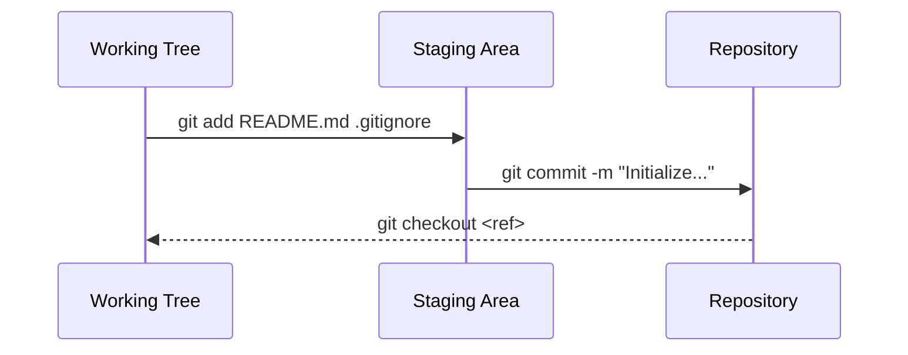

---

# Git Graph GUI

今天使用 VS Code 插件：

```text
Git Graph
```

它是 Git 历史的图形视图，不是另一个版本管理系统。

---

# 命令行和 Git Graph 的关系

| 命令行 | Git Graph |
| --- | --- |
| `git log --oneline` | 提交列表 |
| `git branch` | 分支视图 |
| `git diff` | 文件变化 |
| `git checkout` / `switch` | 切换位置 |

---

# `.gitignore`

```text
# Build artifacts
build/
*.o
*.a
*.elf
*.bin
*.hex
*.map
*.exe
*.out

# IDE files
.vscode/
.idea/

# OS files
.DS_Store
Thumbs.db
```

`.gitignore` 用来避免把本地构建产物和临时文件提交进仓库。

---

# `.gitignore` 的注意点

- 只影响还没有被 Git 跟踪的新文件
- 已经提交过的文件，后来写进 `.gitignore` 不会自动消失
- 课程项目里通常不提交 `build/`
- 团队项目里有些 `.vscode` 配置可以提交，看约定

---

# 课后拓展：`.gitattributes` 和 `.gitkeep`

`.gitattributes`：

- 控制换行符
- 控制语言统计
- 控制 merge 策略

`.gitkeep`：

- 不是 Git 官方机制
- 常用于保留空目录
- 本节不展开

---

# 分支是什么

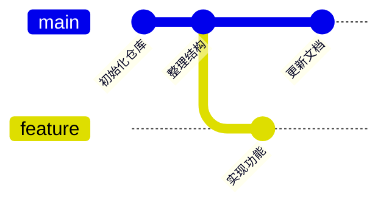

分支是一条开发线。

---

# 创建和切换分支

```bash
git switch -c new-branch-1
# Or equivalently:
git checkout -b new-branch-2
```

做一些修改后：

```bash
git status
git add src/counter.c
git commit -m "Update counter demo"
```

---

# `git merge`

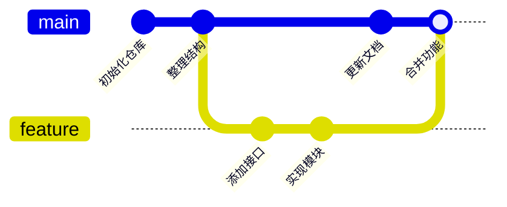

merge 把另一条分支的修改合回**当前分支**。


```bash
git switch main
git merge feature/demo-counter
```


拓展内容：

- rebase
- squash


---

# Merge Conflict 是什么

```text
同一个文件的同一段内容
在两个分支里被不同方式修改
Git 无法自动决定保留哪一个
```

处理原则：

- 先读冲突内容
- 决定最终代码
- 删除冲突标记
- `git add`
- `git commit`

---

# `git stash`

stash 用来临时放下当前改动。

适合场景：

- 你改到一半，需要切分支
- 你想先 pull 远程更新
- 你不想马上 commit 当前实验性修改

---

# Stash 图示


stash 不是长期保存方案，长期保存用 commit。

---

# Stash 实操

```bash
git status
git stash push -m "try counter changes"
git status
git stash list
git stash pop
```

常用命令：

- `git stash -u`: 连 untracked 文件一起 stash
- `git stash list`: 查看 stash 列表
- `git stash pop`: 恢复最近一次 stash 并从 stash 列表删除
- `git stash drop`: 删除 stash 列表中的某个 stash

---

# Remote 和 GitHub


`origin` 只是远程仓库的常用名字。

---

# Remote 基本操作

查看远程：

```bash
git remote -v
```

添加远程：

```bash
git remote add origin <repo-url>
```

push：

```bash
git push origin main:main
git push origin main

git push --set-upstream origin main
git push -u origin main

git push
```

---

# `push` / `fetch` / `pull`

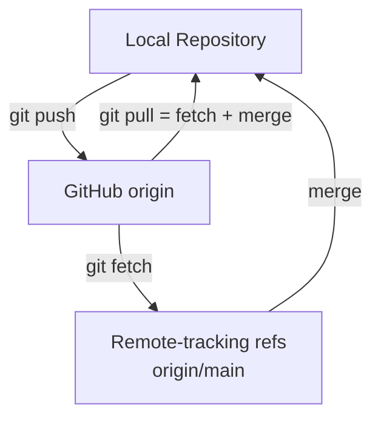

`pull` 本质是 `fetch` 后再 `merge`。

---

# `git fetch`

```bash
git fetch origin
```

作用：

- 下载远程最新历史
- 不直接改你的当前分支文件
- 可以先观察远程发生了什么

---

# `git pull`

```bash
git pull
```

等价直觉：

```bash
git fetch origin && git merge origin/main
```

改代码前先 pull，是团队协作里的基本习惯。

---

# Clone 仓库到本地

HTTPS：

```bash
git clone https://github.com/user/repo.git
```

SSH：

```bash
git clone git@github.com:user/repo.git
```

HTTPS 更直观；SSH 更适合长期开发。

---

# GitHub Repo 权限

| 权限 | 含义 |
| --- | --- |
| Public | 任何人可见 |
| Private | 只有授权用户可见 |
| Collaborator | 被邀请的协作者 |
| Branch Protection | 保护重要分支 |

---

# Branch Protection

常见保护规则：

- 禁止直接 push 到 `main`
- 要求 Pull Request
- 要求 review
- 要求 CI 通过

本节只知道概念，不现场配置。

---

# 课后拓展

| 功能 | 用途 |
| --- | --- |
| `git tag` | 给版本打标签 |
| `git cherry-pick` | 选择性地应用某个提交 |
| `git submodule` | 引入另一个 Git 仓库 |
| `git worktree` | 一个仓库多个工作目录 |
| Git hooks | 在 commit/push 前后执行脚本 |

一个有趣的网站：https://learngitbranching.js.org/

---
layout: section
---

# 桌面端 C 工程构建

Example Project 1

---

# C/C++ 标准与实现

标准不是编译器。

| 层次 | 作用 |
| --- | --- |
| ISO C / C++ 标准 | 定义语言规则和标准库接口 |
| 编译器实现 | 把源代码翻译成目标平台代码 |
| 标准库实现 | 提供 `printf`、`malloc`、`std::vector` 等函数和类型 |
| 平台与 ABI | 规定函数调用、对象格式、链接方式 |

---

# 一个实现包含什么

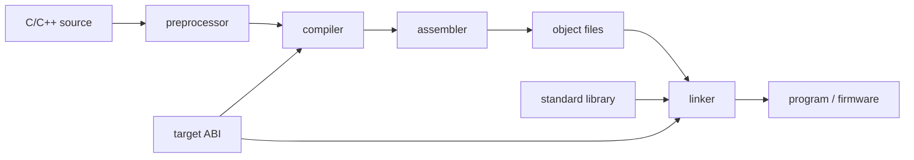

常见实现组合：

- GCC + glibc / newlib / libstdc++
- Clang + libc / libc++
- MSVC + Windows SDK

---

# 标准保证什么

标准保证：

- `int main(void)` 的语言语义
- `#include <stdio.h>` 这样的标准库接口
- 表达式、控制流、类型系统的基本规则

标准不保证：

- `int` 一定是 32 bit
- 可执行文件一定是 ELF / PE / Mach-O
- 裸机环境一定有 `printf`
- 同一段代码在所有目标平台生成相同机器码


---

# Example Project 1 文件结构

```text
proj-1/
├── README.md
├── .gitignore
├── include/
│   ├── counter.h
│   └── led.h
└── src/
    ├── counter.c
    ├── led.c
    └── main.c
```

---

# 两个模块

| 模块      | 作用                      |
| --------- | ------------------------- |
| `led`     | 用 `printf` 模拟 LED 状态 |
| `counter` | 维护一个简单计数器        |

---

## `led.h`

```c
#pragma once

void led_on(void);
void led_off(void);
void led_toggle(void);
int led_get_state(void);
```

<br/>

## `counter.h`

```c
#pragma once

void counter_init(int value);
int counter_increment(void);
int counter_get(void);
```

`.h` 放接口，`.c` 放实现。

---

# `main.c` 使用模块

```c
#include <stdio.h>

#include "counter.h"
#include "led.h"

int main(void) {
  counter_init(0);

  led_on();
  printf("counter = %d\n", counter_increment());

  led_toggle();
  printf("counter = %d\n", counter_increment());

  led_off();
  printf("final counter = %d\n", counter_get());
  return 0;
}
```

---

# 一步构建

```bash
mkdir -p build

gcc -Iinclude src/main.c src/led.c src/counter.c \
  -o build/main
```

这条命令内部会完成：

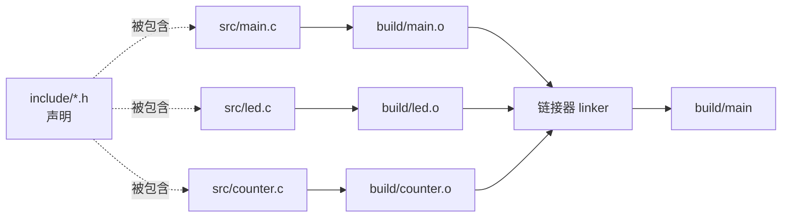

---

# 运行结果

```bash
./build/main
```

```text
LED ON
counter = 1
LED OFF
counter = 2
LED OFF
final led state = 0
final counter = 2
```

桌面端程序由操作系统加载并运行。

---

# `-Iinclude` 是什么

```bash
gcc -Iinclude src/main.c src/led.c src/counter.c \
  -o build/main
```

`-Iinclude` 把 `include/` 加入头文件搜索路径。

```text
desktop-c-build/
├── include/
│   ├── counter.h
│   └── led.h
└── src/
    ├── counter.c
    ├── led.c
    └── main.c
```

每个 `.c` 文件都是独立编译单元，都会独立处理自己的 `#include`。

---

# 引号形式：`#include "..."`

```c
#include "led.h"
```

常见搜索顺序：

```text
1. 当前源文件所在目录
2. `-I` 指定的目录
3. 编译器默认系统目录
```

适合包含项目自己的头文件。

---

# 尖括号形式：`#include <...>`

```c
#include <stdio.h>
```

常见搜索顺序：

```text
1. `-I` 指定的目录
2. 编译器默认系统目录
```

适合包含标准库、SDK 或工具链提供的头文件。

---

# 本项目的 include 搜索

编译 `src/main.c` 时：

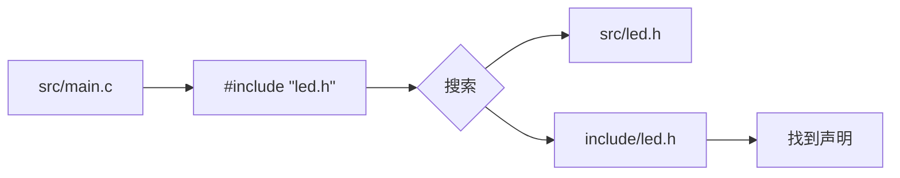

`src/led.h` 不存在，所以需要 `-Iinclude`。

---

# 错误 1：找不到头文件

去掉 `-Iinclude`：

```bash
gcc src/main.c src/led.c src/counter.c \
  -o build/main
```

可能看到：

```text
fatal error: led.h: No such file or directory
```

这是编译阶段错误。

---

# 错误 2：找不到函数实现

忘记 `src/counter.c`：

```bash
gcc -Iinclude src/main.c src/led.c \
  -o build/main
```

可能看到：

```text
undefined reference to `counter_init`
```

这是链接阶段错误。

---

# Include 不是 Link

```c
#include "counter.h"
```

解决：

```text
编译器能不能看懂函数声明
```

不解决：

```text
链接器能不能找到函数实现
```

---

# 可选：预处理

```bash
gcc -Iinclude -E src/main.c -o build/main.i
```

预处理会处理：

- `#include`
- `#define`
- 条件编译

生成的 `main.i` 通常很大，不需要提交。

---

# 可选：生成汇编

```bash
gcc -Iinclude -S src/main.c -o build/main.s
```

这一步用于观察：

```text
C code -> assembly
```

---

# 可选：只编译不链接

```bash
gcc -Iinclude -c src/main.c -o build/main.o
```

`.o` 是 object file。

- 不是可执行文件
- 还没有和其他 `.o` / library 合并
- 最终需要 linker 参与

---

# 静态库是什么

把多个 object file 打包：

```bash
gcc -Iinclude -c src/led.c -o build/led.o
gcc -Iinclude -c src/counter.c -o build/counter.o
ar rcs build/libdriver.a build/led.o build/counter.o
```

链接：

```bash
gcc -Iinclude -c src/main.c -o build/main.o
gcc build/main.o -Lbuild -ldriver -o build/app
```

---

# 桌面端工具链

| 平台    | 常见工具                               |
| ------- | -------------------------------------- |
| Linux   | GCC / Clang / Make / CMake / GDB       |
| Windows | MSVC / MinGW-w64 / LLVM                |
| macOS   | Apple Clang / Xcode Command Line Tools |

C/C++ 的核心是提前编译和链接。

---

# 和其他语言对比

| 语言       | 常见运行方式                 |
| ---------- | ---------------------------- |
| Python     | 解释器运行 `.py`             |
| Java       | 编译到 bytecode，由 JVM 运行 |
| JavaScript | 浏览器或 Node.js 执行        |
| C/C++      | 编译、链接成本机程序         |

---

# IDE、LSP、Compiler 的分工

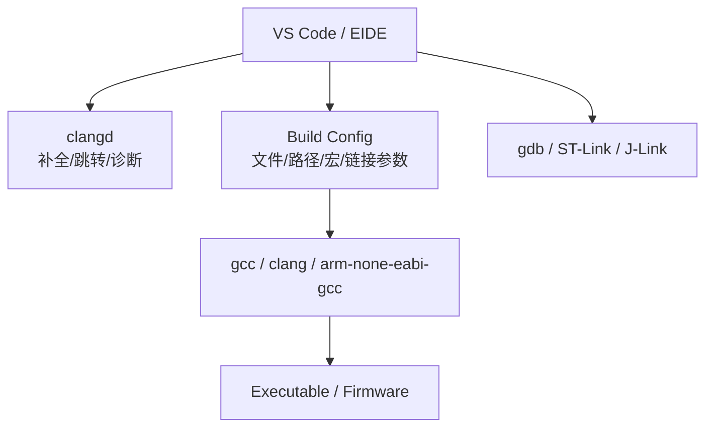

---

# clangd 为什么会报错

clangd 需要知道：

- include paths
- macros
- language standard
- target architecture
- compile commands

工程能编译但编辑器红线很多，通常是 clangd 没拿到正确构建参数。

---
layout: section
---

# 从桌面端到嵌入式

Example Project 2

---

# Example Project 2 的目标

- 把同类 C 工程迁移到 `arm-none-eabi-gcc`
- 理解为什么不能直接运行 `.elf`
- 理解 startup code 和 vector table
- 理解 linker script 和 Flash/RAM
- 生成 `.elf`、`.bin`、`.hex`
- 再看 EIDE 如何保存这些构建配置

---

# Example Project 2 文件结构

```bash
mkdir proj-2
cd proj-2
```

```text
proj-2/
├── include/
│   ├── counter.h
│   └── led.h
├── linker/
│   └── stm32f407ighx_min.ld
└── src/
    ├── counter.c
    ├── led.c
    ├── main.c
    └── startup.c
```

---

# 目标平台

| 项目   | 值                    |
| ------ | --------------------- |
| MCU    | STM32F407IGHx         |
| CPU    | Arm Cortex-M4         |
| Flash  | `0x08000000`, 1024 KB |
| RAM    | `0x20000000`, 128 KB  |
| CCMRAM | `0x10000000`, 64 KB   |

---

# 裸机端模块变化

桌面端 `led`：

```text
printf("LED ON")
```

裸机端 `led`：

```text
volatile state variable
```

不绑定具体 GPIO，因为 Project 2 只讲工具链和启动流程。

---

# 裸机 `main`

```c
#include "counter.h"
#include "led.h"

int main(void) {
  counter_init(0);
  led_off();

  while (1) {
    led_toggle();
    counter_increment();
  }
}
```

嵌入式程序通常不会自然退出。

---

# 一步生成 ELF

```bash
mkdir -p build

arm-none-eabi-gcc -mcpu=cortex-m4 -mthumb \
  -nostdlib -Iinclude \
  -T linker/stm32f407ighx_min.ld \
  src/startup.c src/main.c src/led.c src/counter.c \
  -o build/firmware.elf
```

---

# 命令里的关键参数

| 参数              | 含义                   |
| ----------------- | ---------------------- |
| `-mcpu=cortex-m4` | 目标 CPU               |
| `-mthumb`         | Thumb 指令集           |
| `-nostdlib`       | 不使用默认标准启动和库 |
| `-Iinclude`       | 头文件搜索路径         |
| `-T ...ld`        | 指定 linker script     |

---

# 生成烧录文件

```bash
arm-none-eabi-objcopy -O binary \
  build/firmware.elf build/firmware.bin

arm-none-eabi-objcopy -O ihex \
  build/firmware.elf build/firmware.hex

arm-none-eabi-size build/firmware.elf
```

`.elf` 是链接产物，`.bin/.hex` 是烧录常用格式。

---

# 桌面端 vs 裸机

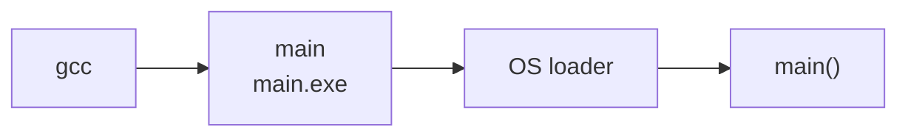


---

# ELF 无法直接运行

```bash
./build/firmware.elf
```

原因：

- 它是给 Cortex-M4 的，不是给当前电脑 CPU 的
- 它依赖 MCU 的内存映射
- 它从 `Reset_Handler` 开始，不是操作系统进程入口

---

# 为什么桌面端不需要手写

桌面端程序启动链路：


桌面端通常由系统工具链提供：

- OS loader：装载程序、建立进程地址空间
- C runtime：准备栈、全局变量、标准库运行环境
- linker 默认脚本：由系统工具链隐式提供

裸机端没有 OS loader，也没有默认进程运行时。

---

# 嵌入式启动流程

```text
Power on / Reset
  -> vector table
  -> Reset_Handler
  -> copy .data
  -> clear .bss
  -> main
  -> while (1)
```

`main` 不是芯片执行的第一段代码。

---

# Vector Table

```c
typedef void (*ISR_t)(void);

__attribute__((section(".isr_vector"), used))
const ISR_t vector_table[] = {
  &_estack,
  Reset_Handler,
};
```

向量表至少要告诉 CPU：

- 初始栈顶在哪里
- Reset 后跳到哪里

---

# Reset Handler 的作用

`Reset_Handler` 是复位后执行的第一段 C 级启动代码。

它负责把运行环境整理到 `main()` 可以正常执行的状态：


桌面程序通常由操作系统和运行时完成这些工作；裸机程序必须自己完成。

---

# Reset Handler

```c
void Reset_Handler(void) {
  uint32_t *src = &_sidata;
  uint32_t *dst = &_sdata;

  while (dst < &_edata) {
    *dst++ = *src++;
  }

  dst = &_sbss;
  while (dst < &_ebss) {
    *dst++ = 0;
  }

  main();
}
```

对应关系：

- `&_sidata -> &_sdata`：把有初值变量从 Flash 拷贝到 RAM
- `&_sbss -> &_ebss`：把零初始化变量清零
- `main()`：进入用户程序

---

# `.data` 和 `.bss`

| 段      | 含义                  | 启动时做什么        |
| ------- | --------------------- | ------------------- |
| `.text` | 代码和只读常量        | 放在 Flash          |
| `.data` | 有初值的全局/静态变量 | 从 Flash 拷贝到 RAM |
| `.bss`  | 零初始化全局/静态变量 | 在 RAM 中清零       |

---

# Linker Script: MEMORY

```text
MEMORY
{
  FLASH  (rx)  : ORIGIN = 0x08000000, LENGTH = 1024K
  RAM    (xrw) : ORIGIN = 0x20000000, LENGTH = 128K
  CCMRAM (xrw) : ORIGIN = 0x10000000, LENGTH = 64K
}

_estack = ORIGIN(RAM) + LENGTH(RAM);
```

STM32F407IGHx 的最小布局（示例）。

---

# Linker Script: SECTIONS

```text
.isr_vector : {
  KEEP(*(.isr_vector))
} > FLASH

.text : {
  *(.text*)
  *(.rodata*)
} > FLASH

_sidata = LOADADDR(.data);
```

告诉 linker 各类内容放到哪里。

---

# Linker Script: data / bss

```text
.data : {
  _sdata = .;
  *(.data*)
  _edata = .;
} > RAM AT > FLASH

.bss : {
  _sbss = .;
  *(.bss*)
  *(COMMON)
  _ebss = .;
} > RAM
```

这些符号会被 `startup.c` 使用。

---

# Startup 与 Linker Script 分工

| 文件 | 负责内容 |
| --- | --- |
| `startup.c` | 提供 vector table、定义 `Reset_Handler`、初始化 `.data`、清零 `.bss`、调用 `main()` |
| linker script | 声明 Flash/RAM 地址、安排 section 位置、导出启动所需符号 |

核心关系：

```text
linker script 定义内存布局和符号
startup.c 使用这些符号完成启动初始化
```

---

# Startup 与 Linker Script 如何配合

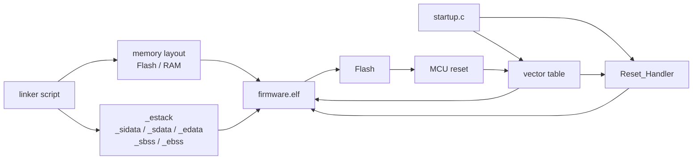

没有这两部分，芯片不知道从哪里开始，也不知道代码和数据应该放在哪里。

---

# 可选：拆开编译和链接

```bash
arm-none-eabi-gcc -mcpu=cortex-m4 -mthumb \
  -Iinclude -c src/startup.c -o build/startup.o

arm-none-eabi-gcc -mcpu=cortex-m4 -mthumb \
  -Iinclude -c src/main.c -o build/main.o
```

每个 `.c` 可以先变成 `.o`。

---

# 可选：再链接 ELF

```bash
arm-none-eabi-gcc -mcpu=cortex-m4 -mthumb \
  -nostdlib \
  -T linker/stm32f407ighx_min.ld \
  build/startup.o build/main.o \
  build/led.o build/counter.o \
  -o build/firmware.elf
```

一步命令只是把这些阶段合在一起。

---

# 嵌入式工具链对比

| 工具链              | 常见场景                           |
| ------------------- | ---------------------------------- |
| `arm-none-eabi-gcc` | 开源、跨平台、EIDE/CMake/Make 常用 |
| Arm Compiler 5      | 老 Keil MDK 项目                   |
| Arm Compiler 6      | 新 Keil MDK，基于 LLVM/Clang       |
| IAR EWARM           | 商业工业项目                       |
| LLVM bare-metal     | 可用，但配置更复杂                 |

---

# Project 2 补充：外设配置的底层原理

本页开始只做实例讲解，不现场实操。

目标是理解：

```text
配置外设 = 按参考手册要求读写寄存器
```

HAL、LL、CMSIS 和手写寄存器代码，本质上都在操作这些地址。

---

# 外设寄存器是内存地址

在 Cortex-M MCU 里，外设寄存器通常映射到固定内存地址。


对 C 代码来说，访问寄存器就是访问一个 `volatile` 指针。

---

# 示例：寄存器地址定义

下面示例使用 STM32F4 常见地址，演示 `GPIOD` 的一个输出引脚。

```c
#include <stdint.h>

#define REG32(addr) (*(volatile uint32_t *)(addr))

#define RCC_BASE        0x40023800UL
#define GPIOD_BASE      0x40020C00UL

#define RCC_AHB1ENR     REG32(RCC_BASE + 0x30UL)
#define GPIOD_MODER     REG32(GPIOD_BASE + 0x00UL)
#define GPIOD_ODR       REG32(GPIOD_BASE + 0x14UL)
#define GPIOD_BSRR      REG32(GPIOD_BASE + 0x18UL)
```

这些地址来自芯片参考手册，不是 C 语言自己规定的。

---

# 第一步：打开外设时钟

STM32 外设默认不一定有时钟。

使用 `GPIOD` 前，需要先打开 `RCC` 里的对应时钟位。

```c
#define RCC_AHB1ENR_GPIODEN (1U << 3)

static void GPIOD_EnableClock(void) {
  RCC_AHB1ENR |= RCC_AHB1ENR_GPIODEN;
}
```

如果外设时钟没开，后续配置寄存器通常不会得到预期效果。

---

# 第二步：配置 GPIO 模式

以 `PD12` 为例，把 pin mode 配成通用输出模式。

```c
#define LED_PIN 12U

static void PD12_ConfigOutput(void) {
  uint32_t shift = LED_PIN * 2U;

  GPIOD_MODER &= ~(3U << shift);
  GPIOD_MODER |=  (1U << shift);
}
```

`MODER` 每个引脚占 2 bit，所以 `PD12` 对应 bit 24 和 bit 25。

---

# 第三步：写 GPIO 输出

`BSRR` 常用于原子置位和复位。

```c
static void PD12_On(void) {
  GPIOD_BSRR = (1U << LED_PIN);
}

static void PD12_Off(void) {
  GPIOD_BSRR = (1U << (LED_PIN + 16U));
}

static void PD12_Toggle(void) {
  GPIOD_ODR ^= (1U << LED_PIN);
}
```

真实项目里要继续考虑电气连接、默认电平、速度、上下拉和复用功能。

---

# 合起来看

```c
void Led_LowLevelInit(void) {
  GPIOD_EnableClock();
  PD12_ConfigOutput();
}

void Led_Toggle(void) {
  PD12_Toggle();
}
```

这就是最小的寄存器级 GPIO 控制流程：

```text
开时钟 -> 配模式 -> 写输出寄存器
```

---

# HAL / LL 做了什么

HAL 写法可能是：

```c
__HAL_RCC_GPIOD_CLK_ENABLE();

GPIO_InitTypeDef init = {0};
init.Pin = GPIO_PIN_12;
init.Mode = GPIO_MODE_OUTPUT_PP;
init.Pull = GPIO_NOPULL;
init.Speed = GPIO_SPEED_FREQ_LOW;
HAL_GPIO_Init(GPIOD, &init);

HAL_GPIO_TogglePin(GPIOD, GPIO_PIN_12);
```

它最终仍然会写 `RCC` 和 `GPIO` 相关寄存器。

---

# 看寄存器代码时关注什么

- `volatile`：告诉编译器每次都要真实访问内存地址
- bit mask：用位运算修改某几个 bit
- read-modify-write：先读寄存器，再清位或置位
- clock enable：很多外设必须先开时钟
- reference manual：寄存器地址、偏移和 bit 定义的来源

后续使用 CubeMX 和 HAL 时，仍然要知道这些配置最后落到哪里。

---
layout: section
---

# Project 2 EIDE

教师详细演示：自动构建系统不是魔法

---

# EIDE Project

实际路径：

```text
../demo-projects/baremetal-arm-build-EIDE
```

关键文件：

```text
baremetal-arm-build-EIDE/
├── .eide/
│   ├── eide.yml
│   └── files.options.yml
├── .vscode/
│   └── tasks.json
└── baremetal-arm-build-EIDE.code-workspace
```

---

# EIDE 做了什么

EIDE 不替代编译器。

```text
EIDE project config
  -> source files
  -> include paths
  -> defines
  -> CPU / FPU options
  -> linker script
  -> output path
  -> calls toolchain
```

---

# 手写命令到 EIDE 配置

| 手写命令             | EIDE 配置                |
| -------------------- | ------------------------ |
| `src/*.c`            | `srcDirs` / source files |
| `-Iinclude`          | `incList`                |
| `-mcpu=cortex-m4`    | `cpuType: Cortex-M4`     |
| `-T ...ld`           | `scatterFilePath`        |
| `build/firmware.elf` | `outDir` + target output |

---

# `.eide/eide.yml`: project

```yaml
version: "4.1"
name: baremetal-arm-build-EIDE
type: ARM
srcDirs:
  - src
outDir: build
```

这里定义项目类型、源码目录和输出目录。

---

# `.eide/eide.yml`: include

```yaml
cppPreprocessAttrs:
  defineList: []
  incList:
    - include
  libList: []
```

这对应命令里的：

```bash
-Iinclude
```

---

# `.eide/eide.yml`: toolchain

```yaml
toolchain: GCC
toolchainConfigMap:
  GCC:
    cpuType: Cortex-M4
    floatingPointHardware: single
```

这对应：

```bash
arm-none-eabi-gcc -mcpu=cortex-m4
```

---

# FPU 设置要小心

EIDE 中可能配置：

```yaml
floatingPointHardware: single
$float-abi-type: hard
```

课堂重点：

- CPU 是 Cortex-M4
- FPU / ABI 要和目标芯片、库、启动文件匹配
- 混用 soft/hard float 可能导致链接问题

---

# `.eide/eide.yml`: linker

```yaml
scatterFilePath: linker/stm32f407ighx_min.ld
useCustomScatterFile: true
```

这对应：

```bash
-T linker/stm32f407ighx_min.ld
```

---

# `.eide/files.options.yml`

```yaml
version: "2.1"
options:
  Debug:
    files: {}
    virtualPathFiles: {}
```

这个文件用于给特定文件追加编译选项。

初学阶段先理解“默认无特殊文件选项”即可。

---

# EIDE 和手写命令的关系

```mermaid
flowchart LR
  A[手写命令] --> B[参数拆分]
  B --> C[EIDE 配置文件]
  C --> D[EIDE 调用 arm-none-eabi-gcc]
  D --> E[firmware.elf]
```

自动构建系统保存的是工程决策，不是隐藏原理。

---

# EIDE 常见错误 1

找不到头文件：

```text
fatal error: led.h: No such file or directory
```

检查：

- `incList`
- include path 是否相对项目根目录
- 文件是否真的在 `include/`

---

# EIDE 常见错误 2

链接失败：

```text
undefined reference to `counter_increment`
```

检查：

- `src/counter.c` 是否在源码目录内
- 文件是否被 exclude
- 函数名声明和定义是否一致

---

# EIDE 常见错误 3

启动或链接脚本问题：

```text
undefined reference to `_estack`
```

检查：

- linker script 是否正确指定
- startup 里用到的符号是否在 `.ld` 中定义
- section 名是否一致

---

# EIDE 演示顺序

1. 打开 workspace
2. 查看 `.eide/eide.yml`
3. 找到 `srcDirs`
4. 找到 `incList`
5. 找到 `cpuType`
6. 找到 `scatterFilePath`
7. 触发 build
8. 对照输出命令和产物

---

# Project 2 到 Project 3

Project 2 仍然不是完整 STM32 应用。

缺少：

- CMSIS
- HAL / LL
- CubeMX 初始化代码
- 真实 GPIO 配置
- 时钟树配置
- 中断和外设初始化

这些交给 Project 3。

---
layout: section
---

# Example Project 3

完整的 STM32 工程

---

# Example Project 3 的目标

- CubeMX 选择芯片/开发板
- 配置基础时钟
- 配置一个 GPIO 输出
- 生成 STM32 工程
- 识别 CMSIS / HAL / startup / linker
- 配置或导入 EIDE
- 编译、烧录、提交 Git

---

# Project 3 和前两个的区别

| Project   | 代码来源               | 目标                |
| --------- | ---------------------- | ------------------- |
| Project 1 | 手写桌面 C             | 理解 C 构建         |
| Project 2 | 手写裸机 C             | 理解交叉编译和启动  |
| Project 3 | CubeMX 生成 + 用户代码 | 完成真实 STM32 工程 |

---

# Step 1: 新建 CubeMX 工程

选择方式：

- 有固定开发板：优先 Board Selector
- 自定义板：选择具体 MCU

本课目标：

```text
STM32F407IGHx / 对应课程开发板
```

---

# STM32 名词分层

```mermaid
flowchart TB
  Board[开发板] --> MCU[STM32F407IGHx MCU]
  MCU --> Core[Arm Cortex-M4 core]
  MCU --> Memory[Flash / SRAM / CCMRAM]
  MCU --> Peripherals[GPIO / UART / SPI / I2C / TIM / ADC / CAN]
```

---

# MCU 生态的几个层级

| 层级 | 示例 |
| --- | --- |
| 1. 指令集架构 | Arm / RISC-V / Xtensa / AVR |
| 2. 处理器内核 | Cortex-M4 / Cortex-M7 / RV32IMC |
| 3. 芯片系列 | STM32F1 / STM32F4 / STM32H7 |
| 4. 具体型号 | STM32F407IGHx |
| 5. 开发板 | 课程板 / Nucleo / Discovery |
| 6. 软件支持 | CMSIS / HAL / LL / RTOS |

```text
架构 -> 内核 -> 系列 -> 型号 -> 开发板 -> 软件支持
```

先分清层级，再看资料、配置工具和报错信息。

---

# 架构与内核示例

| 层级 | 例子 | 说明 |
| --- | --- | --- |
| 指令集架构 | Armv7-M / Armv8-M | CPU 能执行什么指令、异常模型如何定义 |
| 指令集架构 | RISC-V RV32 / RV64 | 开放指令集，常见于新 MCU 和 SoC |
| 处理器内核 | Cortex-M3 / M4 / M7 | 面向 MCU 的 Arm 内核 |
| 处理器内核 | Cortex-A53 / A72 | 面向应用处理器，通常运行 Linux |
| 处理器内核 | Xtensa LX6 / LX7 | ESP32 系列常见内核 |

`Cortex-*` 是 Arm 的处理器内核产品线，不是某个具体芯片。

---

# Cortex-M 与 Cortex-A

| 项目 | Cortex-M | Cortex-A |
| --- | --- | --- |
| 典型用途 | MCU、实时控制、低功耗设备 | 应用处理器、手机、Linux 板卡 |
| 常见系统 | 裸机、RTOS | Linux、Android |
| 启动关注点 | vector table、`Reset_Handler`、中断 | bootloader、MMU、操作系统启动 |
| 例子 | Cortex-M0 / M3 / M4 / M7 / M33 | Cortex-A7 / A53 / A72 |
| 课程相关 | STM32F407 使用 Cortex-M4 | 不作为本课主线 |

同属 Arm 生态，但开发模型差别很大。

---

# STM32 系列示例

| 系列 | 常见定位 | 例子 |
| --- | --- | --- |
| STM32F1 | 经典入门、资源适中 | STM32F103 |
| STM32F4 | 性能更高，常见于控制和机器人 | STM32F407 / STM32F429 |
| STM32H7 | 高性能 MCU，频率和外设更强 | STM32H743 / STM32H750 |
| STM32G0 / G4 | 新一代通用或电机控制方向 | STM32G030 / STM32G431 |
| STM32L4 / U5 | 低功耗方向 | STM32L432 / STM32U575 |
| STM32WB / WL | 无线连接方向 | STM32WB55 / STM32WL55 |

同是 STM32，不同系列的内核、外设、时钟树和内存布局都可能不同。

---

# 其他常见 MCU

| 厂商 / 生态 | 例子 | 特点 |
| --- | --- | --- |
| ST | STM32F1 / F4 / H7 | CubeMX、HAL / LL 生态完整 |
| Espressif | ESP32 / ESP32-S3 | Wi-Fi / Bluetooth 常见，Xtensa 或 RISC-V |
| Nordic | nRF52 / nRF53 | 低功耗 Bluetooth 常见 |
| NXP | LPC / i.MX RT | Cortex-M MCU 和高性能 crossover MCU |
| Microchip | AVR / PIC / SAM | 8 bit 到 Cortex-M 产品线都有 |
| TI | MSPM0 / C2000 | 低功耗或电机控制场景常见 |
| GigaDevice | GD32F1 / GD32F4 | 国产常见 Cortex-M MCU |

工具链、SDK 和启动文件会随厂商生态变化，但“内核、内存、外设、启动、链接”的问题仍然存在。

---

# 回到课程目标芯片

| 层级 | 本课对应 |
| --- | --- |
| 指令集 / 内核 | Arm Cortex-M4 |
| MCU 系列 | STM32F4 |
| 具体型号 | STM32F407IGHx |
| 开发对象 | 课程开发板 |
| 生成工具 | STM32CubeMX |
| 工程管理 | EIDE + Arm GCC |
| 软件库 | CMSIS + HAL / LL |

后续遇到配置项时，先判断它属于哪一层。

---

# Step 2: 配置 GPIO

目标：一个 LED 输出。

CubeMX 中：

```text
Pin mode: GPIO_Output
Label: LED_STATUS
Initial level: Low
```

---

# 外设初始化的一般顺序

```text
enable clock
  -> configure pin
  -> configure mode
  -> initialize peripheral
  -> read / write / interrupt
```

CubeMX 的价值之一是帮你生成这些初始化代码。

---

# Step 3: 配置时钟树

今天只需要知道：

- CPU 要有时钟
- 总线要有时钟
- 外设也要有时钟
- 时钟配置错误会导致外设不工作或频率不对

不深入 PLL 公式。

---

# 时钟树概念图

```mermaid
flowchart LR
  HSE[HSE / HSI] --> PLL[PLL]
  PLL --> SYSCLK[SYSCLK]
  SYSCLK --> AHB[AHB]
  AHB --> APB1[APB1 peripherals]
  AHB --> APB2[APB2 peripherals]
```

---

# Step 4: 生成工程

生成后重点看结构，不急着改代码：

```text
stm32-cubemx-eide/
├── Core/
│   ├── Inc/
│   └── Src/
├── Drivers/
│   ├── CMSIS/
│   └── STM32F4xx_HAL_Driver/
├── startup_stm32f407xx.s
└── STM32F407xx_FLASH.ld
```

---

# `Core/Src/main.c`

这里通常包含：

- `main`
- `SystemClock_Config`
- 外设初始化调用
- `while (1)` 主循环
- `USER CODE BEGIN/END`

---

# `Drivers/CMSIS`

*Cortex Microcontroller Software Interface Standard*

CMSIS 提供：

- Cortex-M core 寄存器定义
- startup 相关基础
- 芯片头文件
- 中断号和外设基地址定义

它不是 HAL。

---

# `Drivers/STM32F4xx_HAL_Driver`

*Hardware Abstraction Layer*

HAL 提供：

- GPIO API
- UART API
- TIM API
- ADC API
- CAN API

HAL 更抽象，LL 更接近寄存器。

LL: Low Layer

---

# Startup 和 Linker Script

CubeMX 生成：

```text
stm32-cubemx-eide/
├── startup_stm32f407xx.s
└── STM32F407xx_FLASH.ld
```

对照 Project 2：

- Project 2 是教学最小版
- CubeMX 是真实工程版

---

# Step 5: USER CODE 区域

```c
/* USER CODE BEGIN WHILE */
while (1)
{
  HAL_GPIO_TogglePin(LED_STATUS_GPIO_Port, LED_STATUS_Pin);
  HAL_Delay(500);
}
/* USER CODE END WHILE */
```

用户代码写在保留区，避免重新生成时被覆盖。

---

# CubeMX 重新生成后

一定做：

```bash
git status
git diff
```

重点看：

- 哪些文件被 CubeMX 改了
- 自己写的代码是否保留
- 是否新增了驱动文件
- 是否更新了 `.ioc`
- Windows 上注意 `\r\n` 和 `\n` 换行差异
- 如果 diff 全文件变动，先检查是否只是换行符变化

项目协作时可以用 `.gitattributes` 固定换行策略。

---

# Step 6: 改成 EIDE 项目

需要配置：

- source files
- include directories
- preprocessor definitions
- linker script
- compiler toolchain
- output format
- flash/debug tool

---

# EIDE Source Files

要包含：

```text
stm32-cubemx-eide/
├── Core/
│   └── Src/
│       └── *.c
├── Drivers/
│   └── STM32F4xx_HAL_Driver/
│       └── Src/
│           └── *.c
└── startup_stm32f407xx.s
```

如果某个 `.c` 没进构建，链接时会报 undefined reference。

---

# EIDE Include Paths

常见 include：

```text
stm32-cubemx-eide/
├── Core/
│   └── Inc/
└── Drivers/
    ├── CMSIS/
    │   ├── Include/
    │   └── Device/ST/STM32F4xx/Include/
    └── STM32F4xx_HAL_Driver/
        └── Inc/
```

如果配置错，编译器会找不到 HAL 或芯片头文件。

---

# EIDE Defines

常见宏：

```text
USE_HAL_DRIVER
STM32F407xx
```

宏会影响：

- 头文件选择
- HAL 配置
- 条件编译路径

---

# EIDE Linker Script

真实 CubeMX 工程通常有：

```text
stm32-cubemx-eide/
└── STM32F407xx_FLASH.ld
```

EIDE 中必须指向它。

否则 startup 中的符号和内存布局可能对不上。

---

# Step 7: 编译

检查：

- 是否有 include error
- 是否有 undefined reference
- 是否生成 `.elf`
- 是否生成 `.bin` 或 `.hex`
- output path 是否在 `build/`

先解决第一条错误，不要从最后一屏开始看。

---

# Step 8: 烧录

常见工具：

- ST-Link
- J-Link
- DAPLink

烧录失败先检查：

- 供电
- 线缆
- 调试器
- 目标芯片型号
- reset / boot 配置

---

# Project 3 检查清单

- CubeMX 工程能打开
- EIDE 工程能编译
- LED blink 代码在 `USER CODE` 区域
- Git 里没有提交 `build/`
- README 写清楚怎么编译和烧录
- GitHub 链接可访问

---
layout: section
---

# C OOP 范式

嵌入式 C 里的模块化写法

---

# 为什么讲 C OOP

后续会写很多“对象”：

- LED
- Motor
- IMU
- PID Controller
- Protocol Parser
- Chassis
- Gimbal

C 没有 class，但可以写出清晰的对象风格。

---

# 桌面端 Led

```c
typedef struct {
  const char *name;
  int state;
} Led;

void Led_Init(Led *self, const char *name);
void Led_On(Led *self);
void Led_Off(Led *self);
void Led_Toggle(Led *self);
```

`self` 表示正在操作哪一个对象。

---

# STM32 端 Led

```c
typedef struct {
  GPIO_TypeDef *port;
  uint16_t pin;
} Led;

void Led_Init(Led *self, GPIO_TypeDef *port, uint16_t pin);
void Led_On(Led *self);
void Led_Off(Led *self);
void Led_Toggle(Led *self);
```

接口相似，底层 backend 不同。

---

# 模拟虚表：`ops` 表

C 里可以用函数指针表模拟“同一接口，不同实现”。

```c
typedef struct LedBase LedBase;

typedef struct {
  void (*on)(LedBase *self);
  void (*off)(LedBase *self);
  void (*toggle)(LedBase *self);
} LedOps;

struct LedBase {
  const LedOps *ops;
};
```

`ops` 表类似 C++ 对象里的虚表概念，但需要手动维护。

---

# Base 指针

把公共字段放在结构体第一项，可以用 base 指针访问公共接口。

```c
typedef struct {
  LedBase base;
  const char *name;
  int state;
} DesktopLed;

typedef struct {
  LedBase base;
  GPIO_TypeDef *port;
  uint16_t pin;
} Stm32Led;
```

调用侧只需要 `LedBase *`。

---

# 通过接口调用

```c
void Led_Toggle(LedBase *led) {
  led->ops->toggle(led);
}

void App_Run(LedBase *status_led) {
  Led_Toggle(status_led);
}
```

实际对象可以是：

```c
DesktopLed desktop_led;
Stm32Led stm32_led;
```

应用层依赖接口，底层对象决定具体行为。

---

# 回到具体对象

具体实现函数内部再把 `LedBase *` 转回自己的类型。

```c
static void DesktopLed_Toggle(LedBase *base) {
  DesktopLed *self = (DesktopLed *)base;
  self->state = !self->state;
}

static const LedOps desktop_led_ops = {
  .toggle = DesktopLed_Toggle,
};
```

要求 `base` 是结构体第一项，这样地址才一致。

---

# 课后扩展：`container_of`

如果 `base` 不在结构体第一项，直接强制转换就不成立。

更通用的写法是根据成员地址反推出外层对象地址。

```c
#include <stddef.h>

#define container_of(ptr, type, member) \
  ((type *)((char *)(ptr) - offsetof(type, member)))
```

`offsetof(type, member)` 计算成员在结构体里的偏移。

---

# `container_of` 示例

```c
static void DesktopLed_Toggle(LedBase *base) {
  DesktopLed *self = container_of(base, DesktopLed, base);
  self->state = !self->state;
}
```

这里的含义是：

- `base` 是成员指针
- `DesktopLed` 是外层结构体类型
- 第三个 `base` 是成员名

这是 Linux kernel 等 C 工程里常见的高级写法。

---

# 几个相关操作

| 操作 | 含义 | 示例 |
| --- | --- | --- |
| upcast | 具体对象转 base 指针 | `LedBase *p = &led->base;` |
| downcast | base 指针转具体对象 | `container_of(p, DesktopLed, base)` |
| type tag | 运行时区分对象类型 | `led->kind == LED_DESKTOP` |
| magic value | 检查指针是否指向合法对象 | `led->magic == LED_MAGIC` |

这些技巧可以扩展阅读，本节只要求理解 `struct + ops + base`。

---

# `ops` 表的调用关系

```mermaid
flowchart LR
  APP["App_Run"] --> BASE["LedBase *"]
  BASE --> OPS["LedOps"]
  OPS --> D["DesktopLed_Toggle"]
  OPS --> S["Stm32Led_Toggle"]
  D --> PC["printf / state"]
  S --> GPIO["HAL_GPIO_TogglePin"]
```

这就是 C 里的手动多态。

---

# `.h` 和 `.c` 的边界

`.h`：

- 暴露类型
- 暴露函数声明
- 给别人 include

`.c`：

- 保存内部状态
- 实现函数
- 隐藏细节

---

# C OOP 的价值

- 多个对象复用同一组函数
- 代码边界清楚
- 方便替换底层实现
- 后续更容易测试和移植

---
layout: section
---

# 总结

从工程地图回到三个项目

---

# 今天的三条线

```text
Git:
  status -> add -> commit -> push

C build:
  source -> compiler -> linker -> executable

Embedded:
  source -> cross compiler -> firmware -> flash -> MCU
```

---

# 三个 Project 的定位

| Project               | 你应该记住                                |
| --------------------- | ----------------------------------------- |
| `proj-1`     | C 工程如何被 gcc 构建                     |
| `proj-2` | 固件为什么需要 startup 和 linker script   |
| `proj-3`   | 真实 STM32 工程如何生成、配置、编译、烧录 |

---

# 评价重点

- 工程结构清楚
- 构建命令或 EIDE 配置可复现
- `.gitignore` 正确
- commit history 有意义
- Project 3 能编译并烧录

---
layout: end
---

# Q&A

下一讲：从基础工程进入第一个外设实验
